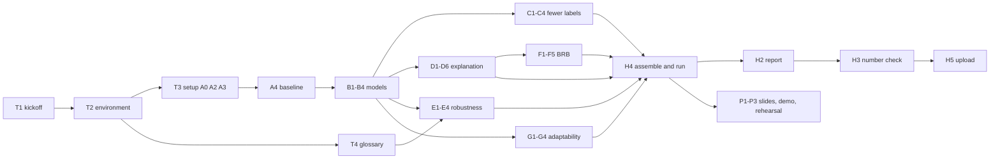

# Final Mini Project Task List: An Explainable and Robust Cyber-Defence Model

- **Course:** AI for Cybersecurity (D7084E / D7041E)
- **Group:** one person (you do every part and present every part)
- **Hand-in deadline:** Thursday 15 October 2026, **08:00** (notebook, README and report on Canvas)
- **Presentation:** Thursday 15 October 2026, 14:45–18:00. 13 minutes, then questions. You must be
  there and run (or show running) the code
- **Random seed:** `42` everywhere (`random_state=42`, `np.random.default_rng(42)`)
- **Instructions:** `15_oct_Final Mini Project.pdf` (same text in `15_oct_Final Mini Project.txt`)
- **Dataset:** CIC-UNSW-NB15 (UNSW-NB15, CICFlowMeter version) in `UNSW-NB15/`, **all 305,105 clean
  rows** (why this dataset: `Dataset_Choice.md`)

This file turns the mini-project instructions into small tasks you can do one at a time, in order. It
assumes **no background** in cybersecurity, machine learning or programming: section 0 explains every
word you need, and every task says *why* it exists before it says *what* to do.

| Section | What it gives you |
|---|---|
| [0. Words you need](#0-words-you-need-read-this-first) | Plain-language glossary. Read it once before starting |
| [1. Starting point](#1-starting-point-checked-on-2026-10-09) | What is in this folder, facts about the data, what a trial run showed, decisions already made, the time budget |
| [2. How the work is organised](#2-how-the-work-is-organised) | Part notebooks, step markers, the shared names, the test-set rule, git |
| [Task overview](#task-overview) | Every task on one page, with what it needs first |
| [Plan](#plan) | The order of work and a day-by-day plan up to 15 October |
| [3. Tasks in detail](#3-tasks-in-detail) | Why, background, what to do, pitfalls, done-when, for each task |
| [4. Grading checklist](#4-grading-checklist) | Which task covers which grading requirement |
| [5. Questions for the teacher](#5-questions-for-the-teacher) | Open points, with the default we use until we get an answer; the dataset citation |

Task IDs: **T1–T4** are setup tasks. The project's own parts keep the brief's letters: **A1–A4, B1–B4,
C1–C4, D1–D6, E1–E4, F1–F5, G1–G4**, so every task matches the PDF directly. **X1–X9** are optional
extras, **P1–P3** are the presentation and **H1–H5** are the hand-in.

---

## 0. Words you need (read this first)

### 0.1 Computer and programming basics

| Word | Meaning |
|---|---|
| **Terminal** | The window where you type commands (Linux/macOS: "Terminal"; Windows: "PowerShell"). Every command in this file is typed there and run with Enter |
| **Folder / path** | Where a file lives. `UNSW-NB15/Data.csv` = the file `Data.csv` inside the folder `UNSW-NB15`. Paths in this file start from the project folder |
| **Python** | The programming language we use. Version 3.13 |
| **Library / package** | Code someone else wrote that we reuse: `pandas` (tables), `scikit-learn` (models), `shap` and `lime` (explanations), `matplotlib` (figures) |
| **Virtual environment (`.venv`)** | A private folder holding exactly the library versions in `requirements.txt`, so the code always gives the same numbers. You *activate* it in every new terminal |
| **uv** | A fast tool that creates the virtual environment and installs the libraries |
| **Jupyter notebook (`.ipynb`)** | A document made of *cells*. A **code cell** holds Python and shows its output below it; a **Markdown cell** holds text. "Run All" runs every cell from top to bottom |
| **Kernel** | The Python process behind a notebook. "Restart kernel and run all" = start fresh and run everything, the way the grader will |
| **Variable** | A name that holds a value, e.g. `X_train` holds the training table |
| **Function** | A named piece of code you can call, e.g. `score(model, X, y)` returns the scores of a model |
| **DataFrame / Series** | pandas' table / one column of a table |
| **CSV** | A plain-text table: one row per line, columns separated by commas |
| **`assert`** | A line that stops the notebook with an error if something is not true. We use them as built-in checks |
| **git / repository** | git records every version of the project's files. The *repository* is the project folder with that history |
| **Commit / push** | *Commit* = save a snapshot of your files in git. *Push* = copy your commits to GitHub (a backup and a link you can hand in) |
| **Seed** | A number that fixes all "random" choices, so a rerun gives exactly the same result |

### 0.2 The security problem

| Word | Meaning |
|---|---|
| **Packet** | One small chunk of data sent over a network |
| **Network flow** | One conversation between two computers, summarised as a row of numbers: how long it lasted, how many packets went each way, how big they were, how long the gaps between them were. **One row of our table = one flow** |
| **Forward / backward** | *Forward* (`Fwd`) = packets from the side that started the conversation (for an attack: the attacker). *Backward* (`Bwd`) = the replies from the other side |
| **CICFlowMeter** | The program that turned the recorded traffic into flows and computed the 76 numbers per flow |
| **Intrusion detection system (IDS)** | The program that looks at flows and says "attack" or "normal". Our models are IDSs |
| **SOC analyst** | The person in a Security Operations Centre who reads the IDS alerts and decides what to do |
| **Benign** | Normal, harmless traffic |
| **False alarm (false positive)** | The IDS calls a normal flow an attack. Costs analyst time; too many and people stop reading alerts |
| **Missed attack (false negative)** | The IDS calls an attack normal. The attacker gets through unnoticed |
| **UNSW-NB15** | A public dataset of network traffic recorded in 2015 at UNSW Canberra: normal traffic plus nine kinds of attacks generated with a traffic tool. Our copy (CIC-UNSW-NB15) is the version re-processed with CICFlowMeter |
| **TCP handshake / window size** | How two computers start a conversation. `Init Win Bytes` = the "window" each side announces at the start; `Seg Size Min` = the smallest segment header. Both depend on the operating system, so they act like a fingerprint of the machine |

The nine attack types (from `UNSW-NB15/Readme.txt`, code in brackets):

| Attack type | In plain words |
|---|---|
| **Benign** (0) | Normal traffic |
| **Analysis** (1) | Probing web applications and ports to study the target (port scans, spam, HTML file penetration) |
| **Backdoor** (2) | Using a secret way into a computer that bypasses its normal login |
| **DoS** (3) | Denial of service: overloading a service so real users cannot use it |
| **Exploits** (4) | Using a known software bug to break into a system |
| **Fuzzers** (5) | Sending large amounts of random or malformed data to make a program crash or misbehave |
| **Generic** (6) | Attacks that work against every block cipher (encryption) of a given size, whatever the key |
| **Reconnaissance** (7) | Scanning the network to find out which machines and services exist, before attacking |
| **Shellcode** (8) | A small piece of attack code sent inside a packet to take control of a program |
| **Worms** (9) | Malware that copies itself to other computers on its own |

### 0.3 Machine learning basics

| Word | Meaning |
|---|---|
| **Feature** | One column of the table, e.g. `Flow Duration`. We have 67 after cleaning |
| **Label** | The right answer for a row. We use **1 = attack, 0 = benign**. We also keep the attack type (`Fuzzers`, …) for Part G |
| **Model / classifier** | A program that learns from labelled rows and then guesses the label of new rows |
| **Train / validation / test set** | We split the rows 60/20/20. *Train*: the model learns from it. *Validation*: we use it to choose settings. *Test*: only for the final scores. Using the test set to choose anything gives an F |
| **Stratified split** | Each part gets the same share of every class (here: of every attack type) |
| **Leakage** | Accidentally letting information from the test set, or from the answer, into training. Scores then look better than they really are |
| **Glass box** | A model a person can read: a **decision tree** (a chain of yes/no questions) or logistic regression (one weight per feature) |
| **Black box** | A model too big to read. Ours is **gradient boosting** (scikit-learn's `HistGradientBoostingClassifier`): about 100 small trees built one after another, each fixing the mistakes of the ones before. A random forest (300 trees that vote) is the other option in the brief, but it is too slow on all our rows (section 1.3) |
| **Setting (hyperparameter)** | A choice made before training, e.g. the depth of a tree. Chosen on the validation set |
| **Probability / threshold** | The model's confidence that a flow is an attack, 0 to 1. At or above the threshold (0.5) we call it an attack |
| **Overfitting** | The model memorises the training rows and does worse on new rows |
| **Duplicate rows** | Identical flows. If one copy is in training and one in test, the test is too easy. We remove them before splitting |

### 0.4 Scores (metrics)

Our test set: 61,021 flows, 16,052 of them attacks and 44,969 benign.

| Score | Meaning | Good value |
|---|---|---|
| **Accuracy** | Share of all flows labelled correctly. Misleading when attacks are rare | high, but compare with the trivial baseline |
| **Recall** (detection rate) | Of the 16,052 real attacks, what share did we catch? | high |
| **Precision** | Of the flows we called attacks, what share really were? | high |
| **F1** | One number that balances precision and recall | high |
| **Macro-F1** | F1 for the attack class and F1 for the benign class, averaged equally. The big benign class cannot inflate it | high |
| **FAR** (false alarm rate) | Of the 44,969 normal flows, what share did we wrongly call attacks? `FP / (FP + TN)` | **low** |
| **PR-AUC** (average precision) | How well the model ranks attacks above normal flows, built from precision and recall over all thresholds. A model that guesses scores the attack share (0.263) | high |
| **Confusion matrix** | The 2 × 2 table of (true benign / true attack) × (called benign / called attack) |
| **Trivial baseline** | A "model" that always answers the majority class (benign). Here: accuracy 0.737, recall 0. Every real score is compared with it |

The brief asks for **macro-F1, recall, PR-AUC and FAR** for every model. We also show accuracy, because
the baseline is defined by it.

### 0.5 Learning with fewer labels (Part C)

| Word | Meaning |
|---|---|
| **Label budget** | How many training rows we pretend have a label. Here 10% of 183,063 = 18,306 |
| **Lower line** | The black box trained on the 18,306 labelled rows alone. The method must beat this to count as help |
| **Upper line** | The black box trained on all 183,063 labels (Part B) |
| **Pseudo-labelling** (semi-supervised) | The model labels the unlabelled rows it is very sure about, adds them to its training data, and retrains |
| **Confidence cutoff** | How sure the model must be before a guess is used, e.g. 0.95 |
| **Self-supervised / pretext task** | Learn from the unlabelled rows with a made-up task that needs no labels (e.g. fill in hidden values), then train the classifier on the few labels |

### 0.6 Explanations (Part D)

| Word | Meaning |
|---|---|
| **Global explanation** | Which features matter most for the model overall |
| **Local explanation** | Why the model gave *this one* flow its score |
| **SHAP** | Splits one prediction into one contribution per feature: "`Flow IAT Mean` pushed this flow towards attack by 0.8". *Base value* (the average output) + all contributions = the model's output |
| **Log-odds** | The unit SHAP uses for gradient boosting: 0 = 50% attack, +2 ≈ 88%, −2 ≈ 12%. Bigger = more attack. Compare features by size, not by probability |
| **TreeExplainer** | The fast, exact SHAP method for tree models (trees, forests, boosting) |
| **Bar / beeswarm / waterfall plot** | SHAP figures: average importance per feature / one dot per flow per feature / one flow's contributions stacked up |
| **LIME** | Another explanation method: it makes thousands of slightly changed copies of the flow, asks the model about each, and fits a straight line. The slopes are the explanation. It uses randomness |
| **Fit score (R²)** | How well LIME's straight line matches the model, 0 (useless) to 1 (perfect) |
| **Fidelity / faithful** | The explanation really describes what the model does |
| **Deletion test** | Replace the features the explanation calls most important with "ordinary" values (training medians). If the model's probability drops a lot more than when you replace random features, the explanation was faithful |
| **Stability / stable** | Running the explanation again (another seed) gives the same answer |
| **Correlated features ("twins")** | Features that carry almost the same information. SHAP and LIME can split the credit between twins differently, which causes disagreement |

### 0.7 Robustness (Part E)

| Word | Meaning |
|---|---|
| **Robustness** | How much the scores drop when the input gets messy |
| **Standard deviation (std)** | How spread out a column's values are. Noise is sized as a share of each feature's training std |
| **Gaussian noise** | Small random errors, mostly small and sometimes larger, like a sensor that measures slightly wrong |
| **Median** | The middle value of a column. Used as the "ordinary" value when a feature is missing |
| **Missing feature** | A field the sensor failed to record. We fill it with the training median |
| **Evasion attack** | The attacker changes their own traffic until the model calls it normal. **Constrained** = only changes a real attacker could make |

### 0.8 Belief rule base, BRB (Part F)

| Word | Meaning |
|---|---|
| **Rule** | IF `feature 1` is Low AND `feature 2` is High THEN risk is (Low 0.1, Medium 0.3, High 0.6) |
| **Antecedent** | The IF part: the two input features |
| **Referential values** | The three reference points Low / Medium / High of each feature. We take the 5th percentile, median and 95th percentile of the training data |
| **Matching degree** | How much a value belongs to each level. A value halfway between Low and Medium is 0.5 Low and 0.5 Medium |
| **Activation weight** | How strongly a rule fires for this flow. The 9 weights add up to 1 |
| **Belief degree** | The THEN part: how much the rule believes in each risk level |
| **Evidential Reasoning (ER)** | The formula that combines the beliefs of all firing rules into one answer |
| **Unknown (ignorance)** | The part of the belief the rules cannot assign to any level, e.g. because a rule had little training data or an input is missing. **A forest or boosting model cannot say "I don't know"; a BRB can** |
| **Utility** | One risk number from the beliefs (Low = 0, Medium = 50, High = 100) that we compare with a threshold |

### 0.9 Adaptability (Part G)

| Word | Meaning |
|---|---|
| **Hidden (unseen) attack** | An attack type removed from the training data, standing in for a brand-new attack ("zero-day") |
| **Concept drift** | The traffic or the attacks change over time, so a model trained last month slowly gets worse |
| **Adapting** | An analyst labels a few examples of the new attack; we add them and retrain |
| **Monitoring** | Watching the model in use (alert rate, uncertain predictions, feature distributions) to notice that something changed |

---

## 1. Starting point (checked on 2026-10-09)

### 1.1 What is in this folder

This folder is **self-contained**: nothing in `PreviousLabs/` is needed. These files were copied from
the earlier labs:

| Path | Copied from | What it is for |
|---|---|---|
| `UNSW-NB15/Data.csv`, `Label.csv`, `Readme.txt` | downloaded dataset | **The data.** 447,915 flows × 76 features, labels 0–9. 188 MB, **not in git** (section 1.2) |
| `UNSW-NB15/CICFlowMeter_out.csv` | downloaded dataset | 1.8 GB, every flow with IP addresses. **Do not use** (section 1.2) |
| `requirements.txt` | Lab 4.2 (+ `pytest`) | Pinned library versions that work together (Python 3.13, scikit-learn 1.6.1, shap 0.52.0, lime 0.2.0.1, …) |
| `tools/assemble.py` | Lab 4.2 | Merges the part notebooks into the single hand-in notebook. Needs small edits (T2) |
| `tools/feature_glossary.py` | Lab 4.2 | Writes a plain-language table of the features. Written for CICIDS2017 names; adapted in T4 |
| `tools/check_report_numbers.py` | Lab 4.2 | Checks that the numbers in the report match the notebook's tables. Rewritten for our tables in H3 (optional) |
| `src/brbes.py`, `src/test_brbes.py` | Lab 3, unchanged | The BRB engine (input transformation, rule activation, Evidential Reasoning, Unknown, utility, rules built from training data, step-by-step trace) and its tests. Used in Part F |
| `src/xai_tools.py`, `src/test_xai_tools.py` | Lab 3 (one change: the seed is now set in the file) | SHAP/LIME helpers: `deletion_test`, `lime_stability`, `lime_explain`, `topk_overlap`, `rank_agreement`, `importance_table`, `shap_attack_values`. Used in Part D. They already handle gradient boosting |
| `report/build_report.py`, `report/build_docx.py`, `report/title_page_template.docx`, `report/fonts/` | Lab 4.2 | Turn the Markdown report into PDF and Word. Need small edits (H2) |
| `reference/lab4_1_phishing/` | Lab 4.1 | Part notebooks and report of Lab 4.1. **Read-only examples** of: tree depth chosen on validation, few labels + pseudo-labelling + self-supervised, SHAP bar/beeswarm/waterfall, LIME, three cases, LIME stability, a 2-feature BRB compared with a tree and a forest on the same 2 features |
| `reference/lab4_2_robustness/` | Lab 4.2 | Part notebooks, README, report and reference list of Lab 4.2. **Read-only examples** of: setup notebook, `add_noise`, `add_missing`, a constrained greedy evasion attack, the deletion test, LIME fit, figure style |
| `parts/`, `results/figures/`, `results/tables/`, `report/figures/` | – | Empty. Where your work goes |
| `Dataset_Choice.md`, `CHANGELOG.md` | – | Why UNSW-NB15; history of changes to this folder |

The copied unit tests pass (`python -m pytest src`: 16 passed, checked 2026-10-09).

To open a reference notebook, open it in Jupyter like any other notebook. Copy code from it into your
own part notebook; never edit the reference files and never `%run` them. They were written for other
datasets (CICIDS2017, phishing URLs) and for a random forest, so feature names and some details differ.

### 1.2 Facts about the data

Measured on 2026-10-09:

| Fact | Value | What it means for us |
|---|---|---|
| `Data.csv` | 447,915 rows × 76 numeric columns, no IDs, no IP addresses | All features are numbers already: nothing to encode |
| `Label.csv` | one column `Label`, codes 0–9, same 447,915 rows in the same order | Read both files and put them side by side |
| Infinite, missing or negative values | **none** | No filling needed for the real data |
| Exact duplicate rows (features + label) | **141,742** (133,329 of them benign) | Drop before splitting, otherwise copies of one flow land in both train and test |
| Rows with identical features but different labels | **1,068** (after dropping exact duplicates) | Drop them: no model can get them right, and they are noise |
| Clean rows | **305,105** (26.3% attacks) | **We use all of them** |
| Columns with one constant value | 9 (`Bwd PSH Flags`, `Fwd URG Flags`, `Bwd URG Flags`, `URG Flag Count`, `CWR Flag Count`, `ECE Flag Count`, `Fwd Bytes/Bulk Avg`, `Fwd Packet/Bulk Avg`, `Fwd Bulk Rate Avg`) | Drop the ones constant in **training** → **67 features** |
| 0/1 columns | `Fwd PSH Flags`, `RST Flag Count` | Do not add noise to these in Part E |
| `CICFlowMeter_out.csv` | 3,540,241 rows: every flow of the capture (all 89,583 attacks + 3,450,658 benign) with Flow ID, IPs, ports, timestamp | `Data.csv` = all attacks + about 10% of the benign flows (the dataset page calls it the "80-20 ratio dataset"). **In the real traffic only about 2.5% of flows are attacks**, not 26%. Say this in the report: precision and the number of false alarms per day would be much worse in reality |
| Attacker IP addresses | 100% of attacks come from `175.45.176.x`, against 1.6% of benign flows | IP addresses would give the answer away. Never use the big file's IP columns |
| Feature names | CICFlowMeter v4 names, e.g. `Total Fwd Packet`, `FWD Init Win Bytes`, `Fwd Seg Size Min` | Different spelling from the CICIDS2017 names in the reference notebooks |

Counts per attack type (code in brackets). The split is the one in section 1.5:

| Attack type | Raw rows | Clean rows | Train | Validation | Test |
|---|---:|---:|---:|---:|---:|
| Benign (0) | 358,332 | 224,847 | 134,909 | 44,969 | 44,969 |
| Exploits (4) | 30,951 | 30,836 | 18,502 | 6,167 | 6,167 |
| Fuzzers (5) | 29,613 | 26,010 | 15,606 | 5,202 | 5,202 |
| Reconnaissance (7) | 16,735 | 11,988 | 7,192 | 2,398 | 2,398 |
| Generic (6) | 4,632 | 4,373 | 2,623 | 875 | 875 |
| DoS (3) | 4,467 | 4,315 | 2,589 | 863 | 863 |
| Shellcode (8) | 2,102 | 1,663 | 998 | 332 | 333 |
| Backdoor (2) | 452 | 452 | 271 | 91 | 90 |
| Analysis (1) | 385 | 385 | 231 | 77 | 77 |
| Worms (9) | 246 | 236 | 142 | 47 | 47 |
| **Total** | 447,915 | 305,105 | 183,063 | 61,021 | 61,021 |

### 1.3 What a trial run showed (so you know what to expect)

Trial runs on 2026-10-09 followed exactly the recipe in section 1.5, on this 8-core laptop. These are
**validation-set** numbers with **default** settings, only to check the plan works. They are **not**
results for the report: the report's numbers come from the assembled notebook (H4).

| What | Trial result | Consequence for the plan |
|---|---|---|
| Load + clean + split | 19–54 s (faster when the file was read recently) | Leaves about 4 minutes for everything else |
| Random forest, 300 trees, all rows | **487 s** to train, **756 s** for SHAP on 300 rows | Far over the 5-minute limit. **The black box is gradient boosting instead** (the brief allows "random forest or gradient boosting") |
| Gradient boosting (default settings), all rows | 9–21 s to train (one unexplained run took 131 s); SHAP on 1,000 rows 1.8 s; predicting 5,000 rows 0.05 s | Fast enough for everything, including LIME |
| Gradient boosting, validation | macro-F1 0.971, recall 0.992, PR-AUC 0.981, FAR 0.028 | Far above the trivial baseline (accuracy 0.737, recall 0) |
| Decision tree (depth 8), validation | macro-F1 0.967, recall 0.981, PR-AUC 0.969, FAR 0.029; 8 s to train | The glass box is almost as good |
| Logistic regression, all rows | 48–101 s **per setting**; macro-F1 0.961 | Slow, but kept as the second glass box (2026-10-09: correctness first, runtime is optimised at the end) |
| Settings search on a 20% part of training | 1.3 s per boosting model, 1.7 s per tree | Search settings there, train the final model on all training rows |
| Global SHAP top 3 (gradient boosting) | `Fwd Seg Size Min`, `FWD Init Win Bytes`, `Bwd Packets/s` | The top 2 are **TCP settings of the machines**, not the attack itself. Likely a *shortcut*: all attacks come from the same few attacker machines. Discuss in D1 and the Discussion (X6 tests it) |
| BRB levels | `Fwd Seg Size Min` has only 7 distinct values and cannot get three levels; `FWD Init Win Bytes` gives 0 / 5,792 / 26,064; `Bwd Packets/s` gives 5.1 / 296.7 / 5,633.8 | The likely BRB pair is `FWD Init Win Bytes` and `Bwd Packets/s` |
| Part C: 10% labels (18,306) | lower line macro-F1 0.968; one pseudo-labelling round added 143,824 guesses, 99.5% right, macro-F1 0.968; 10 s per round | Expect "the unlabelled data did not help much": 10% of a big dataset is already a lot of labels. A clear negative result is fine (the brief says so) |
| Part G: hide one type, recall on it (validation) | **Fuzzers 0.989 → 0.696** (5,202 rows; overall recall 0.992 → 0.889); Exploits 0.996 → 0.973; Reconnaissance 0.989 → 0.965; DoS, Generic, Shellcode ≥ 0.99 | Fuzzers is clearly "new" to the model; the others look like attacks it already knows. **We hide Fuzzers** |
| Whole trial (load, two models, SHAP, Part C round, 6 hidden-type models) | 107 s | The lean plan fits in 5 minutes if the settings searches stay small (budget in section 1.5) |

### 1.4 Where our data differs from the brief

| The brief says | Our data | What to do |
|---|---|---|
| "UNSW-NB15, network intrusion with a different feature set from CICIDS" | Our copy has the **same kind** of features as CICIDS (CICFlowMeter), not the original 49 UNSW-NB15 features | Name the version correctly in the report and README |
| Part G: use attack types; if there are none, use a period/source column or a time split | We **have** attack types | Hide one attack type (Fuzzers). No fallback needed |
| "Subsample if you need to … you can choose 4,000 to 5,000 rows" | We use **all 305,105 clean rows** | The 5-minute limit still applies: keep the settings searches small (section 1.5) and measure the run time in H4. Say in the report that we did not subsample, and where we searched settings on a 20% part of the training set |
| "Train … one black box (random forest or gradient boosting)" | A forest is too slow on all rows | Gradient boosting; say why in the report |
| Part F: "compare it with a tree and a forest that see only those same two features" | – | We do exactly that: a forest on **two** features is fast |
| Every member presents their part | One person | You present all parts (13 minutes); see P1 |

### 1.5 Decisions already made

| Decision | Choice | Why |
|---|---|---|
| Data file | `UNSW-NB15/Data.csv` + `UNSW-NB15/Label.csv`; never `CICFlowMeter_out.csv` | No IP addresses (leakage), 10× smaller |
| Rows | **All 305,105 clean rows**, no sample | Your choice (2026-10-09); precise numbers (5,202 Fuzzers test rows instead of 85) |
| Label | `y = 1` for every attack type, `0` for Benign; keep the attack-type name in `type_*` | Binary detector as in the brief; the type is needed in Part G |
| Cleaning | 1) drop exact duplicate rows, 2) drop rows whose identical features carry different labels, 3) (after the split) drop columns that are constant in training | Section 1.2 |
| Split | 60/20/20, stratified on the **attack type**: first `test_size=0.20`, then `test_size=0.25` of the rest, `random_state=42` → 183,063 / 61,021 / 61,021 | Same as our Lab 1 and Lab 4.2; every attack type appears in every part |
| Glass boxes | Decision tree (depth chosen on validation) and logistic regression (scaled inside a Pipeline, `C` chosen on validation) | The brief asks for at least one; two glass boxes give a fairer picture against the black box. Logistic regression is slow on all rows (about 90 s per fit); runtime is optimised at the end |
| Black box | Gradient boosting, `HistGradientBoostingClassifier(random_state=42)`; `learning_rate` and `max_leaf_nodes` chosen on validation | Fast on all rows; SHAP TreeExplainer is exact and fast for it |
| Settings searches | Each candidate is trained on a stratified **20% part of the training set** and scored on validation; the winner is then trained on **all** training rows | Keeps the notebook under 5 minutes; the choice is still made on validation |
| Threshold | 0.5 for every model (the BRB's threshold is chosen on validation, F2) | Simple and the same everywhere |
| Global SHAP | On 1,000 **validation** rows | Part F picks its two features from this ranking; that is a choice, so it must not look at the test set |
| Part C | 10% of the training labels (18,306 rows); pseudo-labelling, 2 rounds, cutoff chosen on validation from `[0.90, 0.95, 0.99]`; self-supervised is the optional extra X1 | The brief allows either; pseudo-labelling is the simplest |
| Part E | Noise **and** missing features (required); evasion is the optional extra X3 | The brief asks for at least one, at several levels |
| Part F | Lab 3's tested engine `src/brbes.py`; referential values = training 5th percentile / median / 95th percentile; rule beliefs from the training data; compared with a tree and a random forest on the same two features | Already tested; the brief asks for 3 levels × 2 features = 9 rules |
| Part G | Hide **Fuzzers**; adapt with 50 and with 100 labelled Fuzzers rows taken from the removed **training** rows; 3 seeds each | Largest drop in the trial (section 1.3) |
| Models on disk | None. Every model is retrained when the notebook runs | Training takes seconds |
| Python | 3.13 with `requirements.txt` | Same as Labs 3, 4.1 and 4.2 |

**Time budget** (the whole notebook must run in under 5 minutes; estimates from section 1.3):

| Part | Budget | What uses the time |
|---|---:|---|
| Setup (A0, A2, A3) | 60 s (measured: 46 s) | Reading the CSVs, removing duplicates |
| A + B | 45 s + logistic regression (not yet measured; runtime is optimised at the end) | 5 tree depths and 4 boosting settings on 20% (≈ 15 s), 2 final models (≈ 25 s); 4 logistic regression settings on 20% and the final one (about 90 s on all rows) |
| C | 70 s | Lower line (1 s), 3 cutoffs × 2 rounds (≈ 60 s) |
| D | 30 s | SHAP (2 s), LIME 3 cases + 30 stability runs + D6 experiments (≈ 20 s), deletion test |
| E | 15 s | Predictions only |
| F | 20 s | BRB on 61,021 rows (vectorised), 2-feature tree and forest |
| G | 65 s | 1 hidden model + 2 sizes × 3 seeds (7 models × ≈ 9 s) |
| **Total** | **≈ 305 s** | Over budget by a little: if H4 measures more than 300 s, first cut the C cutoffs to `[0.95, 0.99]`, then the G seeds to 2 |

---

## 2. How the work is organised

### 2.1 Part notebooks, step markers and stand-ins

The brief wants **one** notebook that runs from top to bottom. One huge notebook is slow to work in:
every change means re-running five minutes of code. So you work in **one small notebook per part**
in `parts/`, each of which runs in well under a minute, and `tools/assemble.py` builds the hand-in
notebook from them (this worked in Labs 4.1 and 4.2).

1. **Step marker.** The first line of every cell names its step: `# STEP B2` in code cells,
   `<!-- STEP B2 -->` in Markdown cells. The assembly script puts cells in this order:
   A0, A1, A2, A3, A4, B1 … B4, C1 … C4, D1 … D6, E1 … E4, F1 … F5, G1 … G4, then X1 … X9. Inside one
   step it keeps your order.
2. **Setup first.** Every part notebook except `00_setup.ipynb` starts with this one cell:
   ```python
   # STANDIN A0
   %run 00_setup.ipynb
   ```
   It loads the data, makes the split and defines the shared helpers (section 2.3).
3. **Stand-in cells.** A part notebook sometimes needs something made in an earlier part (Part D needs
   the boosting model from B2). Copy that code into a cell whose first line is `# STANDIN B2`. The
   assembly script drops stand-ins, because in the hand-in notebook the real B2 cell is already above.
   Ready-made stand-ins are in section 2.3. **When you change the real step, update its stand-ins
   too**, or the part notebooks and the hand-in notebook give different numbers.
4. **Use the shared names** of section 2.3, so the cells fit together when assembled.
5. **Numbers for the report** come from one run of the assembled notebook (H4), never from a part
   notebook.

### 2.2 Folder layout

```
AI-for-Cybersecurity-Final-Mini-Project/
├── TASKLIST.md                      this file (tick the boxes as you go)
├── README.md                        H1
├── requirements.txt, .gitignore     T2
├── UNSW-NB15/                       the data (not in git)
├── parts/
│   ├── 00_setup.ipynb               A0, A2, A3 (shared setup)
│   ├── 10_baseline_models.ipynb     A1, A4, B1–B4, X8, X9
│   ├── 20_few_labels.ipynb          C1–C4, X1, X2
│   ├── 30_explanation.ipynb         D1–D6, X6
│   ├── 40_robustness.ipynb          E1–E4, X3
│   ├── 50_brb.ipynb                 F1–F5, X7
│   └── 60_adaptability.ipynb        G1–G4, X4, X5
├── src/                             read-only (copied, tested helpers)
├── tools/assemble.py                T2
├── mini_project_unsw_nb15.ipynb     made by tools/assemble.py, never edited by hand
├── results/figures/<step>_<name>.png
├── results/tables/<step>_<name>.csv
├── report/                          H2
└── reference/                       read-only examples from Labs 4.1 and 4.2
```

### 2.3 The shared names (the contract)

These names connect the parts. **Do not rename them.**

**Made by the setup notebook (T3), available everywhere:**

| Name | What it is |
|---|---|
| `SEED = 42` | The seed |
| `ATTACK_NAMES` | `{0: "Benign", 1: "Analysis", …, 9: "Worms"}` from `UNSW-NB15/Readme.txt` |
| `CLEAN_COUNTS` | dict with the row counts of each cleaning step (raw, after duplicates, after conflicts) for A2 |
| `X_train, X_val, X_test` | pandas DataFrames, 67 raw (unscaled) feature columns |
| `y_train, y_val, y_test` | pandas Series, 1 = attack, 0 = benign |
| `type_train, type_val, type_test` | pandas Series with the attack-type name (`"Benign"`, `"Fuzzers"`, …), same rows as `y_*` |
| `TUNE_IDX` | positions of a stratified 20% part of `X_train` (seed 42), used **only** for settings searches |
| `FEATURES` | list of the 67 feature names |
| `FLAG_COLS`, `CONT_COLS` | the 0/1 columns (2 distinct values in training) and the continuous ones |
| `TRAIN_MEDIAN`, `TRAIN_STD` | pandas Series, one value per feature, **measured on `X_train` only** |
| `score(model, X, y, threshold=0.5)` | returns `{"accuracy", "macro_f1", "recall", "pr_auc", "far"}` for any model with `predict_proba` |
| `score_proba(y, p, threshold=0.5)` | the same five scores from attack probabilities `p` (used for the BRB, whose output is not a scikit-learn model) |
| `TABLES`, `FIGURES` | `Path("results/tables")`, `Path("results/figures")` |

**Made by the project steps:**

| Name | Type | Made in | Used by |
|---|---|---|---|
| `tree`, `logreg` | the Part B decision tree and logistic regression (Pipeline with `StandardScaler`), trained on all of `X_train` | B1 | B3, D (optional), E |
| `BOOST_SETTINGS` | dict of the gradient boosting model's chosen settings, incl. `random_state=SEED` | B2 | C, F, G |
| `make_boost()` | returns a new, untrained gradient boosting model with `BOOST_SETTINGS` | B2 | C, F, G |
| `boost` | the Part B gradient boosting model, trained on all of `X_train` | B2 | C4, D, E, G |
| `MODELS` | `{"tree": tree, "logreg": logreg, "boosting": boost}` | B2 | E |
| `boost_few`, `boost_pseudo` | the lower line and the pseudo-labelling model | C1, C2 | C4 |
| `shap_global` | pandas Series: feature → mean \|SHAP\| on validation rows, sorted | D1 | F1 |
| `TOP2` | list of the two features for the BRB | F1 (from `shap_global`) | F2–F5 |
| `CASES` | `{"detection": i, "negative": j, "mistake": k}`: **positions** in `X_test` of the three explained flows | D2 | D3–D6, F4 |
| `add_noise(X, level, seed=SEED)` | noisy copy of `X` | E1 | X3 |
| `add_missing(X, frac, seed=SEED)` | copy of `X` with a share of each row's values set to `TRAIN_MEDIAN` | E2 | X3 |
| `HIDDEN = "Fuzzers"` | the hidden attack type | G1 | G2–G4, X4 |

**Ready-made stand-ins.** Use the version below until B1/B2/D1/D2 are done; afterwards, paste the
**real** cell (with its chosen settings) under the same `# STANDIN` marker.

```python
# STANDIN B2
from sklearn.ensemble import HistGradientBoostingClassifier
from sklearn.linear_model import LogisticRegression
from sklearn.pipeline import Pipeline
from sklearn.preprocessing import StandardScaler
from sklearn.tree import DecisionTreeClassifier

BOOST_SETTINGS = {"random_state": SEED}          # replace with the settings chosen in B2
def make_boost():
    return HistGradientBoostingClassifier(**BOOST_SETTINGS)

tree = DecisionTreeClassifier(max_depth=8, random_state=SEED).fit(X_train, y_train)   # depth from B1
logreg = Pipeline([("scale", StandardScaler()),                                      # C from B1
                   ("model", LogisticRegression(C=1.0, max_iter=2000, random_state=SEED))]).fit(X_train, y_train)
boost = make_boost().fit(X_train, y_train)
MODELS = {"tree": tree, "logreg": logreg, "boosting": boost}
```

```python
# STANDIN D1
import shap
_sv = shap.TreeExplainer(boost)(X_val.iloc[:1000])
shap_global = (pd.Series(np.abs(_sv.values).mean(axis=0), index=FEATURES)
               .sort_values(ascending=False))
```

```python
# STANDIN D2
_p = boost.predict_proba(X_test)[:, 1]
_yt = y_test.to_numpy()
_tp = np.flatnonzero((_yt == 1) & (_p >= 0.5)); _tn = np.flatnonzero((_yt == 0) & (_p < 0.5))
_wrong = np.flatnonzero((_p >= 0.5) != (_yt == 1))
CASES = {"detection": int(_tp[np.argmax(_p[_tp])]), "negative": int(_tn[np.argmin(_p[_tn])]),
         "mistake": int(_wrong[np.argmax(np.abs(_p[_wrong] - 0.5))])}
```

### 2.4 The test-set rule (an F if broken)

The brief: "Choose all settings on the validation set. The test set is touched once, at the end." and
"The test set was used to choose settings, or the labels of the hidden set were used in training" gives
an F. In practice:

- **Every choice is made on validation, in code that stays in the notebook**: tree depth, boosting
  settings, the pseudo-labelling cutoff, the BRB features (`TOP2`), the BRB threshold, the 2-feature
  tree's depth. The grader can then see how each was chosen.
- **Test scores come only from the last step of each part** (B3, C4, D2–D6 on the explained flows,
  E1–E3, F3, G2, G3). Those cells score fixed models and choose nothing.
- **Never change a setting after looking at a test number.** If you must, say so in the report.
- **Explaining test flows is fine** (D2–D6): it picks nothing that changes a model.
- **Part G:** Fuzzers rows of the **test** set are never added to training. The 50–100 "newly labelled"
  rows come from the Fuzzers rows that G1 removed from the **training** set.
- **Part C:** the 90% of training rows whose labels are hidden (`y_hidden`) may only be used to *check*
  how many pseudo-labels were right, never to train.

### 2.5 Figures and tables for the report

Save every figure and table the report or the slides may use, with the step in the file name:
`results/figures/D1_shap_beeswarm.png`, `results/tables/B3_test_scores.csv`. Put the saving code in the
step's own cell, so the assembled notebook regenerates everything. SHAP plots need `show=False` before
`plt.savefig(...)`. Every figure in the report needs a caption (the brief grades it).

### 2.6 Git (run these yourself)

The folder is already a git repository. After each finished task, save a snapshot:

```bash
git add parts/ results/ TASKLIST.md
git commit -m "C2: pseudo-labelling with cutoff chosen on validation"
```

Once, to get a backup and a link you can hand in: create an empty **private** repository on GitHub,
then:

```bash
git remote add origin <repository URL>
git push -u origin main
```

After that, `git push` after each commit. `UNSW-NB15/` is not in git (`.gitignore`), so keep your own
copy of the data.

---

## Task overview

Replace ☐ with ☑ when a task is done. "Needs" = what must exist first.

### Setup

| ID | Task | What it is and why | Needs | Done |
|---|---|---|---|---|
| T1 | Kickoff | Read the brief and this file, accept the decisions, check the dataset citation | – | ☐ (citation checked; the rest is yours) |
| T2 | Environment and assembly script | Install the libraries; `assemble.py` knows this project's steps | T1 | ☑ |
| T3 | Setup notebook (steps A0, A2, A3) | Load, clean, split; build every shared name of section 2.3 | T2 | ☑ |
| T4 | Feature glossary | One table: what each of the 67 features means in plain words. Needed to read SHAP results | T2 | ☑ |

### Part A: the problem and the data

| ID | Task | What it is and why | Needs | Done |
|---|---|---|---|---|
| A1 | State the problem | 2–3 sentences: what is detected, who uses it, what a false alarm costs | T1 | ☑ |
| A2 | Load and clean (in T3) | Counts of records and features, class balance, cleaning steps | T3 | ☑ |
| A3 | Split 60/20/20 (in T3) | Stratified split, checked | T3 | ☑ |
| A4 | Trivial baseline | Always-benign accuracy and recall on validation and test: the line every model must beat | T3 | ☐ |

### Part B: supervised models

| ID | Task | What it is and why | Needs | Done |
|---|---|---|---|---|
| B1 | Glass boxes | Decision tree and logistic regression, settings chosen on validation | T3 | ☐ |
| B2 | Black box | Gradient boosting, settings chosen on validation; publishes `BOOST_SETTINGS`, `make_boost`, `boost` | T3 | ☐ |
| B3 | Test scores | Four metrics on the test set, next to the trivial baseline | B1, B2, A4 | ☐ |
| B4 | Where the models go wrong | Confusion matrices and recall per attack type | B3 | ☐ |

### Part C: learning with fewer labels

| ID | Task | What it is and why | Needs | Done |
|---|---|---|---|---|
| C1 | Keep 10% of the labels; lower line | Boosting on 18,306 labelled rows only | B2 | ☐ |
| C2 | Pseudo-labelling | Cutoff chosen on validation; how many guesses were right | C1 | ☐ |
| C3 | Did the unlabelled data help? | Validation comparison and a plain yes/no with the reason | C2 | ☐ |
| C4 | The results table | All models, four metrics, trivial baseline, test set: the report's main table | C3, B3 | ☐ |

### Part D: explanation

| ID | Task | What it is and why | Needs | Done |
|---|---|---|---|---|
| D1 | Global SHAP | Which features drive the model; do they make sense to a security person? | B2 | ☐ |
| D2 | Pick the three cases | Confident detection, confident negative, a mistake (test set) | B2 | ☐ |
| D3 | Local SHAP and LIME | Explain the three cases with both methods | D2 | ☐ |
| D4 | Fidelity: deletion test | Top-k SHAP features vs k random features, replaced with medians | D1 | ☐ |
| D5 | Stability of LIME | LIME with 10 seeds: how often is the top 3 the same? | D3 | ☐ |
| D6 | Do SHAP and LIME agree? Why not? | Investigate every disagreement (grade 5) | D3, D5 | ☐ |

### Part E: robustness

| ID | Task | What it is and why | Needs | Done |
|---|---|---|---|---|
| E1 | Noise | `add_noise`; all three models at 6 noise levels | B2 | ☐ |
| E2 | Missing features | `add_missing`; all three models at 5 levels | B2 | ☐ |
| E3 | What broke first? | Figure, and the level at which we stop trusting the model | E1, E2 | ☐ |
| E4 | What would an attacker change? | Feature-group table (needed for the Discussion); optional X3 runs the attack | T4, D1 | ☐ |

### Part F: a knowledge-based layer (BRB, needed for grade 5)

| ID | Task | What it is and why | Needs | Done |
|---|---|---|---|---|
| F1 | Pick the two features | Top two usable features of the validation SHAP ranking → `TOP2` | D1 | ☐ |
| F2 | Build the BRB | 3 referential values each, 9 rules from the training data, threshold on validation | F1 | ☐ |
| F3 | Fair comparison | BRB vs a tree and a forest that see only `TOP2`, test set | F2 | ☐ |
| F4 | Belief output for one case | Low / Medium / High / **Unknown**, step by step | F2, D2 | ☐ |
| F5 | What the BRB gives and costs | Written comparison with numbers | F3, F4 | ☐ |

### Part G: adaptability

| ID | Task | What it is and why | Needs | Done |
|---|---|---|---|---|
| G1 | Hide Fuzzers from training | Remove Fuzzers from the training set only, retrain | B2 | ☐ |
| G2 | Measure the cost | Overall recall and Fuzzers recall on the test set | G1 | ☐ |
| G3 | Adapt with 50 and 100 labels | Add a few Fuzzers rows back, retrain, measure again | G2 | ☐ |
| G4 | What we would do | One paragraph: were a few labels enough; how to notice in a real system | G3 | ☐ |

### Optional extras (only if time is left; watch the 5-minute budget)

| ID | Task | What it is and why | Needs | Done |
|---|---|---|---|---|
| X1 | Self-supervised alternative for Part C | Fill-in-the-blanks network on unlabelled rows + classifier on the labels | C1 | ☐ |
| X2 | Part C with 1% and 5% labels | Does pseudo-labelling help when labels are really scarce? | C3 | ☐ |
| X3 | Constrained evasion attack | Third robustness test; the attacker changes only what they control | E4 | ☐ |
| X4 | Learning curve for Part G | Fuzzers recall after adding 10, 25, 50, 100, 250, 500 labels | G3 | ☐ |
| X5 | Hide each attack type in turn | Which attacks are "new" to the model and which are not | G2 | ☐ |
| X6 | Shortcut check | Retrain without the TCP-settings features: does the model still work? | D1 | ☐ |
| X7 | BRB with a missing input; an expert edits a rule | Shows the Unknown part growing and the rules being editable | F4 | ☐ |
| X8 | Settings searches on all training rows | Repeat B1–B2 without the 20% shortcut: are the same settings chosen? | B3 | ☐ |
| X9 | Confidence intervals | Bootstrap the test scores: which differences between models are real? | B3 | ☐ |

### Presentation and hand-in

| ID | Task | What it is and why | Needs | Done |
|---|---|---|---|---|
| P1 | Slides | 13 minutes covering Parts A–G | all parts | ☐ |
| P2 | Live demo | Run the notebook during the talk (required); recording as a backup | H4 | ☐ |
| P3 | Rehearsal | Full run-through with a timer | P1, P2 | ☐ |
| H1 | README | Dataset, where to get it, libraries, how to run (required) | T2, T3 | ☐ |
| H2 | Report, 6–8 pages | The eight headings of the brief, captioned figures, AI-use statement | all parts | ☐ |
| H3 | Number check | Every number in the report matches the notebook | H2, H4 | ☐ |
| H4 | Final run | Fresh run of the assembled notebook, under 5 minutes | all parts | ☐ |
| H5 | Upload | Notebook + README + code as zip or repository link, report as PDF, before 15 Oct 08:00 | H1–H4 | ☐ |

---

## Plan

### Order of work

Work in the order of the task overview: setup, then Parts A → G, then the hand-in. Part B is the only
real dependency: once `BOOST_SETTINGS` and `boost` exist, Parts C to G only need B2's cell (as a
stand-in) and can be done in any order. F needs D1 and D2 (or their stand-ins).



### Day by day

| Day | Work | End of the day |
|---|---|---|
| Fri 9 Oct | T1, T2, T3, T4 | `%run 00_setup.ipynb` works; glossary written |
| Sat 10 Oct | A1, A4, B1–B4, C1–C4 | Results table (C4) exists |
| Sun 11 Oct | D1–D6 | All explanation figures and tables |
| Mon 12 Oct | E1–E4, F1–F5 | Robustness and BRB done |
| Tue 13 Oct | G1–G4; H4 (first full run); report sections 1–3 and 6 | Assembled notebook runs; **numbers frozen** |
| Wed 14 Oct | Report sections 4, 5, 7, 8; H1, H3, H5 (upload in the evening); P1, P2 | Everything on Canvas |
| Thu 15 Oct | P3 rehearsal in the morning; presentation from 14:45 | Done |

If a day runs late, drop optional extras first, never a required step. Upload on Wednesday evening: the
deadline is 08:00 on Thursday.

---

## 3. Tasks in detail

Every task has the same parts: **Why** (what question it answers), **Background** (only where new ideas
appear), **What to do** (tick the boxes), **Pitfalls**, **Done when**, and **Goes into the report**.

### Phase 0: kickoff and setup

#### T1 · Kickoff (about 1 hour)

**Why:** An hour of reading now saves days later: you will know what each part asks and where the
traps are (the test-set rule, the 5-minute limit, the AI declaration).

- [ ] Read the brief (`15_oct_Final Mini Project.pdf`), section 0 of this file, and sections 1 and 2.
- [x] Decide group size and data size: one person, all rows (2026-10-09). Sections 1.5 and the plan
      reflect this.
- [ ] Read section 1.5 once more and change anything you disagree with *now*, before code depends on it.
- [x] Check the exact dataset name, link and citation on the dataset web page (done 2026-10-09; the
      result is at the end of section 5, ready for H1 and H2).
- [ ] Ask the teacher the questions in section 5 (one email), especially whether a one-person group
      presents in the same 13-minute slot.

**Done when:** you know what every part asks, and the decisions in section 1.5 are final.

#### T2 · Environment and assembly script

**Why:** The notebook must give the same numbers every time it runs. "The notebook reproduces the
numbers in the report" is required for every grade.

- [x] Create the environment, in the project folder:
      ```bash
      # install uv once (Linux/macOS):
      curl -LsSf https://astral.sh/uv/install.sh | sh
      # Windows PowerShell instead:
      #   powershell -ExecutionPolicy ByPass -c "irm https://astral.sh/uv/install.ps1 | iex"
      uv venv --python 3.13 .venv
      source .venv/bin/activate            # Windows: .venv\Scripts\activate
      uv pip install -r requirements.txt
      python -m pytest src                 # must end with "16 passed"
      ```
- [x] Check the data is the right file: `sha256sum UNSW-NB15/Data.csv UNSW-NB15/Label.csv` must print
      `60d55f4f8f1e72bdfa2e0c1c74c03ac301bd880af321fdad1ba453950a7aa16a` for `Data.csv` and
      `5b2fcf31dc2d03ac6a07f8791858e55d86306f05442c3a4528bcc67301956a56` for `Label.csv`.
- [x] Open a notebook: `jupyter lab` in the activated terminal, then open `parts/` in the browser tab.
      Choose the kernel of `.venv` if Jupyter asks.
- [x] Edit `tools/assemble.py`:
  - `OUTPUT = ROOT / "mini_project_unsw_nb15.ipynb"`
  - `STEP_ORDER = (["A0", "A1", "A2", "A3", "A4", "B1", "B2", "B3", "B4", "C1", "C2", "C3", "C4",
    "D1", "D2", "D3", "D4", "D5", "D6", "E1", "E2", "E3", "E4", "F1", "F2", "F3", "F4", "F5",
    "G1", "G2", "G3", "G4"] + [f"X{i}" for i in range(1, 10)])`
  - the error message that lists the allowed steps (`"expected one of …"`) → `A0-A4, B1-B4, C1-C4,
    D1-D6, E1-E4, F1-F5, G1-G4, X1-X9`
  - the docstring at the top: replace the Lab 4.2 step list and file name
  - `TITLE` → project title, your name, a one-paragraph summary, and "Generated by
    `tools/assemble.py` from the notebooks in `parts/`. Do not edit this file by hand."
- [x] Test it on a tiny dummy notebook in `parts/` (one cell `# STEP A1` + `print("hi")`) with
      `python tools/assemble.py --no-execute`, then delete the dummy and the output notebook.

**Pitfalls:** `ModuleNotFoundError` almost always means the environment is not active. Activate it in
every new terminal (`source .venv/bin/activate`).

**Done when:** `python -m pytest src` passes, and the assembly script builds a notebook.

**Result (2026-10-09):** `.venv` created with Python 3.13.7 (scikit-learn 1.6.1, shap 0.52.0); `python -m pytest src`: 16 passed; both SHA-256 hashes match. `tools/assemble.py` edited (output `mini_project_unsw_nb15.ipynb`, steps A0–G4 + X1–X9, title, messages) and tested on a dummy part notebook: stand-in dropped, steps sorted, `--strict` fails on missing steps, the built notebook executes. Dummy and output deleted. The `TITLE` names Stefanos Ntentopoulos; change it there if needed.


#### T3 · Setup notebook, steps A0, A2, A3

**Why:** Every part notebook starts by running this one. It is also the brief's Part A "load and clean
the data" and "split 60/20/20".

**Background:** `reference/lab4_2_robustness/00_setup.ipynb` is a complete example of such a notebook
(install check, imports, working folder, loading, split, helpers, final check of the shared names). Copy
its structure; change the data part.

- [x] `# STEP A0` cell 1: install shap and lime **only if they are missing** (Colab); copy it from the
      Lab 4.2 setup notebook.
- [x] `# STEP A0` cell 2: imports, `SEED = 42`, `warnings.filterwarnings("ignore", message="Unknown solver
      options")` (a harmless scikit-learn/scipy warning), and
      `if Path.cwd().name == "parts": os.chdir("..")` so paths work in both the part notebooks and the
      final notebook. Create `results/tables` and `results/figures`. Define `TABLES`, `FIGURES`.
      Data folder: `UNSW-NB15/`, or the notebook's own folder if the CSVs were uploaded next to it (Colab).
      Start a timer (`SETUP_START = time.time()`).
- [x] `# STEP A0` cell 3: `score(model, X, y, threshold=0.5)` and `score_proba(y, p, threshold=0.5)`:
      ```python
      def score_proba(y, p, threshold=0.5):
          pred = (np.asarray(p) >= threshold).astype(int)
          tn, fp, fn, tp = confusion_matrix(y, pred, labels=[0, 1]).ravel()
          return {"accuracy": accuracy_score(y, pred),
                  "macro_f1": f1_score(y, pred, average="macro"),
                  "recall": recall_score(y, pred, zero_division=0),
                  "pr_auc": average_precision_score(y, p),
                  "far": fp / (fp + tn) if (fp + tn) else 0.0}

      def score(model, X, y, threshold=0.5):
          return score_proba(y, model.predict_proba(X)[:, 1], threshold)
      ```
- [x] `# STEP A2` cells: load and clean.
  - `X_raw = pd.read_csv(".../Data.csv")`, `labels = pd.read_csv(".../Label.csv")["Label"]`;
    `assert len(X_raw) == len(labels) == 447_915`.
  - `ATTACK_NAMES` from `Readme.txt` (section 0.2 table); `attack_type = labels.map(ATTACK_NAMES)`.
  - Put features and `attack_type` in one DataFrame `df`. Check: no infinite or missing values
    (`np.isfinite(df[feature_columns]).all().all()`); if there are any, drop those rows.
  - Drop exact duplicates: `df = df.drop_duplicates()` → 306,173 rows.
  - Drop rows whose features are identical but labels differ. Fast version (a few seconds):
    ```python
    row_key = pd.util.hash_pandas_object(df[feature_columns], index=False).to_numpy()
    conflict = df.groupby(row_key)["attack_type"].transform("nunique").to_numpy() > 1
    df = df[~conflict]                      # 305,105 rows
    ```
  - `CLEAN_COUNTS = {"raw": 447915, "after_duplicates": …, "after_conflicts": …}`; `assert` each
    number of section 1.2.
  - Print the class balance (attack types, and attack vs benign) before and after cleaning; save it as
    `results/tables/A2_class_balance.csv`.
- [x] `# STEP A3` cells: split.
  - `y = (df["attack_type"] != "Benign").astype(int)`; split as in section 1.5, stratified on
    `df["attack_type"]`; keep `type_train/val/test`. `assert` 183,063 / 61,021 / 61,021 rows.
  - Drop the columns that are constant **in `X_train`** from all three sets; `FEATURES` = the remaining
    67 names (`assert len(FEATURES) == 67`).
  - `FLAG_COLS` (2 distinct values in `X_train`), `CONT_COLS` (the rest), `TRAIN_MEDIAN = X_train.median()`,
    `TRAIN_STD = X_train.std()`.
  - `TUNE_IDX`: `train_test_split(np.arange(len(X_train)), train_size=0.20, stratify=type_train,
    random_state=SEED)[0]`.
  - Print a table: rows and attack share per part, and counts per attack type per part (section 1.2);
    save it as `results/tables/A3_split.csv`.
- [x] Last `# STEP A3` cell (an A0 cell would be sorted to the top by the assembly script): assert that every shared name of section 2.3 (first table) exists, and print
      the time the setup took.

**Pitfalls:**
- Remove duplicates **before** splitting, or the same flow can be in train and test.
- Medians and std from `X_train` only, never from the whole data (leakage).
- `CASES`, `TUNE_IDX` and similar are **positions**: use `X_train.iloc[...]`, not `X_train.loc[...]`.
- After `drop_duplicates`, the row index has gaps. That is fine; never use `.loc` with positions.

**Done when:** `%run 00_setup.ipynb` from another notebook in `parts/` gives every shared name, in about
a minute, with the counts of section 1.2.

**Result (2026-10-09):** `parts/00_setup.ipynb` (13 cells: A0 setup and `score()`, A2 load and clean,
A3 split and shared names). All counts match section 1.2: 447,915 → 306,173 (141,742 duplicates) →
305,105 (1,068 conflicts); split 183,063 / 61,021 / 61,021; 9 constant columns dropped → 67 features
(65 continuous, 0/1: `Fwd PSH Flags`, `RST Flag Count`); `TUNE_IDX` = 36,612 rows. It writes
`results/tables/A2_class_balance.csv` and `A3_split.csv`. **Run time 46 s** (reading `Data.csv` ≈ 20 s).
Three speed-ups, each checked to give the same result: the table is kept as one block of decimal
numbers; duplicates are found by hashing rows (same rows as `drop_duplicates()`, 4 s instead of 21 s);
the split selects row positions first. `%run 00_setup.ipynb` from another part notebook and
`tools/assemble.py` both work.

**Goes into the report:** section 1 (records, features, class balance, cleaning steps, split).


#### T4 · Feature glossary

**Why:** Every result in this project is a list of feature names. Without networking background,
`FWD Init Win Bytes` means nothing. One table makes every SHAP plot, every BRB rule and the attacker
discussion readable.

- [x] Adapt `tools/feature_glossary.py`: read `UNSW-NB15/Data.csv` and make the split exactly like T3;
      update the `MEANING` dictionary to our 76 CICFlowMeter v4 names (most map one-to-one from the
      CICIDS2017 names already in it: `Total Fwd Packets` → `Total Fwd Packet`, `Init_Win_bytes_forward` →
      `FWD Init Win Bytes`, `min_seg_size_forward` → `Fwd Seg Size Min`, `Avg Fwd Segment Size` →
      `Fwd Segment Size Avg`, …); write `results/tables/T4_feature_glossary.md` and `.csv`.
- [x] Columns: name, plain meaning, unit, direction (forward / backward / both), training min / median /
      max, and the "twin" group (features with |correlation| > 0.95 in training).
- [x] Add a short note for the three TCP-settings features (`FWD Init Win Bytes`, `Bwd Init Win Bytes`,
      `Fwd Seg Size Min`): they are set by the operating system of each machine at the start of the
      conversation.

**Done when:** every one of the 67 features has a one-line meaning that a non-expert understands.

**Result (2026-10-09):** `python tools/feature_glossary.py` writes `results/tables/T4_feature_glossary.md`
(readable) and `.csv`. 67 features: 20 forward, 20 backward, 27 both directions. Proposed attacker
groups: 27 Free, 5 Costly, 35 Fixed (`Fwd Packets/s` counted as Free: the attacker can send more
slowly; `FWD Init Win Bytes` and `Fwd Seg Size Min` as Free: settings of the attacker's own machine).
**18 twin groups cover 42 features**; two are mixed (group 2: `Total Fwd Packet` + `Fwd Header Length`;
group 6: `Fwd Packet Length Min` + `Packet Length Min`). The cleaning and split inside the script are
the same as in the setup notebook (it asserts 305,105 clean rows and 183,063 × 67 training rows).

---

### Part A: the problem and the data (notebook `10_baseline_models.ipynb`)

#### A1 · State the problem

**Why:** The brief asks for it first, and every later number is judged against it: a false alarm and a
missed attack cost different things.

- [x] A `<!-- STEP A1 -->` Markdown cell, 2–3 sentences: **what** is detected (malicious network flows
      on an organisation's network: exploits, fuzzing, scanning, DoS, backdoors, worms …), **who** uses
      it (the SOC analysts who receive the alerts), and **what a false alarm costs** them (minutes of an
      analyst's time per alert; with millions of flows a day even a small FAR means many alerts, and
      people start ignoring them). Also one sentence on what a missed attack costs.
- [x] Add the dataset in one sentence: CIC-UNSW-NB15 (UNSW-NB15 recorded in 2015, CICFlowMeter
      features), all 305,105 clean flows.

**Done when:** the cell reads well to someone who has never seen the project.

**Result (2026-10-09):** Markdown cell `<!-- STEP A1 -->` in `parts/10_baseline_models.ipynb`, after
the `# STANDIN A0` cell that runs the setup. It covers what is detected, who uses it (SOC analysts),
the cost of a false alarm (alert fatigue; 1% FAR ≈ 10,000 false alarms per million normal flows), the
cost of a missed attack, and the data (all 305,105 clean flows, 26.3% attacks).

**Goes into the report:** section 1, first paragraph.

#### A2 · Load and clean, A3 · Split

Done inside T3 (setup notebook). Check the printed numbers against section 1.2 and write them into
report section 1: records and features before and after each cleaning step, class balance, the split
sizes, and that **no subsample** was taken.

#### A4 · Trivial baseline

**Why:** "Every later score is compared against this." With 74% benign flows, a model that never raises
an alarm already scores 0.74 accuracy, so accuracy alone says little.

- [ ] `DummyClassifier(strategy="most_frequent")` fitted on `X_train, y_train`.
- [ ] Its scores with `score()` on **validation and test**; save `results/tables/A4_baseline.csv`.
- [ ] `assert` accuracy == share of benign rows (0.737) and recall == 0. Note: its macro-F1 is about
      0.42 and its PR-AUC equals the attack share (0.263), the score of a model that guesses.

**Done when:** the table exists and the asserts pass.

**Goes into the report:** section 1 (the baseline) and every results table (first row).

---

### Part B: supervised models (notebook `10_baseline_models.ipynb`)

#### B1 · Glass boxes: decision tree and logistic regression

**Why:** A model a person can read is the natural starting point. If it is almost as good as the black
box, it may be the better choice for a security team. Two glass boxes of different kinds (questions
vs. weights) show whether "readable" really costs accuracy.

- [ ] Try `max_depth` in `[3, 5, 8, 12, None]`, `random_state=SEED`. Train each on the 20% part
      (`X_train.iloc[TUNE_IDX]`), score on **validation**; keep the depth with the best macro-F1 (ties →
      the smaller tree). Save `results/tables/B1_tree_depth.csv`.
- [ ] Train `tree` with that depth on **all** of `X_train`.
- [ ] Print the tree's first levels with `sklearn.tree.export_text(tree, feature_names=FEATURES,
      max_depth=3)`. Write in plain English what its first question asks (use T4's glossary).
- [ ] Logistic regression: `Pipeline([("scale", StandardScaler()), ("model",
      LogisticRegression(C=C, max_iter=2000, random_state=SEED))])`. Try `C` in `[0.01, 0.1, 1, 10]` on the
      20% part, score on validation, keep the best macro-F1. Save `results/tables/B1_logreg_C.csv`. Train
      `logreg` with that `C` on all of `X_train`.
- [ ] The 10 largest weights (`logreg.named_steps["model"].coef_[0]`, on scaled features, so they are
      comparable): which features push towards "attack", which towards "benign"? Save
      `results/tables/B1_logreg_weights.csv`.

**Pitfalls:** never choose with the test set. Fit the scaler only inside the Pipeline (never on
validation or test data). If logistic regression warns that it did not converge, raise `max_iter`.

**Done when:** `tree` and `logreg` exist with their validation scores and chosen settings.

#### B2 · Black box: gradient boosting

**Why:** The strongest model, and the one every later part explains, disturbs and adapts. Its settings
become the shared `BOOST_SETTINGS`, so every part uses the same model.

- [ ] Grid on the 20% part, scored on validation: `learning_rate` in `[0.05, 0.1]` × `max_leaf_nodes`
      in `[31, 63]`, `random_state=SEED` (4 models, about 6 s). Best validation macro-F1 wins. Save
      `results/tables/B2_boost_grid.csv`.
- [ ] Publish `BOOST_SETTINGS`, `make_boost()`, `boost` (trained on **all** of `X_train`) and `MODELS`
      (section 2.3). Then update the `# STANDIN B2` cell in section 2.3 (and in your other part
      notebooks) with the chosen settings.
- [ ] One sentence for the report on why gradient boosting and not a random forest (section 1.3:
      8 minutes to train, 12.5 minutes for SHAP on all rows).

**Done when:** `BOOST_SETTINGS` and `boost` exist.

#### B3 · Test scores next to the baseline

**Why:** The brief's main supervised result: the four metrics on the test set, with the trivial
baseline on the same rows.

- [ ] One table, rows: always benign, tree, logreg, boosting; columns: macro-F1, recall, PR-AUC, FAR
      (+ accuracy); on the **test** set. Also the same table on validation (the brief's "results before
      and after validation test" in report section 1). Save `results/tables/B3_test_scores.csv` and
      `B3_val_scores.csv`.
- [ ] Two sentences: how much better than the baseline is each model? Are the glass boxes good enough?

**Done when:** both tables are saved.

**Goes into the report:** section 3 (the results table, together with C4).

#### B4 · Where the models go wrong

**Why:** "Recall 0.99" hides *which* attacks are missed. The per-type view also prepares Part G.

- [ ] Confusion matrix of the boosting model on test (figure `results/figures/B4_confusion_boost.png`).
- [ ] Recall per attack type for tree and boosting on test (`type_test`); save
      `results/tables/B4_recall_per_type.csv`. Mark the types with fewer than 100 test rows (Backdoor,
      Analysis, Worms) as "few rows: less precise".
- [ ] How many false alarms would this FAR mean per day? Example: 1,000,000 benign flows × FAR. Keep the
      number for the Discussion (in reality 97.5% of flows are benign, section 1.2).

**Done when:** the table and the figure exist.

**Goes into the report:** section 3 and section 7 (Discussion).

---

### Part C: learning with fewer labels (notebook `20_few_labels.ipynb`)

Example code for all of Part C: `reference/lab4_1_phishing/20_label_scarce.ipynb` (steps A7, A8, A10, X1).

#### C1 · Keep 10% of the labels; the lower line

**Why:** A pseudo-labelling score means nothing on its own. The **lower line** (the same model on the
few labels alone) shows whether the unlabelled rows added anything.

- [ ] Split `X_train` (not `X`!) into labelled and unlabelled parts:
      `X_lab, X_unlab, y_lab, y_hidden = train_test_split(X_train, y_train, train_size=0.10,
      stratify=type_train, random_state=SEED)` → 18,306 labelled, 164,757 unlabelled.
- [ ] Comment next to `y_hidden`: "only used to count how many pseudo-labels were right; never trained on".
- [ ] `boost_few = make_boost().fit(X_lab, y_lab)`; its validation scores.

**Done when:** `boost_few` exists with validation scores.

#### C2 · Pseudo-labelling

**Why:** The model labels the unlabelled rows it is very sure about and learns from them too. It helps
only if the confident guesses are right *and* add something new.

- [ ] Write `pseudo_label(cutoff, rounds=2)`: start from `X_lab, y_lab`; each round train
      `make_boost()`, predict the remaining unlabelled rows, take those with probability ≥ cutoff or
      ≤ 1 − cutoff, add them with the guessed label, remove them from the pool. Train the final model on
      everything. Record per round: added (attack / benign), still unlabelled, and how many guesses were
      right (`y_hidden.loc[...]`, check only).
- [ ] Try `cutoff` in `[0.90, 0.95, 0.99]`; choose the best validation macro-F1 → `boost_pseudo`.
      Save `results/tables/C2_cutoff.csv` and `C2_rounds.csv`.

**Pitfalls:** `y_hidden` must never reach `.fit()`. The guesses are mostly *easy* rows (the trial: 99.5%
right after one round); check how many attack guesses were added per round. Each round takes about 10 s.

**Done when:** `boost_pseudo` and both tables exist.

#### C3 · Did the unlabelled data help?

**Why:** The brief: "Say plainly whether the unlabelled data helped. A clear negative result, properly
explained, scores as well as a positive one."

- [ ] On validation: lower line, pseudo-labelling, upper line (Part B model, all labels). Differences
      in macro-F1, recall, FAR.
- [ ] A Markdown cell: **yes or no**, by how much, and why. The trial suggests "hardly": 18,306 labels
      already give macro-F1 0.968, close to the 0.971 of all labels, so there is little left to gain;
      confident guesses are rows the model already gets right, so they add nothing new; wrong guesses add
      noise. X2 tests whether it helps with far fewer labels.

**Done when:** the verdict is written with numbers.

#### C4 · The results table (all models, test set)

**Why:** Report section 3 asks for "one table with all models and all four metrics, against the trivial
baseline". It gathers Part B and Part C on the same test set.

- [ ] Rows: always benign, tree, logreg, boosting (100% labels), boosting (10% labels), boosting +
      pseudo-labels (+ X1 if done). Columns: macro-F1, recall, PR-AUC, FAR (+ accuracy). **Test set.**
      Save `results/tables/C4_all_models_test.csv`.
- [ ] Repeat the C3 verdict with the test numbers: same answer?

**Done when:** the table is saved and matches B3 for the Part B rows.

**Goes into the report:** section 2 (Part C approach), section 3 (the table and the verdict).

---

### Part D: explanation (notebook `30_explanation.ipynb`)

Example code: `reference/lab4_1_phishing/10_supervised_forest.ipynb` (steps B2, B5, B6, C2) and
`src/xai_tools.py` (`deletion_test`, `lime_stability`, `lime_explain`, `topk_overlap`). To import it:

```python
import sys
sys.path.insert(0, "src")
import xai_tools
```

LIME and `xai_tools` send plain numbers to the model; give it its column names back:

```python
def predict_fn(a):
    return boost.predict_proba(pd.DataFrame(a, columns=FEATURES))
```

**SHAP for gradient boosting differs from the reference notebooks** (which used a random forest): the
explanation has **no class axis** (use `sv`, not `sv[:, :, 1]`), and the values are in **log-odds**,
not probability (section 0.6). Say so in figure captions.

#### D1 · Global SHAP

**Why:** "Which features drive it, and do they make sense to a security person?" Part F also picks its
two features from this ranking, so it is computed on **validation** rows.

- [ ] `explainer = shap.TreeExplainer(boost)`; `sv = explainer(X_val.iloc[:1000])` (about 2 s).
- [ ] Bar plot and beeswarm (top 10), saved as `results/figures/D1_shap_bar.png` and
      `D1_shap_beeswarm.png`.
- [ ] `shap_global` (section 2.3); save `results/tables/D1_shap_top.csv` with the T4 meaning of each top
      feature.
- [ ] A Markdown cell answering: do these make sense? Expect `Fwd Seg Size Min` and `FWD Init Win Bytes`
      at the top (section 1.3). They separate the attacker's machines from the normal ones, **not**
      attack behaviour: a security person would call this a *shortcut*. An attacker on a different
      machine (or with different system settings) would not have them. Which of the top 10 *do* describe
      behaviour (packet rates, sizes, timing)?

**Done when:** both figures, the table and the answer exist.

#### D2 · Pick the three cases

**Why:** The brief asks for "a confident correct detection, a confident correct negative, and a mistake".

- [ ] From the boosting model's test probabilities: highest-probability true attack (`detection`),
      lowest-probability true benign (`negative`), the most confident wrong answer (`mistake`). Store
      `CASES` (section 2.3; the stand-in shows the code).
- [ ] Table `results/tables/D2_cases.csv`: position, attack type, true label, probability.

**Done when:** `CASES` and the table exist.

#### D3 · Local explanations with SHAP and LIME

- [ ] For each case: SHAP waterfall (top 10), saved as `results/figures/D3_shap_<case>.png`.
- [ ] For each case: LIME with `LimeTabularExplainer(X_train.values, feature_names=FEATURES,
      class_names=["benign", "attack"], discretize_continuous=True, random_state=SEED)`,
      `num_features=8`, `num_samples=5000`; save the figure (`D3_lime_<case>.png`) and print the fit
      score. A fit score below 0.5 means "LIME's straight line does not describe the model well here".
- [ ] Table `results/tables/D3_top3.csv`: per case, SHAP top 3, LIME top 3, how many shared
      (`xai_tools.topk_overlap`), LIME fit score.
- [ ] For the mistake: which features fooled the model? What kind of flow was it (its attack type)?

**Done when:** six figures and the table exist.

#### D4 · Fidelity: the deletion test

**Why:** An explanation is faithful if the features it calls important really matter to the model.
Replace them with ordinary values and the prediction should change much more than when you replace
random features.

- [ ] Rows: 500 test flows the model calls attacks (seed 42). Their SHAP values.
- [ ] `xai_tools.deletion_test(predict_fn, X_rows, {"SHAP": shap_values}, TRAIN_MEDIAN[FEATURES].values,
      ks=(1, 3, 5, 10))`. It also runs the "random" baseline. Save `results/tables/D4_deletion.csv` and a
      figure (mean drop in attack probability vs k, SHAP vs random).
- [ ] Interpret (grade 5): is the SHAP drop clearly bigger than random? If the drop is small even for
      SHAP, why? (Twins: replacing one feature leaves its twin; many medians are 0, so "ordinary" may still
      look like an attack; boosting has many redundant paths.)

**Done when:** the table, the figure and the interpretation exist.

#### D5 · Stability of LIME

**Why:** LIME is random. If two runs give different top features, an analyst cannot trust either one.

- [ ] For each of the three cases: LIME with seeds 0–9 (10 runs). Per case: the share of runs whose top-3
      set equals the most common top-3 set; and the mean pairwise Jaccard overlap of the top 3
      (`xai_tools.lime_stability(predict_fn, X_train.values, x, seeds=range(10), k=3,
      feature_names=FEATURES)`). Save `results/tables/D5_lime_stability.csv`.
- [ ] SHAP for comparison: TreeExplainer run twice on the same flow gives identical values (show it).
- [ ] Interpret: which case is least stable, and does it have a low LIME fit score?

**Pitfalls:** LIME's background is `X_train.values` (183,063 rows); building the explainer takes a few
seconds each time. If D5 is slow, use a 10,000-row random part of `X_train` as the background (seed 42)
everywhere in Part D, and say so.

**Done when:** the table and the interpretation exist.

#### D6 · Do SHAP and LIME agree? Investigate (needed for grade 5)

**Why:** The grade-5 criterion: "disagreement between SHAP and LIME is investigated rather than ignored".

- [ ] From D3: where do the top 3 differ?
- [ ] Test the usual reasons, one experiment each, and record the result in
      `results/tables/D6_investigation.csv`:
  - **Discretisation:** rerun LIME with `discretize_continuous=False`. Does it now agree more?
  - **Too few samples:** rerun with `num_samples=20000`. More stable / more agreement?
  - **Twins:** for each disagreeing pair (SHAP's feature vs LIME's feature), their |correlation| in
    training. Above 0.9 → they carry the same information; both methods are "right".
  - **Poor local fit:** low fit score → trust SHAP (exact for trees) more than LIME here.
- [ ] A short conclusion: which method would you show an analyst, and why?

**Done when:** each experiment has a number and a one-line conclusion.

**Goes into the report:** section 4 (global picture, three cases, fidelity, stability, "do SHAP and LIME
agree?").

---

### Part E: robustness (notebook `40_robustness.ipynb`)

Example code: `reference/lab4_2_robustness/10_baseline_noise.ipynb` (steps B1, B2) has `add_noise` and
`add_missing` ready to copy. Our data has **no negative values**, so clipping noisy values at zero is
always safe.

#### E1 · Noise

**Why:** Real sensors measure slightly wrong. How much measurement error can the model take?

- [ ] `add_noise(X, level, seed=SEED)`: Gaussian noise of width `level × TRAIN_STD` on every column in
      `CONT_COLS`; `FLAG_COLS` untouched; clip at zero. Tests: level 0 changes nothing; flags unchanged.
- [ ] Levels `[0, 0.05, 0.10, 0.20, 0.50, 1.00]`; noise only on the **test** set (the models stay as
      trained); all three `MODELS`; four metrics. Save `results/tables/E1_noise.csv`.

#### E2 · Missing features

- [ ] `add_missing(X, frac, seed=SEED)`: in each row, `round(frac × 67)` random features set to
      `TRAIN_MEDIAN`.
- [ ] Levels `[0, 0.10, 0.20, 0.30, 0.50]`; all three models; four metrics. Save
      `results/tables/E2_missing.csv`.

#### E3 · What broke first, and when do we stop trusting the model?

**Why:** The brief: "Say what broke first, and at what level you would stop trusting the model."

- [ ] **Before** looking at the curves, write the rule for "stop trusting" in a Markdown cell, e.g.
      "recall drops more than 0.05 below the clean score, or FAR doubles".
- [ ] Figure: macro-F1, recall and FAR against the level, one line per model, for noise and for missing
      (`results/figures/E3_robustness.png`; the Lab 4.2 figure code is a good start).
- [ ] Answer: which model and which metric broke first (recall or FAR?), at which level, and at which
      level the rule says "stop". Do the glass boxes or the boosting model hold up better?

#### E4 · What would an attacker change?

**Why:** Report section 7 asks "What would an attacker fake?". This step prepares the answer, and the
optional X3 turns it into an experiment.

- [ ] Using T4's glossary, sort the top 15 SHAP features into **Free** (the attacker controls it cheaply:
      timing, forward packet sizes), **Costly** (possible but makes the attack louder: more forward
      packets) and **Fixed** (the attacker cannot change it: anything backward, i.e. the victim's replies).
      Name the TCP-settings features: an attacker *can* change their own machine's initial window size;
      write how that changes the D1 picture. Example rules: `reference/lab4_2_robustness/20_attack.ipynb`,
      step C1.
- [ ] Save `results/tables/E4_feature_groups.csv`.

**Done when:** the table exists with one reason per feature.

**Goes into the report:** section 5 (what, which levels, what broke first) and section 7 (attacker).

---

### Part F: a knowledge-based layer (notebook `50_brb.ipynb`)

**Background:** A belief rule base reasons with 9 readable rules over two features. `src/brbes.py`
(Lab 3, tested) does all the maths; read its top docstring and the functions `make_levels`,
`build_rule_base`, `infer`, `utility`, `choose_threshold`, `rules_table` and `trace`. A simpler
version of the same engine written out in plain Python is in `reference/lab4_1_phishing/30_brb.ipynb`
(steps D2–D5), good for understanding the steps. Import the engine like `xai_tools` (Part D).

#### F1 · Pick the two features

**Why:** "Take the two most important features from Part D." Each needs three distinct referential
values (Low < Medium < High).

- [ ] Go down `shap_global`: skip 0/1 features and features where `brbes.make_levels(X_train[f])`
      fails (two levels equal). The first two that work are `TOP2`. Print which were skipped and why.
- [ ] Expect `FWD Init Win Bytes` and `Bwd Packets/s` (section 1.3: `Fwd Seg Size Min` has only 7
      distinct values). One sentence per feature from T4's glossary.

#### F2 · Build the BRB

- [ ] `levels = [brbes.make_levels(X_train[f]) for f in TOP2]`;
      `rb = brbes.build_rule_base(X_train[TOP2], y_train, levels)`. The rules' beliefs come from the
      training data: for each rule, the share of attacks among the training flows that activate it. Rules
      with little data keep a visible Unknown.
- [ ] `brbes.rules_table(rb)` → `results/tables/F2_rules.csv` (9 rules: IF part, beliefs Low / Medium /
      High, Unknown, support). Do the rules make sense?
- [ ] Threshold on **validation**: `u = brbes.utility(rb, brbes.infer(rb, X_val[TOP2]))[2]`;
      `tau = brbes.choose_threshold(u, y_val)`.

**Pitfalls:** with 183,063 training rows every rule has plenty of support, so the Unknown in the rules
will be small. That is honest; F4 and X7 show where Unknown still appears.

#### F3 · Fair comparison

**Why:** A model with 67 features against a BRB with 2 would be unfair. "Compare it with a tree and a
forest that see only those same two features."

- [ ] `tree2`: decision tree on `X_train[TOP2]`, depth chosen on validation from `[1, 2, 3, 4, 6]`.
      `forest2 = RandomForestClassifier(n_estimators=100, min_samples_leaf=20, random_state=SEED,
      n_jobs=-1).fit(X_train[TOP2], y_train)` (two features train in seconds; if it is slow, use 50 trees).
- [ ] Test scores: BRB (`score_proba(y_test, u_test / 100, tau / 100)`), `tree2`, `forest2`, and for
      reference the full `boost`. Save `results/tables/F3_brb_comparison.csv`.

#### F4 · The belief output for one case

- [ ] `print(brbes.trace(rb, X_test[TOP2].iloc[CASES["mistake"]], threshold=tau))`: matching degrees,
      firing rules, belief in Low / Medium / High, **Unknown**, utility, decision. Save the text to
      `results/tables/F4_trace.txt`.
- [ ] Explain in plain words where the Unknown comes from for this flow.

#### F5 · What the BRB gives you, and what it costs

- [ ] A Markdown cell with numbers from F3 and F4. **Gives:** 9 rules a person can read and an expert can
      edit; an explicit Unknown (it can say "not sure", the forest cannot); every decision can be traced
      step by step. **Costs:** only two features, so lower scores; levels and rules need choosing; the
      utility threshold must be tuned. Is the gap to `forest2` (same two features) small or large?

**Done when:** F2–F4 outputs are saved and F5 is written.

**Goes into the report:** section 2 (how the BRB was built), section 3 (comparison table), section 7
(Part F paragraph), with the Unknown shown.

---

### Part G: adaptability (notebook `60_adaptability.ipynb`)

#### G1 · Hide Fuzzers from the training set

**Why:** Attacks change. Hiding one type from training imitates a brand-new attack and measures what that
costs.

- [ ] `HIDDEN = "Fuzzers"`. `keep = (type_train != HIDDEN).to_numpy()`;
      `boost_hidden = make_boost().fit(X_train[keep], y_train[keep])`. Print how many rows were removed
      (15,606).
- [ ] Keep the removed rows as `X_new, y_new` (the pool an analyst could label in G3). Test-set Fuzzers rows
      stay in the test set and are never trained on.

#### G2 · Measure what it costs

- [ ] On the **test** set, for `boost` (Part B, saw Fuzzers) and `boost_hidden`: overall recall,
      recall on Fuzzers rows alone (5,202 rows), recall on the other attacks, FAR. Save
      `results/tables/G2_hidden.csv`.
- [ ] Expect a clear drop on Fuzzers (trial on validation: 0.989 → 0.696) and on overall recall
      (0.992 → 0.889). Why did the model still catch about 70%? Fuzzers share traits with other attacks
      from the same attacker machines (D1, X6).

#### G3 · Adapt with 50 and 100 labels

- [ ] For `n` in `[50, 100]` and seeds `[0, 1, 2]`: draw `n` rows from `X_new` (`random_state=seed`),
      add them to the reduced training set, train `make_boost()`, measure the G2 numbers again.
- [ ] Report mean, min and max over the seeds for each `n`. Save `results/tables/G3_adapt.csv` and a small
      figure (Fuzzers recall: seen / hidden / +50 / +100).
- [ ] Note: 50 rows among 167,000 training rows is a tiny share. If recall barely moves, try giving the
      new rows more weight (`sample_weight`) as a variant, and say so.

#### G4 · What we would do

- [ ] One short paragraph (brief, step 4): were 50–100 labels enough to get back to the "seen" recall?
      How would we notice a new attack in a real system, where nobody tells us? Ideas: watch the alert
      rate and the share of flows with probability near 0.5; compare today's feature distributions with
      the training data (drift); the BRB's Unknown rising; analysts label a small random sample every
      week; retrain on a schedule.

**Done when:** G2 and G3 tables, the figure and the paragraph exist.

**Goes into the report:** section 6 (Adaptability).

---

### Optional extras (only if time is left)

Each extra goes in its part notebook with marker `# STEP X<n>`. Every extra adds run time: check the
5-minute budget (section 1.5) in H4, and leave slow extras out of the hand-in notebook (keep their
results in a separate notebook and say so).

- **X1 · Self-supervised alternative.** Fill-in-the-blanks network (scale `X_train`, hide 20% of the
  values, `MLPRegressor(hidden_layer_sizes=(32,))` predicts them back; train it on a 20,000-row part to
  keep it fast), then a classifier on the 32 learned numbers with the labelled rows. Code:
  `reference/lab4_1_phishing/20_label_scarce.ipynb`, step A9.
- **X2 · Fewer labels.** C1–C3 with 1% (1,831) and 5% labels. Does pseudo-labelling help when labels are
  really scarce?
- **X3 · Constrained evasion attack.** Greedy attack on 50 detected test attacks, changing only
  Free/Costly features upwards, at most 5 features, steps of half a training std. Constrained vs
  unconstrained success rate. Code: `reference/lab4_2_robustness/20_attack.ipynb`, steps C1–C3.
- **X4 · Learning curve for Part G.** Fuzzers recall after adding 10, 25, 50, 100, 250, 500 labelled
  rows: how many are needed to get back to the "seen" recall?
- **X5 · Every type hidden.** G1–G2 for each attack type with at least 500 training rows; one table.
  Which attacks look "new" to the model?
- **X6 · Shortcut check.** Retrain without `FWD Init Win Bytes`, `Bwd Init Win Bytes` and
  `Fwd Seg Size Min`. Validation and test scores, new SHAP top 10, and G2 again. If the scores barely
  drop, the behaviour features carry the information too; if they drop a lot, the model relied on the
  machines' fingerprint.
- **X7 · BRB extras.** One flow with one input missing (`np.nan`): the Unknown grows (show the trace).
  Then "the expert" edits one rule by hand on a **copy** of the rule base: what changes?
- **X8 · Settings searches on all training rows.** B1–B2 again, with every candidate trained on all of
  `X_train` instead of the 20% part. Are the same settings chosen? If yes, the 20% shortcut is safe.
- **X9 · Confidence intervals.** Bootstrap the test set (200 resamples) for the boosting model's four
  metrics: 95% intervals. Which differences in C4 are smaller than the interval?

---

### Presentation

#### P1 · Slides

**Why:** 13 minutes to show Parts A–G and the live code. You present every part yourself.

- [ ] Time plan: problem, data, baseline 1.5 min; Part B 1.5 min; Part C 1.5 min; Part D 2.5 min;
      Part E 1.5 min; Part F 2 min; Part G 1.5 min; conclusion (would you deploy it?) 1 min. The demo
      runs in the background from the start (P2).
- [ ] At most 1–2 slides per part; one number per slide that matters; figures from `results/figures/`.
- [ ] Prepare for questions on any part (the brief warns about it): re-read section 0 and your report.

#### P2 · Live demo

**Why:** "Run your code during the presentation or show a demo of it running. A slide showing results you
obtained earlier is not enough."

- [ ] Plan: open the hand-in notebook and press "Restart and Run All" at the start of the talk (it takes
      under 5 minutes); show the results tables when the run reaches them.
- [ ] Backup: a screen recording of a full real run (say in the talk that it is a recording, the brief
      requires it). Test the laptop, the projector connection and the environment the day before.

#### P3 · Rehearsal

- [ ] At least one full run-through with a timer on Wed 14 or Thu 15 morning. Cut slides, not parts.

---

### Hand-in

#### H1 · README

**Why:** The brief requires "a short README naming the dataset, where to get it, the libraries, and how
to run".

- [ ] `README.md` in the project root (`reference/lab4_2_robustness/README.md` is a good model; copy its
      structure): title, your name; one-paragraph summary; dataset (CIC-UNSW-NB15, link and citation
      from section 5, the files needed, SHA-256 hashes from T2, the cleaning, all rows used); setup (`uv`
      commands, Python 3.13, pinned versions); how to run (Run All, or `python tools/assemble.py
      --strict`); run time; folder layout; how the part notebooks are assembled.
- [ ] Say that `src/` must stay next to the notebook (Parts D and F import from it).

#### H2 · Report, 6–8 pages

**Why:** Graded directly; headings are fixed by the brief.

- [ ] Write it in Markdown, `report/Mini_Project_Report.md`; build the PDF with `report/build_report.py`
      after editing its file names (`SOURCE`, `OUTPUT`, `NOTEBOOK`, `CODE_FIGURES`, the PDF title) and,
      for Word, `report/build_docx.py` (`MARKDOWN`, `DOCX`, `TITLE`, `TEMPLATE_TITLE`). Open
      `report/title_page_template.docx` in Word and put in your name and the title.
- [ ] The eight headings, in this order, with what the brief asks under each:
  1. **Problem and data**: problem, users, cost of a false alarm; dataset, size, class balance, baseline;
     the results on validation and on test (A1, A2, A3, A4, B3).
  2. **Method**: models (and why boosting, not a forest), splits, how settings were chosen (on
     validation, candidates trained on a 20% part of training), the Part C approach, the BRB (B1, B2,
     C1, C2, F1, F2).
  3. **Results**: one table with all models and all four metrics, against the trivial baseline; did the
     unlabelled data help (C4, C3, F3).
  4. **Explanation**: global SHAP, the three cases, fidelity and stability, do SHAP and LIME agree (D1–D6).
  5. **Robustness**: what we tested, at what levels, what broke first (E1–E3).
  6. **Adaptability**: which attack type we hid, its recall before and after adapting, how many labels,
     how we would notice in a real system (G1–G4).
  7. **Discussion**: Parts A to G in order, each with our own main result and what it **means**; then:
     would we deploy this? What would an attacker fake (E4, X3)? Which number do we least trust, and why
     (candidates: the 26% attack share vs about 2.5% in real traffic; the shortcut features; recall on
     the small attack types; LIME on low-fit cases)? Where would the method fail outside this dataset?
  8. **Who did what**: one line: all work by you (a one-person group).
- [ ] After section 8: **Use of AI** (required, or F): which AI assistant was used and what for (for
      example: choosing the dataset, planning the work, explaining concepts, drafting and reviewing code,
      checking the text). Then **References**: the two dataset papers (section 5), scikit-learn, SHAP,
      LIME, the BRB/RIMER papers (the list in `reference/lab4_2_robustness/References.md` and the top of
      `src/brbes.py` can be reused).
- [ ] Every figure and table has a caption and is mentioned in the text.
- [ ] The report must not mention this file, task IDs or checkboxes; describe the work itself.

#### H3 · Number check

- [ ] Every number in the report comes from the H4 run's `results/tables/` (or its printed output).
      Either rewrite `tools/check_report_numbers.py` for our tables (it compares the report text with the
      CSVs automatically), or tick every number by hand.

#### H4 · Final run

- [ ] Restart and run from scratch: `python tools/assemble.py --strict`. It must run without errors.
- [ ] Time it: **under 5 minutes** (the brief). If slower, use the cuts in section 1.5 (C cutoffs, G
      seeds), then the LIME background (D5 pitfall), and say so in the report.
- [ ] Best also on a fresh copy of the project (new folder, new `.venv`, data copied in), to catch files
      that only exist on your machine.
- [ ] Re-run H3 if any number changed.

#### H5 · Upload

- [ ] Canvas, **before 15 Oct 08:00** (aim for the evening of 14 Oct):
  - the code: a zip (or the GitHub link) with `mini_project_unsw_nb15.ipynb`, `README.md`,
    `requirements.txt`, `src/`, `tools/`, `parts/`, `results/`, without the data and without `.venv`;
  - the report as PDF.
- [ ] Download the zip again and check it opens.

---

## 4. Grading checklist

| Grade | Requirement in the brief | Covered by |
|---|---|---|
| 3 | Parts A, B and D done and correct | T3, A1–A4, B1–B4, D1–D6 |
| 3 | Notebook runs top to bottom and reproduces the report's numbers | T2, H3, H4 |
| 3 | Settings chosen on validation, test set used once | Section 2.4; B1, B2, C2, F1, F2, F3 |
| 3 | Trivial baseline next to every score | A4, B3, C4 |
| 3 | Explanations produced and described | D1–D3 |
| 3 | Part G attempted: hidden attack, loss of recall | G1, G2 |
| 3 | Code run or demonstrated in the presentation; you explain your work | P1, P2, P3 |
| 3 | Report readable, figures captioned, who-did-what present | H2 |
| 4 | Parts C and E complete, results at several levels | C1–C4, E1–E3 |
| 4 | Part G complete: recall before and after adapting, what we would do | G2–G4 |
| 4 | Same test set, same metrics, baseline alongside | C4, F3, G2 |
| 4 | The report criticises its own results | H2 section 7; X2, X6, X9 help |
| 4 | "Did the unlabelled data help?" answered clearly, even if no | C3 |
| 5 | Working BRB, fair comparison, Unknown shown and discussed | F1–F5 |
| 5 | Discussion with judgement: trustworthy numbers, attacker, failure outside this dataset | H2 section 7; E4, X6 |
| 5 | Fidelity and stability interpreted; SHAP–LIME disagreement investigated | D4, D5, D6 |
| F | Late, absent, no live code, notebook fails, part missing, test set used for choices, uncited copying, undeclared AI use | H5, P2, H4, section 2.4, H2 (Use of AI, References) |

---

## 5. Questions for the teacher

| Question | Our default until answered |
|---|---|
| We are a one-person group. Same 13-minute slot and the same requirements? | Yes; 13 minutes, all parts presented by one person |
| We use **all** 305,105 rows, not a 4,000–5,000-row sample. Fine, as long as the notebook runs in under 5 minutes? | Yes; H4 measures it |
| On all rows a random forest takes about 8 minutes to train, so the black box is gradient boosting (the brief allows it). Part F still uses a random forest on the two BRB features. Fine? | Yes |
| The brief asks for "one notebook". Parts D and F import tested helpers from `src/` (`xai_tools.py`, `brbes.py`). Is that fine? | Yes; `src/` is in the zip and the README says so. Fallback: paste the two files into notebook cells |
| Our copy of UNSW-NB15 is the CICFlowMeter version (same kind of features as CICIDS), not the original 49-feature one. Acceptable? | Yes; the report names the version and says how it differs |
| Report heading 1 asks for "the results before and after validation test". Does that mean validation scores and test scores side by side? | Yes: both tables in section 1 |
| Global SHAP is computed on validation rows, so that choosing the BRB features does not use the test set. Fine? | Yes |

**Dataset citation (checked on the dataset page, 2026-10-09).** The dataset is called **CIC-UNSW-NB15**.
Its page describes `Data.csv` as "the extracted flows for the 80-20 ratio dataset" (80% benign, 20%
attacks), `Label.csv` as its numeric labels, and `CICFlowMeter_out.csv` as all extracted and labelled
flows. Cite both:

- H. Mohammadian, A. H. Lashkari, A. A. Ghorbani. "Poisoning and Evasion: Deep Learning-Based NIDS under
  Adversarial Attacks." *21st Annual International Conference on Privacy, Security and Trust (PST)*,
  2024. (Required by the dataset page.) Data: https://www.unb.ca/cic/datasets/cic-unsw-nb15.html
- N. Moustafa, J. Slay. "UNSW-NB15: a comprehensive data set for network intrusion detection systems
  (UNSW-NB15 network data set)." *Military Communications and Information Systems Conference (MilCIS)*,
  2015. (The original recording.) https://research.unsw.edu.au/projects/unsw-nb15-dataset
