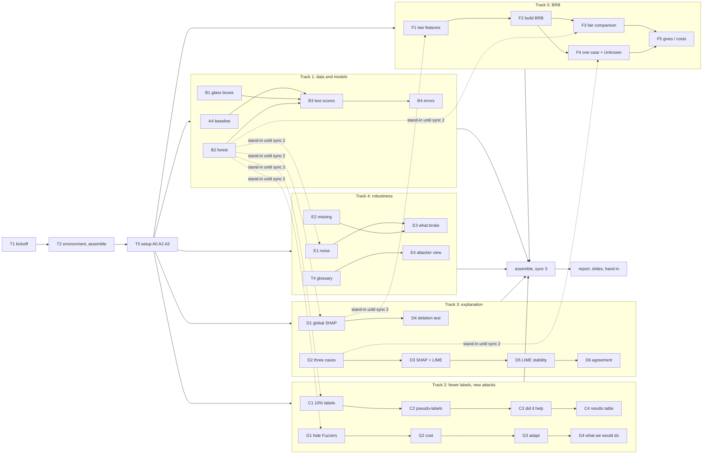

# Final Mini Project Task List: An Explainable and Robust Cyber-Defence Model

- **Course:** AI for Cybersecurity (D7084E / D7041E)
- **Hand-in deadline:** Thursday 15 October 2026, **08:00** (notebook, README and report on Canvas)
- **Presentation:** Thursday 15 October 2026, 14:45–18:00. 13 minutes per group, then questions.
  **Every member must be there and must speak**, or that member gets F
- **Random seed:** `42` everywhere (`random_state=42`, `np.random.default_rng(42)`)
- **Instructions:** `15_oct_Final Mini Project.pdf` (same text in `15_oct_Final Mini Project.txt`)
- **Dataset:** UNSW-NB15, CICFlowMeter version, in `UNSW-NB15/` (why this one: `Dataset_Choice.md`)

This file turns the mini-project instructions into tasks that several people can work on at the same
time. It assumes **no background** in cybersecurity, machine learning or programming: section 0
explains every word you need, and every task says *why* it exists before it says *what* to do.

| Section | What it gives you |
|---|---|
| [0. Words you need](#0-words-you-need-read-this-first) | Plain-language glossary. Read it once before starting |
| [1. Starting point](#1-starting-point-checked-on-2026-10-09) | What is in this folder, facts about the data, what a trial run showed, decisions already made |
| [2. How we work in parallel](#2-how-we-work-in-parallel) | Part notebooks, step markers, stand-ins, the shared names, the test-set rule, git |
| [Task overview](#task-overview) | Every task on one page, with what it needs first |
| [Division of work](#division-of-work) | Tracks for 2 to 5 people, sync points, day-by-day plan |
| [3. Tasks in detail](#3-tasks-in-detail) | Why, background, what to do, pitfalls, done-when, for each task |
| [4. Grading checklist](#4-grading-checklist) | Which task covers which grading requirement |
| [5. Questions for the teacher](#5-questions-for-the-teacher) | Open points, with the default we use until we get an answer |

Task IDs: **T1–T4** are setup tasks. The project's own parts keep the brief's letters: **A1–A4, B1–B4,
C1–C4, D1–D6, E1–E4, F1–F5, G1–G4**, so every task matches the PDF directly. **X1–X9** are optional
extras, **P1–P3** are the presentation and **H1–H5** are the hand-in.

---

## 0. Words you need (read this first)

### 0.1 Computer and programming basics

| Word | Meaning |
|---|---|
| **Terminal** | The window where you type commands (Linux/macOS: "Terminal"; Windows: "PowerShell"). Every command in this file is typed there and run with Enter |
| **Folder / path** | Where a file lives. `UNSW-NB15/Data.csv` = the file `Data.csv` inside the folder `UNSW-NB15`. Paths in this file start from the project folder |
| **Python** | The programming language we use. Version 3.13 |
| **Library / package** | Code someone else wrote that we reuse: `pandas` (tables), `scikit-learn` (models), `shap` and `lime` (explanations), `matplotlib` (figures) |
| **Virtual environment (`.venv`)** | A private folder holding exactly the library versions in `requirements.txt`, so everyone's code gives the same numbers. You *activate* it in every new terminal |
| **uv** | A fast tool that creates the virtual environment and installs the libraries |
| **Jupyter notebook (`.ipynb`)** | A document made of *cells*. A **code cell** holds Python and shows its output below it; a **Markdown cell** holds text. "Run All" runs every cell from top to bottom |
| **Kernel** | The Python process behind a notebook. "Restart kernel and run all" = start fresh and run everything, the way the grader will |
| **Variable** | A name that holds a value, e.g. `X_train` holds the training table |
| **Function** | A named piece of code you can call, e.g. `score(model, X, y)` returns the scores of a model |
| **DataFrame / Series** | pandas' table / one column of a table |
| **CSV** | A plain-text table: one row per line, columns separated by commas |
| **`assert`** | A line that stops the notebook with an error if something is not true. We use them as built-in checks |
| **git / repository** | git records every version of the project's files. The *repository* is the project folder with that history |
| **Commit / branch / merge / pull / push** | *Commit* = save a snapshot. *Branch* = your own line of work. *Merge* = bring your branch into the shared `main`. *Pull* = get the others' work. *Push* = send yours |
| **Seed** | A number that fixes all "random" choices, so a rerun gives exactly the same result |

### 0.2 The security problem

| Word | Meaning |
|---|---|
| **Packet** | One small chunk of data sent over a network |
| **Network flow** | One conversation between two computers, summarised as a row of numbers: how long it lasted, how many packets went each way, how big they were, how long the gaps between them were. **One row of our table = one flow** |
| **Forward / backward** | *Forward* (`Fwd`) = packets from the side that started the conversation (for an attack: the attacker). *Backward* (`Bwd`) = the replies from the other side |
| **CICFlowMeter** | The program that turned the recorded traffic into flows and computed the 76 numbers per flow |
| **Intrusion detection system (IDS)** | The program that looks at flows and says "attack" or "normal". Our models are IDSs |
| **SOC analyst** | The person in a Security Operations Centre who reads the IDS alerts and decides what to do |
| **Benign** | Normal, harmless traffic |
| **False alarm (false positive)** | The IDS calls a normal flow an attack. Costs analyst time; too many and people stop reading alerts |
| **Missed attack (false negative)** | The IDS calls an attack normal. The attacker gets through unnoticed |
| **UNSW-NB15** | A public dataset of network traffic recorded in 2015 at UNSW Canberra: normal traffic plus nine kinds of attacks generated with a traffic tool. Our copy is the version re-processed with CICFlowMeter |
| **TCP handshake / window size** | How two computers start a conversation. `Init Win Bytes` = the "window" each side announces at the start. It depends on the operating system, so it acts like a fingerprint of the machine |

The nine attack types (from `UNSW-NB15/Readme.txt`, code in brackets):

| Attack type | In plain words |
|---|---|
| **Benign** (0) | Normal traffic |
| **Analysis** (1) | Probing web applications and ports to study the target (port scans, spam, HTML file penetration) |
| **Backdoor** (2) | Using a secret way into a computer that bypasses its normal login |
| **DoS** (3) | Denial of service: overloading a service so real users cannot use it |
| **Exploits** (4) | Using a known software bug to break into a system |
| **Fuzzers** (5) | Sending large amounts of random or malformed data to make a program crash or misbehave |
| **Generic** (6) | Attacks that work against every block cipher (encryption) of a given size, whatever the key |
| **Reconnaissance** (7) | Scanning the network to find out which machines and services exist, before attacking |
| **Shellcode** (8) | A small piece of attack code sent inside a packet to take control of a program |
| **Worms** (9) | Malware that copies itself to other computers on its own |

### 0.3 Machine learning basics

| Word | Meaning |
|---|---|
| **Feature** | One column of the table, e.g. `Flow Duration`. We have 66 after cleaning |
| **Label** | The right answer for a row. We use **1 = attack, 0 = benign**. We also keep the attack type (`Fuzzers`, …) for Part G |
| **Model / classifier** | A program that learns from labelled rows and then guesses the label of new rows |
| **Train / validation / test set** | We split the rows 60/20/20. *Train*: the model learns from it. *Validation*: we use it to choose settings. *Test*: only for the final scores. Using the test set to choose anything gives an F |
| **Stratified split** | Each part gets the same share of every class (here: of every attack type) |
| **Leakage** | Accidentally letting information from the test set, or from the answer, into training. Scores then look better than they really are |
| **Glass box** | A model a person can read: a **decision tree** (a chain of yes/no questions) or **logistic regression** (one weight per feature) |
| **Black box** | A model too big to read: a **random forest** (300 decision trees that vote) or gradient boosting |
| **Setting (hyperparameter)** | A choice made before training, e.g. the depth of a tree. Chosen on the validation set |
| **Probability / threshold** | The model's confidence that a flow is an attack, 0 to 1. At or above the threshold (0.5) we call it an attack |
| **Overfitting** | The model memorises the training rows and does worse on new rows |
| **Duplicate rows** | Identical flows. If one copy is in training and one in test, the test is too easy. We remove them before splitting |

### 0.4 Scores (metrics)

Imagine 1,000 test flows, 263 of them attacks (our real proportions).

| Score | Meaning | Good value |
|---|---|---|
| **Accuracy** | Share of all flows labelled correctly. Misleading when attacks are rare | high, but compare with the trivial baseline |
| **Recall** (detection rate) | Of the 263 real attacks, what share did we catch? | high |
| **Precision** | Of the flows we called attacks, what share really were? | high |
| **F1** | One number that balances precision and recall | high |
| **Macro-F1** | F1 for the attack class and F1 for the benign class, averaged equally. The big benign class cannot inflate it | high |
| **FAR** (false alarm rate) | Of the 737 normal flows, what share did we wrongly call attacks? `FP / (FP + TN)` | **low** |
| **PR-AUC** (average precision) | How well the model ranks attacks above normal flows, built from precision and recall over all thresholds. A model that guesses scores the attack share (0.263) | high |
| **Confusion matrix** | The 2 × 2 table of (true benign / true attack) × (called benign / called attack) |
| **Trivial baseline** | A "model" that always answers the majority class (benign). Here: accuracy about 0.737, recall 0. Every real score is compared with it |

The brief asks for **macro-F1, recall, PR-AUC and FAR** for every model. We also show accuracy, because
the baseline is defined by it.

### 0.5 Learning with fewer labels (Part C)

| Word | Meaning |
|---|---|
| **Label budget** | How many training rows we pretend have a label. Here 10% of 3,000 = 300 |
| **Lower line** | The black box trained on the 300 labelled rows alone. The method must beat this to count as help |
| **Upper line** | The black box trained on all 3,000 labels (Part B) |
| **Pseudo-labelling** (semi-supervised) | The model labels the unlabelled rows it is very sure about, adds them to its training data, and retrains |
| **Confidence cutoff** | How sure the model must be before a guess is used, e.g. 0.95 |
| **Self-supervised / pretext task** | Learn from the unlabelled rows with a made-up task that needs no labels (e.g. fill in hidden values), then train the classifier on the few labels |

### 0.6 Explanations (Part D)

| Word | Meaning |
|---|---|
| **Global explanation** | Which features matter most for the model overall |
| **Local explanation** | Why the model gave *this one* flow its score |
| **SHAP** | Splits one prediction into one contribution per feature: "`Flow IAT Mean` pushed the attack probability up by 0.12". *Base value* (the average output) + all contributions = the model's output |
| **TreeExplainer** | The fast, exact SHAP method for tree models |
| **Bar / beeswarm / waterfall plot** | SHAP figures: average importance per feature / one dot per flow per feature / one flow's contributions stacked up |
| **LIME** | Another explanation method: it makes thousands of slightly changed copies of the flow, asks the model about each, and fits a straight line. The slopes are the explanation. It uses randomness |
| **Fit score (R²)** | How well LIME's straight line matches the model, 0 (useless) to 1 (perfect) |
| **Fidelity / faithful** | The explanation really describes what the model does |
| **Deletion test** | Replace the features the explanation calls most important with "ordinary" values (training medians). If the model's probability drops a lot more than when you replace random features, the explanation was faithful |
| **Stability / stable** | Running the explanation again (another seed) gives the same answer |
| **Correlated features ("twins")** | Features that carry almost the same information. SHAP and LIME can split the credit between twins differently, which causes disagreement |

### 0.7 Robustness (Part E)

| Word | Meaning |
|---|---|
| **Robustness** | How much the scores drop when the input gets messy |
| **Standard deviation (std)** | How spread out a column's values are. Noise is sized as a share of each feature's training std |
| **Gaussian noise** | Small random errors, mostly small and sometimes larger, like a sensor that measures slightly wrong |
| **Median** | The middle value of a column. Used as the "ordinary" value when a feature is missing |
| **Missing feature** | A field the sensor failed to record. We fill it with the training median |
| **Evasion attack** | The attacker changes their own traffic until the model calls it normal. **Constrained** = only changes a real attacker could make |

### 0.8 Belief rule base, BRB (Part F)

| Word | Meaning |
|---|---|
| **Rule** | IF `feature 1` is Low AND `feature 2` is High THEN risk is (Low 0.1, Medium 0.3, High 0.6) |
| **Antecedent** | The IF part: the two input features |
| **Referential values** | The three reference points Low / Medium / High of each feature. We take the 5th percentile, median and 95th percentile of the training data |
| **Matching degree** | How much a value belongs to each level. A value halfway between Low and Medium is 0.5 Low and 0.5 Medium |
| **Activation weight** | How strongly a rule fires for this flow. The 9 weights add up to 1 |
| **Belief degree** | The THEN part: how much the rule believes in each risk level |
| **Evidential Reasoning (ER)** | The formula that combines the beliefs of all firing rules into one answer |
| **Unknown (ignorance)** | The part of the belief the rules cannot assign to any level, e.g. because a rule had little training data or an input is missing. **A forest cannot say "I don't know"; a BRB can** |
| **Utility** | One risk number from the beliefs (Low = 0, Medium = 50, High = 100) that we compare with a threshold |

### 0.9 Adaptability (Part G)

| Word | Meaning |
|---|---|
| **Hidden (unseen) attack** | An attack type removed from the training data, standing in for a brand-new attack ("zero-day") |
| **Concept drift** | The traffic or the attacks change over time, so a model trained last month slowly gets worse |
| **Adapting** | An analyst labels a few examples of the new attack; we add them and retrain |
| **Monitoring** | Watching the model in use (alert rate, uncertain predictions, feature distributions) to notice that something changed |

---

## 1. Starting point (checked on 2026-10-09)

### 1.1 What is in this folder

This folder is **self-contained**: nothing in `PreviousLabs/` is needed. These files were copied from
the earlier labs:

| Path | Copied from | What it is for |
|---|---|---|
| `UNSW-NB15/Data.csv`, `Label.csv`, `Readme.txt` | downloaded dataset | **The data.** 447,915 flows × 76 features, labels 0–9. 188 MB, **not in git** (section 1.2) |
| `UNSW-NB15/CICFlowMeter_out.csv` | downloaded dataset | 1.8 GB, every flow with IP addresses. **Do not use** (section 1.2) |
| `requirements.txt` | Lab 4.2 (+ `pytest`) | Pinned library versions that work together (Python 3.13, scikit-learn 1.6.1, shap 0.52.0, lime 0.2.0.1, …) |
| `tools/assemble.py` | Lab 4.2 | Merges our part notebooks into the single hand-in notebook. Needs small edits (T2) |
| `tools/feature_glossary.py` | Lab 4.2 | Writes a plain-language table of the features. Written for CICIDS2017 names; adapted in T4 |
| `tools/check_report_numbers.py` | Lab 4.2 | Checks that the numbers in the report match the notebook's tables. Rewritten for our tables in H3 |
| `src/brbes.py`, `src/test_brbes.py` | Lab 3, unchanged | The BRB engine (input transformation, rule activation, Evidential Reasoning, Unknown, utility, rules built from training data, step-by-step trace) and its tests. Used in Part F |
| `src/xai_tools.py`, `src/test_xai_tools.py` | Lab 3 (one change: the seed is now set in the file) | SHAP/LIME helpers: `deletion_test`, `lime_stability`, `lime_explain`, `topk_overlap`, `rank_agreement`, `importance_table`. Used in Part D |
| `report/build_report.py`, `report/build_docx.py`, `report/title_page_template.docx`, `report/fonts/` | Lab 4.2 | Turn the Markdown report into PDF and Word. Need small edits (H2) |
| `reference/lab4_1_phishing/` | Lab 4.1 | Part notebooks and report of Lab 4.1. **Read-only examples** of: tree depth chosen on validation, 5% labels + pseudo-labelling + self-supervised, SHAP bar/beeswarm/waterfall, LIME, three cases, LIME stability, a 2-feature BRB compared with a tree and a forest on the same 2 features |
| `reference/lab4_2_robustness/` | Lab 4.2 | Part notebooks, README, report and reference list of Lab 4.2. **Read-only examples** of: setup notebook, `add_noise`, `add_missing`, a constrained greedy evasion attack, the deletion test, LIME fit, figure style |
| `parts/`, `results/figures/`, `results/tables/`, `report/figures/` | – | Empty. Where our work goes |
| `Dataset_Choice.md`, `CHANGELOG.md` | – | Why UNSW-NB15; history of changes to this folder |

The copied unit tests pass (`python -m pytest src`: 16 passed, checked 2026-10-09).

To open a reference notebook, open it in Jupyter like any other notebook. Copy code from it into your
own part notebook; never edit the reference files and never `%run` them.

### 1.2 Facts about the data

Measured on 2026-10-09:

| Fact | Value | What it means for us |
|---|---|---|
| `Data.csv` | 447,915 rows × 76 numeric columns, no IDs, no IP addresses | All features are numbers already: nothing to encode |
| `Label.csv` | one column `Label`, codes 0–9, same 447,915 rows in the same order | Read both files and put them side by side |
| Infinite, missing or negative values | **none** | No filling needed for the real data |
| Exact duplicate rows (features + label) | **141,742** (133,329 of them benign) | Drop before sampling, otherwise copies of one flow land in both train and test |
| Rows with identical features but different labels | **1,068** (after dropping exact duplicates) | Drop them: no model can get them right, and they are noise |
| Clean rows | **305,105** | What we sample from |
| Columns with one constant value | 9 in the whole file; 10 in our training split (`RST Flag Count` is also constant there) | Drop the ones constant in **training** (they carry no information) → **66 features** |
| 0/1 columns | `Fwd PSH Flags` (in our training split; `RST Flag Count` is the other one in the whole file) | Do not add noise to it in Part E |
| `CICFlowMeter_out.csv` | 3,540,241 rows: every flow of the capture (all 89,583 attacks + 3,450,658 benign) with Flow ID, IPs, ports, timestamp | `Data.csv` = all attacks + about 10% of the benign flows. **In the real traffic only about 2.5% of flows are attacks**, not 26% as in our sample. Say this in the report: precision and the number of false alarms per day would be much worse in reality |
| Attacker IP addresses | 100% of attacks come from `175.45.176.x`, against 1.6% of benign flows | IP addresses would give the answer away. Never use the big file's IP columns |
| Feature names | CICFlowMeter v4 names, e.g. `Total Fwd Packet`, `FWD Init Win Bytes`, `Fwd Seg Size Min` | Different spelling from the CICIDS2017 names in the reference notebooks |

Counts per attack type (code in brackets):

| Attack type | Raw rows | Clean rows | In our 5,000-row sample | Train / val / test |
|---|---:|---:|---:|---|
| Benign (0) | 358,332 | 224,847 | 3,685 | about 2,211 / 737 / 737 |
| Exploits (4) | 30,951 | 30,836 | 505 | 303 / 101 / 101 |
| Fuzzers (5) | 29,613 | 26,010 | 426 | 256 / 85 / 85 |
| Reconnaissance (7) | 16,735 | 11,988 | 197 | 118 / 39 / 40 |
| Generic (6) | 4,632 | 4,373 | 72 | 43 / 15 / 14 |
| DoS (3) | 4,467 | 4,315 | 71 | 43 / 14 / 14 |
| Shellcode (8) | 2,102 | 1,663 | 27 | 16 / 6 / 5 |
| Backdoor (2) | 452 | 452 | 7 | small |
| Analysis (1) | 385 | 385 | 6 | small |
| Worms (9) | 246 | 236 | 4 | small |
| **Total** | 447,915 | 305,105 | 5,000 (26.3% attacks) | 3,000 / 1,000 / 1,000 |

### 1.3 What a trial run showed (so you know what to expect)

A quick trial on 2026-10-09 followed exactly the recipe in section 1.5 (on an 8-core laptop). These are
**validation-set** numbers with **default** settings, only to check the plan works. They are **not**
results for the report: the report's numbers come from the assembled notebook (sync 3).

| What | Trial result | Consequence for the plan |
|---|---|---|
| Reading `Data.csv` + `Label.csv` | 23 s | Fine |
| Whole load + clean + sample + split | about 60 s | Leaves about 4 minutes for everything else (the 5-minute limit) |
| Random forest, 300 trees, 3,000 rows | 1.5 s to train | No need to save models to disk: just retrain |
| Forest (default), validation | macro-F1 0.957, recall 0.981, PR-AUC 0.936, FAR 0.039 | Far above the trivial baseline (0.737 accuracy, recall 0) |
| Tree (depth 6), validation | macro-F1 0.946, recall 0.951, PR-AUC 0.908, FAR 0.041 | The glass box is not far behind |
| SHAP TreeExplainer, 500 validation rows | 24 s | Use 300–500 rows for the global SHAP, not more |
| Global SHAP top 5 | `FWD Init Win Bytes`, `Fwd Seg Size Min`, `Bwd Init Win Bytes`, `Bwd Packets/s`, `Flow IAT Mean` | The top 3 describe the **TCP settings of the machines**, not the attack itself. Likely a *shortcut*: all attacks come from the same few attacker machines. Discuss in D1 and the Discussion (X6 tests it) |
| BRB levels for `Fwd Seg Size Min` | only 5 distinct values; 5th/50th/95th percentile = 8 / 32 / 32 | Cannot have three levels → F1 skips it. The likely BRB pair is `FWD Init Win Bytes` (levels 0 / 5,792 / 26,064) and `Bwd Init Win Bytes` (0 / 14,480 / 31,856) |
| Hide one attack type from training, recall on it (validation) | Fuzzers 0.976 → **0.859**; Exploits 0.980 → 0.950; Reconnaissance 1.000 → 0.974; Generic, DoS, Shellcode stay at 1.000 | The drop is **much smaller than the brief predicts** ("usually very low"). Fuzzers drops the most and has enough rows, so we hide Fuzzers. Report the small drop honestly and explain it (G4, X6) |

### 1.4 Where our data differs from the brief

| The brief says | Our data | What to do |
|---|---|---|
| "UNSW-NB15, network intrusion with a different feature set from CICIDS" | Our copy has the **same kind** of features as CICIDS (CICFlowMeter), not the original 49 UNSW-NB15 features | Name the version correctly in the report and README |
| Part G: use attack types; if there are none, use a period/source column or a time split | We **have** attack types | Hide one attack type (Fuzzers). No fallback needed |
| "Choose 4,000 to 5,000 rows, with a mix of attack and normal labels" | 5,000 rows, 26.3% attacks | State the sample size and how it was drawn in the report and README |
| "Usually very low" recall on the hidden attack | About 0.86 in the trial | A smaller drop is a real result. Explain it, do not hide it |
| "Notebook runs in under five minutes" | About 1 minute is data loading | Keep SHAP and LIME small; measure the run time in H4 |

### 1.5 Decisions already made (change them at kickoff if you disagree)

| Decision | Choice | Why |
|---|---|---|
| Data file | `UNSW-NB15/Data.csv` + `UNSW-NB15/Label.csv`; never `CICFlowMeter_out.csv` | No IP addresses (leakage), 10× smaller |
| Label | `y = 1` for every attack type, `0` for Benign; keep the attack-type name in `type_*` | Binary detector as in the brief; the type is needed in Part G |
| Cleaning | 1) drop exact duplicate rows, 2) drop rows whose identical features carry different labels, 3) (after the split) drop columns that are constant in training | Section 1.2 |
| Sample | 5,000 rows, `train_test_split(train_size=5000, stratify=attack type, random_state=42)` from the clean rows | The brief's size; keeps the natural mix of attack types |
| Split | 60/20/20, stratified on the **attack type**: first `test_size=0.20`, then `test_size=0.25` of the rest, `random_state=42` → 3,000 / 1,000 / 1,000 | Same as our Lab 1 and Lab 4.2; every attack type appears in every part |
| Glass boxes | Decision tree (depth chosen on validation) and logistic regression (scaled inside a Pipeline, `C` chosen on validation) | The brief asks for at least one; both are cheap |
| Black box | Random forest, 300 trees, `max_depth` and `min_samples_leaf` chosen on validation | Fast, strong, and SHAP TreeExplainer is exact for it |
| Threshold | 0.5 for every model (the BRB's threshold is chosen on validation, F2) | Simple and the same for everyone |
| Global SHAP | On **validation** rows | Part F picks its two features from this ranking; that is a choice, so it must not look at the test set |
| Part C | 10% of the training labels (300 rows); pseudo-labelling with the cutoff chosen on validation; self-supervised is the optional extra X1 | The brief allows either; pseudo-labelling is the simplest |
| Part E | Noise **and** missing features (required); evasion is the optional extra X3 | The brief asks for at least one, at several levels |
| Part F | Lab 3's tested engine `src/brbes.py`; referential values = training 5th percentile / median / 95th percentile; rule beliefs from the training data | Already tested; the brief asks for 3 levels × 2 features = 9 rules |
| Part G | Hide **Fuzzers**; adapt with 50 and with 100 labelled Fuzzers rows taken from the removed **training** rows | Largest drop in the trial and enough rows (section 1.3) |
| Models on disk | None. Every model is retrained when the notebook runs | Training takes seconds |
| Python | 3.13 with `requirements.txt` | Same as Labs 3, 4.1 and 4.2 |

---

## 2. How we work in parallel

### 2.1 Part notebooks, step markers and stand-ins

The brief wants **one** notebook that runs from top to bottom. Several people editing one `.ipynb` file
causes painful git conflicts. So everyone works in their **own** part notebook in `parts/`, and
`tools/assemble.py` builds the hand-in notebook from them (this worked in Labs 4.1 and 4.2).

1. **Step marker.** The first line of every cell names its step: `# STEP B2` in code cells,
   `<!-- STEP B2 -->` in Markdown cells. The assembly script puts cells in this order:
   A0, A1, A2, A3, A4, B1 … B4, C1 … C4, D1 … D6, E1 … E4, F1 … F5, G1 … G4, then X1 … X9. Inside one
   step it keeps your order.
2. **Setup first.** Every part notebook except `00_setup.ipynb` starts with this one cell:
   ```python
   # STANDIN A0
   %run 00_setup.ipynb
   ```
   It loads the data, makes the split and defines the shared helpers (section 2.3).
3. **Stand-in cells.** When you need something another person has not finished (e.g. the forest's
   chosen settings from B2), write a quick simple version yourself in a cell whose first line is
   `# STANDIN B2`. It must use the **same name** as in section 2.3. The assembly script drops stand-ins;
   in the hand-in notebook the real step fills the gap. Ready-made stand-ins are in section 2.3.
4. **Use the shared names** of section 2.3, so cells from different people fit together.
5. **Numbers for the report** come from one run of the assembled notebook (sync 3), never from a part
   notebook.

### 2.2 Folder layout and who edits what

Every file has **one** owner who edits it. Everyone else only reads it.

```
AI-for-Cybersecurity-Final-Mini-Project/
├── TASKLIST.md                      everyone (only tick your own boxes)
├── README.md                        H1 owner
├── requirements.txt, .gitignore     T2 owner
├── UNSW-NB15/                       the data (not in git; get it from the group's shared folder)
├── parts/
│   ├── 00_setup.ipynb               Track 1   A0, A2, A3 (shared setup)
│   ├── 10_baseline_models.ipynb     Track 1   A1, A4, B1–B4, X8, X9
│   ├── 20_few_labels.ipynb          Track 2   C1–C4, X1, X2
│   ├── 30_explanation.ipynb         Track 3   D1–D6, X6
│   ├── 40_robustness.ipynb          Track 4   E1–E4, X3
│   ├── 50_brb.ipynb                 Track 5   F1–F5, X7
│   └── 60_adaptability.ipynb        Track 2   G1–G4, X4, X5
├── src/                             read-only (copied, tested helpers)
├── tools/assemble.py                T2 owner
├── mini_project_unsw_nb15.ipynb     made by tools/assemble.py, never edited by hand
├── results/figures/<step>_<name>.png    written by the step's owner
├── results/tables/<step>_<name>.csv     written by the step's owner
├── report/                          H2 owner (everyone sends text)
└── reference/                       read-only examples from Labs 4.1 and 4.2
```

### 2.3 The shared names (the contract)

These names connect the tasks. **Do not rename them.** The "made in" task owns the real version;
anyone else may use the stand-in.

**Made by the setup notebook (T3), available everywhere:**

| Name | What it is |
|---|---|
| `SEED = 42` | The seed |
| `ATTACK_NAMES` | `{0: "Benign", 1: "Analysis", …, 9: "Worms"}` from `UNSW-NB15/Readme.txt` |
| `CLEAN_COUNTS` | dict with the row counts of each cleaning step (raw, after duplicates, after conflicts, sample) for A2 |
| `clean_df` | the 305,105 clean rows (features + `attack_type`). **Never train on rows outside the sample**; only X4 uses it, for testing |
| `X_train, X_val, X_test` | pandas DataFrames, 66 raw (unscaled) feature columns |
| `y_train, y_val, y_test` | pandas Series, 1 = attack, 0 = benign |
| `type_train, type_val, type_test` | pandas Series with the attack-type name (`"Benign"`, `"Fuzzers"`, …), same rows as `y_*` |
| `FEATURES` | list of the 66 feature names |
| `FLAG_COLS`, `CONT_COLS` | the 0/1 columns (2 distinct values in training) and the continuous ones |
| `TRAIN_MEDIAN`, `TRAIN_STD` | pandas Series, one value per feature, **measured on `X_train` only** |
| `score(model, X, y, threshold=0.5)` | returns `{"accuracy", "macro_f1", "recall", "pr_auc", "far"}` for any model with `predict_proba` |
| `score_proba(y, p, threshold=0.5)` | the same five scores from attack probabilities `p` (used for the BRB, whose output is not a scikit-learn model) |
| `TABLES`, `FIGURES` | `Path("results/tables")`, `Path("results/figures")` |

**Made by the project steps:**

| Name | Type | Made in | Used by |
|---|---|---|---|
| `FOREST_SETTINGS` | dict of the forest's chosen settings, incl. `n_estimators=300`, `random_state=SEED`, `n_jobs=-1` | B2 | C, E, F, G |
| `make_forest()` | returns a new, untrained forest with `FOREST_SETTINGS` | B2 | C, F, G |
| `tree`, `logreg`, `forest` | the three Part B models, trained on all of `X_train` | B1, B2 | C4, D, E |
| `MODELS` | `{"tree": tree, "logreg": logreg, "forest": forest}` | B2 | E |
| `forest_few`, `forest_pseudo` | the lower line and the pseudo-labelling forest | C1, C2 | C4 |
| `shap_global` | pandas Series: feature → mean \|SHAP\| on validation rows, sorted | D1 | F1 |
| `TOP2` | list of the two features for the BRB | F1 (from `shap_global`) | F2–F5 |
| `CASES` | `{"detection": i, "negative": j, "mistake": k}`: **positions** in `X_test` of the three explained flows | D2 | D3–D6, F4 |
| `add_noise(X, level, seed=SEED)` | noisy copy of `X` | E1 | X3 |
| `add_missing(X, frac, seed=SEED)` | copy of `X` with a share of each row's values set to `TRAIN_MEDIAN` | E2 | X3 |
| `HIDDEN = "Fuzzers"` | the hidden attack type | G1 | G2–G4, X4 |

**Ready-made stand-ins** (copy the one you need into your notebook, right after the setup cell):

```python
# STANDIN B2
from sklearn.ensemble import RandomForestClassifier
from sklearn.linear_model import LogisticRegression
from sklearn.pipeline import Pipeline
from sklearn.preprocessing import StandardScaler
from sklearn.tree import DecisionTreeClassifier

FOREST_SETTINGS = {"n_estimators": 300, "random_state": SEED, "n_jobs": -1}
def make_forest():
    return RandomForestClassifier(**FOREST_SETTINGS)

tree = DecisionTreeClassifier(max_depth=6, random_state=SEED).fit(X_train, y_train)
logreg = Pipeline([("scale", StandardScaler()),
                   ("model", LogisticRegression(max_iter=2000, random_state=SEED))]).fit(X_train, y_train)
forest = make_forest().fit(X_train, y_train)
MODELS = {"tree": tree, "logreg": logreg, "forest": forest}
```

```python
# STANDIN D1
import shap
_sv = shap.TreeExplainer(forest)(X_val.iloc[:300])
shap_global = (pd.Series(np.abs(_sv.values[:, :, 1]).mean(axis=0), index=FEATURES)
               .sort_values(ascending=False))
```

```python
# STANDIN D2
_p = forest.predict_proba(X_test)[:, 1]
_yt = y_test.to_numpy()
_tp = np.flatnonzero((_yt == 1) & (_p >= 0.5)); _tn = np.flatnonzero((_yt == 0) & (_p < 0.5))
_wrong = np.flatnonzero((_p >= 0.5) != (_yt == 1))
CASES = {"detection": int(_tp[np.argmax(_p[_tp])]), "negative": int(_tn[np.argmin(_p[_tn])]),
         "mistake": int(_wrong[np.argmax(np.abs(_p[_wrong] - 0.5))])}
```

### 2.4 The test-set rule (an F if broken)

The brief: "Choose all settings on the validation set. The test set is touched once, at the end." and
"The test set was used to choose settings, or the labels of the hidden set were used in training" gives
an F. In practice:

- **Every choice is made on validation, in code that stays in the notebook**: tree depth, forest settings,
  logistic regression `C`, the pseudo-labelling cutoff, the BRB features (`TOP2`), the BRB threshold, the
  2-feature tree's depth. The grader can then see how each was chosen.
- **Test scores come only from the last step of each part** (B3, C4, D4/D5 on the three cases, E1–E3,
  F3, G2, G3). Those cells score fixed models and choose nothing.
- **Never change a setting after looking at a test number.** If you must, say so in the report.
- **Explaining test flows is fine** (D2–D6): it picks nothing that changes a model.
- **Part G:** Fuzzers rows of the **test** set are never added to training. The 50–100 "newly labelled"
  rows come from the Fuzzers rows that G1 removed from the **training** set.
- **Part C:** the 90% of training rows whose labels are hidden (`y_hidden`) may only be used to *check*
  how many pseudo-labels were right, never to train.

### 2.5 Figures and tables for the report

Save every figure and table the report or the slides may use, with the step in the file name:
`results/figures/D1_shap_beeswarm.png`, `results/tables/B3_test_scores.csv`. Put the saving code in the
step's own cell, so the assembled notebook regenerates everything. SHAP plots need `show=False` before
`plt.savefig(...)`. Every figure in the report needs a caption (the brief grades it).

### 2.6 Git for beginners (run these yourself)

Once, after T1 (replace `<you>` with your name):

```bash
git clone <repository URL>
cd AI-for-Cybersecurity-Final-Mini-Project
git switch -c <you>                       # your own branch
```

Every time you finish a piece of work:

```bash
git add parts/<your notebook>.ipynb results/
git commit -m "C2: pseudo-labelling with cutoff chosen on validation"
git push -u origin <you>
```

At a sync point, to bring the others' work into your branch:

```bash
git switch main && git pull
git switch <you> && git merge main
```

Only edit files you own (section 2.2); then merges never conflict. `UNSW-NB15/` is not in git: copy it
from the group's shared folder.

---

## Task overview

Replace ☐ with ☑ when a task is done. "Needs" = what must exist first. Every task that only needs **T3**
can start as soon as the setup notebook is on `main`.

### Setup

| ID | Task | What it is and why | Needs | Done |
|---|---|---|---|---|
| T1 | Kickoff | Agree on sections 1.5 and 2, pick tracks, share the data, create branches. After this, nobody waits for anybody | – | ☐ |
| T2 | Environment and assembly script | Everyone installs the same libraries; `assemble.py` knows this project's steps | T1 | ☐ |
| T3 | Setup notebook (steps A0, A2, A3) | Load, clean, sample, split; build every shared name of section 2.3 | T2 | ☐ |
| T4 | Feature glossary | One table: what each of the 66 features means in plain words. Everyone needs it to read SHAP results | T2 | ☐ |

### Part A: the problem and the data

| ID | Task | What it is and why | Needs | Done |
|---|---|---|---|---|
| A1 | State the problem | 2–3 sentences: what is detected, who uses it, what a false alarm costs | T1 | ☐ |
| A2 | Load and clean (in T3) | Counts of records and features, class balance, cleaning steps | T3 | ☐ |
| A3 | Split 60/20/20 (in T3) | Stratified split, checked | T3 | ☐ |
| A4 | Trivial baseline | Always-benign accuracy and recall on validation and test: the line every model must beat | T3 | ☐ |

### Part B: supervised models

| ID | Task | What it is and why | Needs | Done |
|---|---|---|---|---|
| B1 | Glass boxes | Decision tree and logistic regression, settings chosen on validation | T3 | ☐ |
| B2 | Black box | Random forest, settings chosen on validation; publishes `FOREST_SETTINGS`, `make_forest` | T3 | ☐ |
| B3 | Test scores | Four metrics on the test set, next to the trivial baseline | B1, B2, A4 | ☐ |
| B4 | Where the models go wrong | Confusion matrices and recall per attack type | B3 | ☐ |

### Part C: learning with fewer labels

| ID | Task | What it is and why | Needs | Done |
|---|---|---|---|---|
| C1 | Keep 10% of the labels; lower line | Forest on 300 labelled rows only | T3 (B2 or stand-in) | ☐ |
| C2 | Pseudo-labelling | Cutoff chosen on validation; how many guesses were right | C1 | ☐ |
| C3 | Did the unlabelled data help? | Validation comparison and a plain yes/no with the reason | C2 | ☐ |
| C4 | The results table | All models, four metrics, trivial baseline, test set: the report's main table | C3, B3 (or stand-ins) | ☐ |

### Part D: explanation

| ID | Task | What it is and why | Needs | Done |
|---|---|---|---|---|
| D1 | Global SHAP | Which features drive the forest; do they make sense to a security person? | T3 (B2 or stand-in) | ☐ |
| D2 | Pick the three cases | Confident detection, confident negative, a mistake (test set) | T3 (B2 or stand-in) | ☐ |
| D3 | Local SHAP and LIME | Explain the three cases with both methods | D2 | ☐ |
| D4 | Fidelity: deletion test | Top-k SHAP features vs k random features, replaced with medians | D1 | ☐ |
| D5 | Stability of LIME | LIME with 10 seeds: how often is the top 3 the same? | D3 | ☐ |
| D6 | Do SHAP and LIME agree? Why not? | Investigate every disagreement (grade 5) | D3, D5 | ☐ |

### Part E: robustness

| ID | Task | What it is and why | Needs | Done |
|---|---|---|---|---|
| E1 | Noise | `add_noise`; all three models at 6 noise levels | T3 (B2 or stand-in) | ☐ |
| E2 | Missing features | `add_missing`; all three models at 5 levels | T3 (B2 or stand-in) | ☐ |
| E3 | What broke first? | Figure, and the level at which we stop trusting the model | E1, E2 | ☐ |
| E4 | What would an attacker change? | Feature-group table (needed for the Discussion); optional X3 runs the attack | T4 | ☐ |

### Part F: a knowledge-based layer (BRB, needed for grade 5)

| ID | Task | What it is and why | Needs | Done |
|---|---|---|---|---|
| F1 | Pick the two features | Top two usable features of the validation SHAP ranking → `TOP2` | D1 (or stand-in) | ☐ |
| F2 | Build the BRB | 3 referential values each, 9 rules from the training data, threshold on validation | F1 | ☐ |
| F3 | Fair comparison | BRB vs a tree and a forest that see only `TOP2`, test set | F2 | ☐ |
| F4 | Belief output for one case | Low / Medium / High / **Unknown**, step by step | F2, D2 (or stand-in) | ☐ |
| F5 | What the BRB gives and costs | Written comparison with numbers | F3, F4 | ☐ |

### Part G: adaptability

| ID | Task | What it is and why | Needs | Done |
|---|---|---|---|---|
| G1 | Hide Fuzzers from training | Remove Fuzzers from the training set only, retrain | T3 (B2 or stand-in) | ☐ |
| G2 | Measure the cost | Overall recall and Fuzzers recall on the test set | G1 | ☐ |
| G3 | Adapt with 50 and 100 labels | Add a few Fuzzers rows back, retrain, measure again | G2 | ☐ |
| G4 | What we would do | One paragraph: were a few labels enough; how to notice in a real system | G3 | ☐ |

### Optional extras (only after your own required steps are done)

| ID | Task | What it is and why | Needs | Done |
|---|---|---|---|---|
| X1 | Self-supervised alternative for Part C | Fill-in-the-blanks network on unlabelled rows + classifier on the 300 labels | C1 | ☐ |
| X2 | Part C with 5 label draws and 5% vs 10% | How much the verdict depends on which 300 rows were labelled | C3 | ☐ |
| X3 | Constrained evasion attack | Third robustness test; the attacker changes only what they control | E4 | ☐ |
| X4 | Part G on every Fuzzers flow outside the sample | About 25,600 flows: a far more precise recall than 85 test rows | G3 | ☐ |
| X5 | Hide each attack type in turn | Which attacks are "new" to the model and which are not | G2 | ☐ |
| X6 | Shortcut check | Retrain without the 3 TCP-settings features: does the model still work? | D1 | ☐ |
| X7 | BRB with a missing input; an expert edits a rule | Shows the Unknown part growing and the rules being editable | F4 | ☐ |
| X8 | Bigger sample | B3 with 20,000 rows: do the conclusions change? | B3 | ☐ |
| X9 | Confidence intervals | Bootstrap the test scores: how precise are numbers from 1,000 rows? | B3 | ☐ |

### Presentation and hand-in

| ID | Task | What it is and why | Needs | Done |
|---|---|---|---|---|
| P1 | Slides | 13 minutes, every member presents their own part | all parts | ☐ |
| P2 | Live demo | Run the notebook during the talk (required); recording as a backup | H4 | ☐ |
| P3 | Rehearsal | Full run-through with a timer, at least once | P1, P2 | ☐ |
| H1 | README | Dataset, where to get it, libraries, how to run (required) | T2, T3 | ☐ |
| H2 | Report, 6–8 pages | The eight headings of the brief, captioned figures, AI-use statement | all parts | ☐ |
| H3 | Number check | Every number in the report matches the notebook | H2, H4 | ☐ |
| H4 | Final run | Fresh run of the assembled notebook, under 5 minutes | all parts | ☐ |
| H5 | Upload | Notebook + README + code as zip or repository link, report as PDF, before 15 Oct 08:00 | H1–H4 | ☐ |

---

## Division of work

### Tracks

The work splits into **five tracks** that only meet through the shared names of section 2.3. Each
track is also one block of the presentation, so every member has their own part to explain.

| Track | Theme | Tasks | Report sections it writes | Presents |
|---|---|---|---|---|
| **1. Data and models** | What is the problem, how good are the models? | T3, A1–A4, B1–B4, H3, H4, (X8, X9) | 1 Problem and data; 2 Method (data, splits, models, settings); 3 Results (Part B rows) | Problem, data, baseline, Part B |
| **2. Fewer labels and new attacks** | Does unlabelled data help? What happens with an unseen attack? | C1–C4, G1–G4, (X1, X2, X4, X5) | 2 Method (Part C approach); 3 Results (table, "did it help?"); 6 Adaptability | Parts C and G |
| **3. Explanation** | What does the forest look at, and can we trust the explanations? | D1–D6, (X6) | 4 Explanation | Part D |
| **4. Robustness** | How much messy data can the model take? What could an attacker fake? | T4, E1–E4, H1, (X3) | 5 Robustness; the attacker part of 7 Discussion | Part E, live demo |
| **5. Knowledge layer** | Can 9 readable rules compete with a forest, and what does Unknown add? | F1–F5, H2 (merging), P1 (merging), (X7) | 2 Method (BRB); 3 Results (BRB table); Part F of 7 Discussion; 8 Who did what | Part F, conclusion |

Fewer people? Merge tracks like this:

| People | Person 1 | Person 2 | Person 3 | Person 4 |
|---|---|---|---|---|
| 4 | Track 1 | Track 2 | Track 3 | Tracks 4 + 5 |
| 3 | Tracks 1 + 4 | Track 2 | Tracks 3 + 5 | – |
| 2 | Tracks 1 + 2 + 4 | Tracks 3 + 5 | – | – |

Everyone writes the Discussion paragraph (report section 7) for their own parts; the H2 owner merges
them and writes the "would we deploy this?" conclusion with input from all.

### When we need each other

Everything outside these points can be done alone.

| Sync | When | What happens |
|---|---|---|
| 0 Kickoff | Fri 9 Oct | T1. Everyone has the data, the environment and a branch |
| 1 Setup merged | Sat 10 Oct, morning | T2 and T3 are on `main`, everyone pulls. From now on each works in their own part notebook |
| 2 Settings freeze | Sun 11 Oct, evening | B2 (`FOREST_SETTINGS`, `forest`), D1 (`shap_global`), D2 (`CASES`) are on `main`. Owners of C, E, F and G replace their stand-ins with the real cells and re-run. Did any number change? |
| 3 Assembly and results freeze | Mon 12 Oct, evening | `python tools/assemble.py --strict` runs without errors. **Its** numbers go into the report and slides. No setting changes after this |
| 4 Report and slides draft | Tue 13 Oct, evening | Every section of the report and every slide exists |
| 5 Hand-in | Wed 14 Oct, evening (deadline Thu 08:00) | H3, H4, H5. Do not leave the upload for the morning of the 15th |
| 6 Presentation | Thu 15 Oct | P3 rehearsal in the morning, presentation from 14:45 |



Dotted arrows are the only places where one track uses another's work, and a stand-in removes the wait.

### Suggested order

| Day | Track 1 | Track 2 | Track 3 | Track 4 | Track 5 |
|---|---|---|---|---|---|
| Fri 9 | T1; T3 | T1; read C and G | T1; read D, `src/xai_tools.py` | T1; T2 | T1; read F, `src/brbes.py` |
| Sat 10 | A1, A4, B1, B2 (merge B2 early) | C1, C2 | D1, D2, D3 | T4, E1, E2 | F1, F2 |
| Sun 11 | B3, B4 → sync 2 | C3, C4, G1, G2 | D4, D5 → sync 2 | E3, E4, H1 draft | F3, F4 |
| Mon 12 | X8/X9; report 1–3 | G3, G4 | D6 | X3 (optional) | F5, X7 → sync 3 |
| Tue 13 | report; slides | report 3, 6; slides | report 4; slides | report 5, 7 (attacker); slides; P2 | H2 merge; slides merge (P1) |
| Wed 14 | H3, H4 | H3 | H3 | P2 recording | H2 PDF, H5 upload; P3 |
| Thu 15 | P3 rehearsal; present | P3; present | P3; present | P3; present | P3; present |

---

## 3. Tasks in detail

Every task has the same parts: **Why** (what question it answers), **Background** (only where new ideas
appear), **What to do** (tick the boxes), **Pitfalls**, **Done when**, and **Goes into the report**.

### Phase 0: kickoff and setup

#### T1 · Kickoff (everyone, about 1 hour)

**Why:** This hour makes the rest independent. Once tracks, file owners and the shared names (section
2.3) are fixed, nobody has to wait for anybody.

- [ ] Everyone reads the brief (`15_oct_Final Mini Project.pdf`) and section 0 of this file.
- [ ] Go through sections 1.5 and 2 together; change anything someone disagrees with *now*.
- [ ] Choose tracks (Division of work) and write names next to them in the Tracks table.
- [ ] Repository: one person creates it on GitHub (private), pushes this folder, and adds everyone as
      collaborators. Everyone clones it and creates a personal branch (section 2.6).
- [ ] Put `UNSW-NB15/Data.csv`, `Label.csv` and `Readme.txt` in the group's shared folder (188 MB;
      not in git). Everyone copies them into their own `UNSW-NB15/` folder. `CICFlowMeter_out.csv` is not
      needed.
- [ ] Open the dataset web page and copy the exact dataset name, link and citation into H1 and H2
      (section 5 lists what to check).

**Done when:** everyone has the repository, a branch and the data, and agrees on section 2.

#### T2 · Environment and assembly script (Track 4)

**Why:** Everyone must run the same code with the same library versions, or the numbers will not match
at sync 3. "The notebook reproduces the numbers in the report" is required for every grade.

- [ ] **Every member** creates the environment on their own computer, in the project folder:
      ```bash
      # install uv once (Linux/macOS):
      curl -LsSf https://astral.sh/uv/install.sh | sh
      # Windows PowerShell instead:
      #   powershell -ExecutionPolicy ByPass -c "irm https://astral.sh/uv/install.ps1 | iex"
      uv venv --python 3.13 .venv
      source .venv/bin/activate            # Windows: .venv\Scripts\activate
      uv pip install -r requirements.txt
      python -m pytest src                 # must end with "16 passed"
      ```
- [ ] Check the data is the right file: `sha256sum UNSW-NB15/Data.csv UNSW-NB15/Label.csv` (Windows:
      `certutil -hashfile UNSW-NB15\Data.csv SHA256`) must print
      `60d55f4f8f1e72bdfa2e0c1c74c03ac301bd880af321fdad1ba453950a7aa16a` for `Data.csv` and
      `5b2fcf31dc2d03ac6a07f8791858e55d86306f05442c3a4528bcc67301956a56` for `Label.csv`.
- [ ] Open a notebook: `jupyter lab` in the activated terminal, then open `parts/` in the browser tab.
      Choose the kernel of `.venv` if Jupyter asks.
- [ ] Edit `tools/assemble.py` (Track 4 only):
  - `OUTPUT = ROOT / "mini_project_unsw_nb15.ipynb"`
  - `STEP_ORDER = (["A0", "A1", "A2", "A3", "A4", "B1", "B2", "B3", "B4", "C1", "C2", "C3", "C4",
    "D1", "D2", "D3", "D4", "D5", "D6", "E1", "E2", "E3", "E4", "F1", "F2", "F3", "F4", "F5",
    "G1", "G2", "G3", "G4"] + [f"X{i}" for i in range(1, 10)])`
  - the error message that lists the allowed steps (`"expected one of …"`) → `A0-A4, B1-B4, C1-C4,
    D1-D6, E1-E4, F1-F5, G1-G4, X1-X9`
  - the docstring at the top: replace the Lab 4.2 step list and file name
  - `TITLE` → project title, group number, members, a one-paragraph summary, and "Generated by
    `tools/assemble.py` from the notebooks in `parts/`. Do not edit this file by hand."
- [ ] Test it on a tiny dummy notebook in `parts/` (one cell `# STEP A1` + `print("hi")`) with
      `python tools/assemble.py --no-execute`, then delete the dummy and the output notebook.

**Pitfalls:** `ModuleNotFoundError` almost always means the environment is not active. Activate it in
every new terminal (`source .venv/bin/activate`).

**Done when:** every member's `python -m pytest src` passes, and the assembly script builds a notebook.

#### T3 · Setup notebook, steps A0, A2, A3 (Track 1)

**Why:** Every part notebook starts by running this one, so it must be on `main` first (sync 1). It is
also the brief's Part A "load and clean the data" and "split 60/20/20".

**Background:** `reference/lab4_2_robustness/00_setup.ipynb` is a complete example of such a notebook
(install check, imports, working folder, loading, split, helpers, final check of the shared names). Copy
its structure; change the data part.

- [ ] `# STEP A0` cell 1: install shap and lime **only if they are missing** (Colab); copy it from the
      Lab 4.2 setup notebook.
- [ ] `# STEP A0` cell 2: imports, `SEED = 42`, `warnings.filterwarnings("ignore", message="Unknown solver
      options")` (a harmless scikit-learn/scipy warning), and
      `if Path.cwd().name == "parts": os.chdir("..")` so paths work in both the part notebooks and the
      final notebook. Create `results/tables` and `results/figures`. Define `TABLES`, `FIGURES`.
      Data folder: `UNSW-NB15/`, or the notebook's own folder if the CSVs were uploaded next to it (Colab).
- [ ] `# STEP A0` cell 3: `score(model, X, y, threshold=0.5)` and `score_proba(y, p, threshold=0.5)`:
      ```python
      def score_proba(y, p, threshold=0.5):
          pred = (np.asarray(p) >= threshold).astype(int)
          tn, fp, fn, tp = confusion_matrix(y, pred, labels=[0, 1]).ravel()
          return {"accuracy": accuracy_score(y, pred),
                  "macro_f1": f1_score(y, pred, average="macro"),
                  "recall": recall_score(y, pred, zero_division=0),
                  "pr_auc": average_precision_score(y, p),
                  "far": fp / (fp + tn) if (fp + tn) else 0.0}

      def score(model, X, y, threshold=0.5):
          return score_proba(y, model.predict_proba(X)[:, 1], threshold)
      ```
- [ ] `# STEP A2` cells: load and clean.
  - `X_raw = pd.read_csv(".../Data.csv")`, `labels = pd.read_csv(".../Label.csv")["Label"]`;
    `assert len(X_raw) == len(labels) == 447_915`.
  - `ATTACK_NAMES` from `Readme.txt` (section 0.2 table); `attack_type = labels.map(ATTACK_NAMES)`.
  - Put features and `attack_type` in one DataFrame `df`. Check: no infinite or missing values
    (`np.isfinite(df[features]).all().all()`); if there are any, replace ±inf with NaN and drop the row.
  - Drop exact duplicates: `df = df.drop_duplicates()` → 306,173 rows.
  - Drop rows whose features are identical but labels differ:
    `conflict = df.groupby(feature_columns)["attack_type"].transform("nunique") > 1`; `df = df[~conflict]`
    → 305,105 rows. Keep this as `clean_df`.
  - `CLEAN_COUNTS = {"raw": 447915, "after_duplicates": …, "after_conflicts": …, "sample": 5000}`;
    `assert` each number of section 1.2.
  - Print the class balance (attack types and attack vs benign) before and after cleaning.
- [ ] `# STEP A3` cells: sample and split.
  - `sample, _ = train_test_split(clean_df, train_size=5000, stratify=clean_df["attack_type"],
    random_state=SEED)`.
  - `y = (sample["attack_type"] != "Benign").astype(int)`; split as in section 1.5, stratified on
    `sample["attack_type"]`; keep `type_train/val/test`. `assert` 3,000 / 1,000 / 1,000 rows.
  - Drop the columns that are constant **in `X_train`** from all three sets; `FEATURES` = the remaining
    66 names (`assert len(FEATURES) == 66`).
  - `FLAG_COLS` (2 distinct values in `X_train`), `CONT_COLS` (the rest), `TRAIN_MEDIAN = X_train.median()`,
    `TRAIN_STD = X_train.std()`.
  - Print a table: rows and attack share per part, and counts per attack type per part; save it as
    `results/tables/A3_split.csv`.
- [ ] Last `# STEP A0` cell: assert that every shared name of section 2.3 (first table) exists, and print
      the time the setup took.
- [ ] Merge to `main` the same day (sync 1).

**Pitfalls:**
- Remove duplicates **before** sampling and splitting, or the same flow can be in train and test.
- The `groupby` over 76 columns takes some seconds. If the setup is slower than 90 s, use
  `pd.util.hash_pandas_object(df[feature_columns], index=False)` as a fast row key instead.
- Medians and std from `X_train` only, never from the whole data (leakage).
- `CASES` and similar indices are **positions**: use `X_test.iloc[...]`, not `X_test.loc[...]`.

**Done when:** `%run 00_setup.ipynb` from another notebook in `parts/` gives every shared name, in about
a minute, with the counts of section 1.2.

**Goes into the report:** section 1 (records, features, class balance, cleaning steps, sample, split).

#### T4 · Feature glossary (Track 4)

**Why:** Every result in this project is a list of feature names. Without networking background,
`FWD Init Win Bytes` means nothing. One table makes every SHAP plot, every BRB rule and the attacker
discussion readable.

- [ ] Adapt `tools/feature_glossary.py`: read `UNSW-NB15/Data.csv` and make the split exactly like T3;
      update the `MEANING` dictionary to our 76 CICFlowMeter v4 names (most map one-to-one from the
      CICIDS2017 names already in it: `Total Fwd Packets` → `Total Fwd Packet`, `Init_Win_bytes_forward` →
      `FWD Init Win Bytes`, `min_seg_size_forward` → `Fwd Seg Size Min`, `Avg Fwd Segment Size` →
      `Fwd Segment Size Avg`, …); write `results/tables/T4_feature_glossary.md` and `.csv`.
- [ ] Columns: name, plain meaning, unit, direction (forward / backward / both), training min / median /
      max, and the "twin" group (features with |correlation| > 0.95 in training).
- [ ] Add a short note for the three TCP-settings features (`FWD Init Win Bytes`, `Bwd Init Win Bytes`,
      `Fwd Seg Size Min`): they are set by the operating system of each machine at the start of the
      conversation.

**Done when:** every one of the 66 features has a one-line meaning that a non-expert understands.

---

### Part A: the problem and the data (Track 1, notebook `10_baseline_models.ipynb`)

#### A1 · State the problem

**Why:** The brief asks for it first, and every later number is judged against it: a false alarm and a
missed attack cost different things.

- [ ] A `<!-- STEP A1 -->` Markdown cell, 2–3 sentences: **what** is detected (malicious network flows
      on an organisation's network: exploits, fuzzing, scanning, DoS, backdoors, worms …), **who** uses
      it (the SOC analysts who receive the alerts), and **what a false alarm costs** them (minutes of an
      analyst's time per alert; with thousands of flows a day even a small FAR means many alerts, and
      people start ignoring them). Also one sentence on what a missed attack costs.
- [ ] Add the dataset in one sentence: UNSW-NB15 (2015), the CICFlowMeter version, 5,000-row sample.

**Done when:** the cell reads well to someone who has never seen the project.

**Goes into the report:** section 1, first paragraph.

#### A2 · Load and clean, A3 · Split

Done inside T3 (setup notebook). Track 1 checks the printed numbers against section 1.2 and writes them
into report section 1: records and features before and after each cleaning step, class balance, sample
size and why it was sampled, the split sizes.

#### A4 · Trivial baseline

**Why:** "Every later score is compared against this." With 74% benign flows, a model that never raises
an alarm already scores 0.74 accuracy, so accuracy alone says little.

- [ ] `DummyClassifier(strategy="most_frequent")` fitted on `X_train, y_train`.
- [ ] Its scores with `score()` on **validation and test**; save `results/tables/A4_baseline.csv`.
- [ ] `assert` accuracy == share of benign rows and recall == 0. Note: its macro-F1 is about 0.42 and its
      PR-AUC equals the attack share (about 0.26), the score of a model that guesses.

**Done when:** the table exists and the asserts pass.

**Goes into the report:** section 1 (the baseline) and every results table (first row).

---

### Part B: supervised models (Track 1)

#### B1 · Glass boxes: decision tree and logistic regression

**Why:** A model a person can read is the natural starting point. If it is almost as good as the black
box, it may be the better choice for a security team.

- [ ] Decision tree: try `max_depth` in `[2, 3, 4, 5, 6, 8, 10, None]`, `random_state=SEED`. Score each
      on **validation**; keep the depth with the best macro-F1 (ties → the smaller tree). Save
      `results/tables/B1_tree_depth.csv`.
- [ ] Logistic regression in a Pipeline with `StandardScaler` (scaling only inside the Pipeline), try
      `C` in `[0.01, 0.1, 1, 10]`, `max_iter=2000`. Choose on validation; save
      `results/tables/B1_logreg_C.csv`.
- [ ] Print the chosen tree's first 2–3 levels with `sklearn.tree.export_text(tree, feature_names=FEATURES,
      max_depth=3)`. Write in plain English what its first question asks (use T4's glossary).

**Pitfalls:** never choose with the test set; never fit the scaler outside the Pipeline.

**Done when:** `tree` and `logreg` exist with their validation scores and chosen settings.

#### B2 · Black box: random forest

**Why:** The strongest model, and the one every later part explains, attacks and adapts. Its settings
become the shared `FOREST_SETTINGS`, so everyone uses the same forest.

- [ ] Grid on validation: `n_estimators=300`, `max_depth` in `[None, 10, 20]`, `min_samples_leaf` in
      `[1, 2, 5]`, `random_state=SEED`, `n_jobs=-1` (9 forests, about 15 s). Best validation macro-F1
      wins. Save `results/tables/B2_forest_grid.csv`.
- [ ] Publish `FOREST_SETTINGS`, `make_forest()`, `forest` (trained on all of `X_train`) and `MODELS`
      (section 2.3).
- [ ] Merge to `main` early (Sat 10), so the other tracks can drop their stand-in at sync 2.

**Done when:** `FOREST_SETTINGS` and `forest` are on `main`.

#### B3 · Test scores next to the baseline

**Why:** The brief's main supervised result: the four metrics on the test set, with the trivial
baseline on the same rows.

- [ ] One table, rows: always benign, tree, logreg, forest; columns: macro-F1, recall, PR-AUC, FAR
      (+ accuracy); on the **test** set. Also the same table on validation (the brief's "results before
      and after validation test" in report section 1). Save `results/tables/B3_test_scores.csv` and
      `B3_val_scores.csv`.
- [ ] Two sentences: how much better than the baseline is each model? Is the glass box good enough?

**Done when:** both tables are saved.

**Goes into the report:** section 3 (the results table, together with C4).

#### B4 · Where the models go wrong

**Why:** "Recall 0.98" hides *which* attacks are missed. The per-type view also prepares Part G.

- [ ] Confusion matrix of the forest on test (figure `results/figures/B4_confusion_forest.png`).
- [ ] Recall per attack type for tree and forest on test (`type_test`); save
      `results/tables/B4_recall_per_type.csv`. Mark the types with fewer than 20 test rows as "too few to
      judge".
- [ ] How many false alarms would this FAR mean per day? Example: 1,000,000 benign flows × FAR. Keep the
      number for the Discussion (in reality 97.5% of flows are benign, section 1.2).

**Done when:** the table and the figure exist.

**Goes into the report:** section 3 and section 7 (Discussion).

---

### Part C: learning with fewer labels (Track 2, notebook `20_few_labels.ipynb`)

Example code for all of Part C: `reference/lab4_1_phishing/20_label_scarce.ipynb` (steps A7, A8, A10, X1).

#### C1 · Keep 10% of the labels; the lower line

**Why:** A pseudo-labelling score means nothing on its own. The **lower line** (the same forest on the
few labels alone) shows whether the unlabelled rows added anything.

- [ ] Split `X_train` (not `X`!) into labelled and unlabelled parts:
      `X_lab, X_unlab, y_lab, y_hidden = train_test_split(X_train, y_train, train_size=0.10,
      stratify=type_train, random_state=SEED)` → 300 labelled, 2,700 unlabelled.
- [ ] Comment next to `y_hidden`: "only used to count how many pseudo-labels were right; never trained on".
- [ ] `forest_few = make_forest().fit(X_lab, y_lab)`; its validation scores.

**Done when:** `forest_few` exists with validation scores.

#### C2 · Pseudo-labelling

**Why:** The forest labels the unlabelled rows it is very sure about and learns from them too. It helps
only if the confident guesses are right *and* add something new.

- [ ] Write `pseudo_label(cutoff, rounds=3)`: start from `X_lab, y_lab`; each round train
      `make_forest()`, predict the remaining unlabelled rows, take those with probability ≥ cutoff or
      ≤ 1 − cutoff, add them with the guessed label, remove them from the pool. Train the final forest on
      everything. Record per round: added (attack / benign), still unlabelled, and how many guesses were
      right (`y_hidden.loc[...]`, check only).
- [ ] Try `cutoff` in `[0.80, 0.90, 0.95, 0.99]`; choose the best validation macro-F1 → `forest_pseudo`.
      Save `results/tables/C2_cutoff.csv` and `C2_rounds.csv`.

**Pitfalls:** `y_hidden` must never reach `.fit()`. The guesses should be mostly *easy* benign rows;
check how many attack guesses were added per round.

**Done when:** `forest_pseudo` and both tables exist.

#### C3 · Did the unlabelled data help?

**Why:** The brief: "Say plainly whether the unlabelled data helped. A clear negative result, properly
explained, scores as well as a positive one."

- [ ] On validation: lower line, pseudo-labelling, upper line (Part B forest, all labels). Differences
      in macro-F1, recall, FAR.
- [ ] A Markdown cell: **yes or no**, by how much, and why. Typical reasons for "no": a forest is already
      strong with 300 labels; confident guesses are rows the model already gets right, so they add
      nothing new; wrong guesses add noise. Typical reason for "yes": the extra rows fill gaps for rare
      attack types.
- [ ] Say how much the answer could change with another random 300 labels (X2 measures it).

**Done when:** the verdict is written with numbers.

#### C4 · The results table (all models, test set)

**Why:** Report section 3 asks for "one table with all models and all four metrics, against the trivial
baseline". It gathers Part B and Part C on the same test set.

- [ ] Rows: always benign, tree, logreg, forest (100% labels), forest (10% labels), forest +
      pseudo-labels (+ X1 if done). Columns: macro-F1, recall, PR-AUC, FAR (+ accuracy). **Test set.**
      Save `results/tables/C4_all_models_test.csv`.
- [ ] Repeat the C3 verdict with the test numbers: same answer?

**Pitfalls:** use the stand-in B2 cell until sync 2; after that re-run with the real models.

**Done when:** the table is saved and matches B3 for the Part B rows.

**Goes into the report:** section 2 (Part C approach), section 3 (the table and the verdict).

---

### Part D: explanation (Track 3, notebook `30_explanation.ipynb`)

Example code: `reference/lab4_1_phishing/10_supervised_forest.ipynb` (steps B2, B5, B6, C2) and
`src/xai_tools.py` (`deletion_test`, `lime_stability`, `lime_explain`, `topk_overlap`). To import it:

```python
import sys
sys.path.insert(0, "src")
import xai_tools
```

LIME and `xai_tools` send plain numbers to the model; give the forest its column names back:

```python
def predict_fn(a):
    return forest.predict_proba(pd.DataFrame(a, columns=FEATURES))
```

#### D1 · Global SHAP

**Why:** "Which features drive it, and do they make sense to a security person?" Part F also picks its
two features from this ranking, so it is computed on **validation** rows.

- [ ] `explainer = shap.TreeExplainer(forest)`; `sv = explainer(X_val.iloc[:300])[:, :, 1]` (class 1 =
      attack; about 15 s).
- [ ] Bar plot and beeswarm (top 10), saved as `results/figures/D1_shap_bar.png` and
      `D1_shap_beeswarm.png`.
- [ ] `shap_global` (section 2.3); save `results/tables/D1_shap_top.csv` with the T4 meaning of each top
      feature.
- [ ] A Markdown cell answering: do these make sense? Expect the TCP-settings features at the top
      (section 1.3). They separate the attacker's machines from the normal ones, **not** attack behaviour:
      a security person would call this a *shortcut*. An attacker on a different machine (or with
      different system settings) would not have them. Which of the top 10 *do* describe behaviour
      (packet rates, timing)?

**Done when:** both figures, the table and the answer exist.

#### D2 · Pick the three cases

**Why:** The brief asks for "a confident correct detection, a confident correct negative, and a mistake".

- [ ] From the forest's test probabilities: highest-probability true attack (`detection`),
      lowest-probability true benign (`negative`), the most confident wrong answer (`mistake`; if there is
      none, the flow closest to 0.5). Store `CASES` (section 2.3; the stand-in shows the code).
- [ ] Table `results/tables/D2_cases.csv`: position, attack type, true label, probability.

**Done when:** `CASES` and the table exist.

#### D3 · Local explanations with SHAP and LIME

- [ ] For each case: SHAP waterfall (top 10), saved as `results/figures/D3_shap_<case>.png`.
- [ ] For each case: LIME with `LimeTabularExplainer(X_train.values, feature_names=FEATURES,
      class_names=["benign", "attack"], discretize_continuous=True, random_state=SEED)`,
      `num_features=8`, `num_samples=5000`; save the figure (`D3_lime_<case>.png`) and print the fit
      score. A fit score below 0.5 means "LIME's straight line does not describe the model well here".
- [ ] Table `results/tables/D3_top3.csv`: per case, SHAP top 3, LIME top 3, how many shared
      (`xai_tools.topk_overlap`), LIME fit score.
- [ ] For the mistake: which features fooled the forest? What kind of flow was it?

**Done when:** six figures and the table exist.

#### D4 · Fidelity: the deletion test

**Why:** An explanation is faithful if the features it calls important really matter to the model.
Replace them with ordinary values and the prediction should change much more than when you replace
random features.

- [ ] Rows: the test flows the forest calls attacks (or 200 of them, seed 42). SHAP values for those rows.
- [ ] `xai_tools.deletion_test(predict_fn, X_rows, {"SHAP": shap_values}, TRAIN_MEDIAN[FEATURES].values,
      ks=(1, 3, 5, 10))`. It also runs the "random" baseline. Save `results/tables/D4_deletion.csv` and a
      figure (mean drop vs k, SHAP vs random).
- [ ] Interpret (grade 5): is the SHAP drop clearly bigger than random? If the drop is small even for
      SHAP, why? (Twins: replacing one feature leaves its twin; many medians are 0, so "ordinary" may still
      look like an attack; the forest has many redundant paths.)

**Done when:** the table, the figure and the interpretation exist.

#### D5 · Stability of LIME

**Why:** LIME is random. If two runs give different top features, an analyst cannot trust either one.

- [ ] For each of the three cases: LIME with seeds 0–9 (10 runs). Per case: the share of runs whose top-3
      set equals the most common top-3 set; and the mean pairwise Jaccard overlap of the top 3
      (`xai_tools.lime_stability(predict_fn, X_train.values, x, seeds=range(10), k=3,
      feature_names=FEATURES)`). Save `results/tables/D5_lime_stability.csv`.
- [ ] SHAP for comparison: TreeExplainer run twice on the same flow gives identical values (show it).
- [ ] Interpret: which case is least stable, and does it have a low LIME fit score?

**Done when:** the table and the interpretation exist.

#### D6 · Do SHAP and LIME agree? Investigate (needed for grade 5)

**Why:** The grade-5 criterion: "disagreement between SHAP and LIME is investigated rather than ignored".

- [ ] From D3: where do the top 3 differ?
- [ ] Test the usual reasons, one experiment each, and record the result in
      `results/tables/D6_investigation.csv`:
  - **Discretisation:** rerun LIME with `discretize_continuous=False`. Does it now agree more?
  - **Too few samples:** rerun with `num_samples=20000`. More stable / more agreement?
  - **Twins:** for each disagreeing pair (SHAP's feature vs LIME's feature), their |correlation| in
    training. Above 0.9 → they carry the same information; both methods are "right".
  - **Poor local fit:** low fit score → trust SHAP (exact for trees) more than LIME here.
- [ ] A short conclusion: which method would you show an analyst, and why?

**Done when:** each experiment has a number and a one-line conclusion.

**Goes into the report:** section 4 (global picture, three cases, fidelity, stability, "do SHAP and LIME
agree?").

---

### Part E: robustness (Track 4, notebook `40_robustness.ipynb`)

Example code: `reference/lab4_2_robustness/10_baseline_noise.ipynb` (steps B1, B2) has `add_noise` and
`add_missing` ready to copy. Our data has **no negative values**, so clipping noisy values at zero is
always safe.

#### E1 · Noise

**Why:** Real sensors measure slightly wrong. How much measurement error can the model take?

- [ ] `add_noise(X, level, seed=SEED)`: Gaussian noise of width `level × TRAIN_STD` on every column in
      `CONT_COLS`; `FLAG_COLS` untouched; clip at zero. Tests: level 0 changes nothing; flags unchanged.
- [ ] Levels `[0, 0.05, 0.10, 0.20, 0.50, 1.00]`; noise only on the **test** set (the models stay as
      trained); all three `MODELS`; four metrics. Save `results/tables/E1_noise.csv`.

#### E2 · Missing features

- [ ] `add_missing(X, frac, seed=SEED)`: in each row, `round(frac × 66)` random features set to
      `TRAIN_MEDIAN`.
- [ ] Levels `[0, 0.10, 0.20, 0.30, 0.50]`; all three models; four metrics. Save
      `results/tables/E2_missing.csv`.

#### E3 · What broke first, and when do we stop trusting the model?

**Why:** The brief: "Say what broke first, and at what level you would stop trusting the model."

- [ ] **Before** looking at the curves, write the rule for "stop trusting" in a Markdown cell, e.g.
      "recall drops more than 0.05 below the clean score, or FAR doubles".
- [ ] Figure: macro-F1, recall and FAR against the level, one line per model, for noise and for missing
      (`results/figures/E3_robustness.png`; the Lab 4.2 figure code is a good start).
- [ ] Answer: which model and which metric broke first (recall or FAR?), at which level, and at which
      level the rule says "stop". Does the glass box or the forest hold up better?

#### E4 · What would an attacker change?

**Why:** Report section 7 asks "What would an attacker fake?". This step prepares the answer, and the
optional X3 turns it into an experiment.

- [ ] Using T4's glossary, sort the top 15 SHAP features into **Free** (the attacker controls it cheaply:
      timing, forward packet sizes), **Costly** (possible but makes the attack louder: more forward
      packets) and **Fixed** (the attacker cannot change it: anything backward, i.e. the victim's replies).
      Name the TCP-settings features: an attacker *can* change the own machine's initial window size;
      write how that changes the D1 picture. Example rules: `reference/lab4_2_robustness/20_attack.ipynb`,
      step C1.
- [ ] Save `results/tables/E4_feature_groups.csv`.

**Done when:** the table exists with one reason per feature.

**Goes into the report:** section 5 (what, which levels, what broke first) and section 7 (attacker).

---

### Part F: a knowledge-based layer (Track 5, notebook `50_brb.ipynb`)

**Background:** A belief rule base reasons with 9 readable rules over two features. `src/brbes.py`
(Lab 3, tested) does all the maths; read its top docstring and the functions `make_levels`,
`build_rule_base`, `infer`, `utility`, `choose_threshold`, `rules_table` and `trace`. A simpler
version of the same engine written out in plain Python is in `reference/lab4_1_phishing/30_brb.ipynb`
(steps D2–D5), good for understanding the steps. Import the engine like `xai_tools` (Part D).

#### F1 · Pick the two features

**Why:** "Take the two most important features from Part D." Each needs three distinct referential
values (Low < Medium < High).

- [ ] Go down `shap_global`: skip 0/1 features and features where `brbes.make_levels(X_train[f])`
      fails (two levels equal). The first two that work are `TOP2`. Print which were skipped and why.
- [ ] Expect `FWD Init Win Bytes` and `Bwd Init Win Bytes` (section 1.3: `Fwd Seg Size Min` has only
      5 distinct values). One sentence per feature from T4's glossary.

#### F2 · Build the BRB

- [ ] `levels = [brbes.make_levels(X_train[f]) for f in TOP2]`;
      `rb = brbes.build_rule_base(X_train[TOP2], y_train, levels)`. The rules' beliefs come from the
      training data: for each rule, the share of attacks among the training flows that activate it. Rules
      with little data keep a visible Unknown.
- [ ] `brbes.rules_table(rb)` → `results/tables/F2_rules.csv` (9 rules: IF part, beliefs Low / Medium /
      High, Unknown, support). Do the rules make sense?
- [ ] Threshold on **validation**: `u = brbes.utility(rb, brbes.infer(rb, X_val[TOP2]))[2]`;
      `tau = brbes.choose_threshold(u, y_val)`.

#### F3 · Fair comparison

**Why:** A forest with 66 features against a BRB with 2 would be unfair. "Compare it with a tree and a
forest that see only those same two features."

- [ ] `tree2`: decision tree on `X_train[TOP2]`, depth chosen on validation from `[1, 2, 3, 4]`.
      `forest2 = make_forest().fit(X_train[TOP2], y_train)`.
- [ ] Test scores: BRB (`score_proba(y_test, u_test / 100, tau / 100)`), `tree2`, `forest2`, and for
      reference the full `forest`. Save `results/tables/F3_brb_comparison.csv`.

#### F4 · The belief output for one case

- [ ] `print(brbes.trace(rb, X_test[TOP2].iloc[CASES["mistake"]], threshold=tau))`: matching degrees,
      firing rules, belief in Low / Medium / High, **Unknown**, utility, decision. Save the text to
      `results/tables/F4_trace.txt`.
- [ ] Explain in plain words where the Unknown comes from for this flow.

#### F5 · What the BRB gives you, and what it costs

- [ ] A Markdown cell with numbers from F3 and F4. **Gives:** 9 rules a person can read and an expert can
      edit; an explicit Unknown (it can say "not sure", the forest cannot); every decision can be traced
      step by step. **Costs:** only two features, so lower scores; levels and rules need choosing; the
      utility threshold must be tuned. Is the gap to `forest2` (same two features) small or large?

**Done when:** F2–F4 outputs are saved and F5 is written.

**Goes into the report:** section 2 (how the BRB was built), section 3 (comparison table), section 7
(Part F paragraph), with the Unknown shown.

---

### Part G: adaptability (Track 2, notebook `60_adaptability.ipynb`)

#### G1 · Hide Fuzzers from the training set

**Why:** Attacks change. Hiding one type from training imitates a brand-new attack and measures what that
costs.

- [ ] `HIDDEN = "Fuzzers"`. `keep = type_train != HIDDEN`; `forest_hidden = make_forest().fit(X_train[keep],
      y_train[keep])`. Print how many rows were removed (about 256).
- [ ] Keep the removed rows as `X_new, y_new` (the pool an analyst could label in G3). Test-set Fuzzers rows
      stay in the test set and are never trained on.

#### G2 · Measure what it costs

- [ ] On the **test** set, for `forest` (Part B, saw Fuzzers) and `forest_hidden`: overall recall,
      recall on Fuzzers rows alone (about 85 rows), recall on the other attacks, FAR. Save
      `results/tables/G2_hidden.csv`.
- [ ] Expect a drop from about 0.98 to about 0.86 on Fuzzers (trial, section 1.3), smaller than the brief
      predicts. Do not "fix" it by choosing another type on the test set. The small drop is a finding:
      all attacks come from the same few attacker machines and share traits (D1, X6), so the model
      partly recognises "the attacker's machine" rather than "a fuzzing attack".

#### G3 · Adapt with 50 and 100 labels

- [ ] For `n` in `[50, 100]`: draw `n` rows from `X_new` (`random_state=SEED`), add them to the reduced
      training set, train `make_forest()`, measure the G2 numbers again.
- [ ] Repeat each `n` with 5 different seeds (cheap) and report mean, min and max: with ~85 test rows, one
      flow = 1.2 points of recall. Save `results/tables/G3_adapt.csv` and a small figure (Fuzzers recall:
      seen / hidden / +50 / +100).

#### G4 · What we would do

- [ ] One short paragraph (brief, step 4): were 50–100 labels enough to get back to the "seen" recall?
      How would we notice a new attack in a real system, where nobody tells us? Ideas: watch the alert
      rate and the share of flows with probability near 0.5; compare today's feature distributions with
      the training data (drift); the BRB's Unknown rising; analysts label a small random sample every
      week; retrain on a schedule.

**Done when:** G2 and G3 tables, the figure and the paragraph exist.

**Goes into the report:** section 6 (Adaptability).

---

### Optional extras (only after your own required steps are done)

Each extra goes in its owner's part notebook with marker `# STEP X<n>`.

- **X1 · Self-supervised alternative (Track 2).** Fill-in-the-blanks network (scale `X_train`, hide 20% of
  the values, `MLPRegressor(hidden_layer_sizes=(32,))` predicts them back), then logistic regression on
  the 32 learned numbers with the 300 labels. Compare with logistic regression on the 300 labels alone.
  Code: `reference/lab4_1_phishing/20_label_scarce.ipynb`, step A9.
- **X2 · Label draws (Track 2).** C1–C3 with 5 different 10% draws, and with 5%: mean ± std. Does the
  verdict hold?
- **X3 · Constrained evasion attack (Track 4).** Greedy attack on 50 detected test attacks, changing only
  Free/Costly features upwards, at most 5 features, steps of half a training std. Constrained vs
  unconstrained success rate. Code: `reference/lab4_2_robustness/20_attack.ipynb`, steps C1–C3.
- **X4 · Out-of-sample Fuzzers (Track 2).** Score `forest`, `forest_hidden` and the adapted forests on the
  ~25,600 clean Fuzzers flows **outside** the 5,000-row sample (`clean_df` minus the sample). Never
  train on them. A far more precise recall than 85 rows.
- **X5 · Every type hidden (Track 2).** G1–G2 for each attack type with at least 40 training rows; one
  table. Which attacks look "new" to the model?
- **X6 · Shortcut check (Track 3).** Retrain the forest without `FWD Init Win Bytes`, `Bwd Init Win Bytes`
  and `Fwd Seg Size Min`. Validation and test scores, new SHAP top 10. If the scores barely drop, the
  behaviour features carry the information too; if they drop a lot, the model relied on the machines'
  fingerprint.
- **X7 · BRB extras (Track 5).** One flow with one input missing (`np.nan`): the Unknown grows (show the
  trace). Then "the expert" edits one rule by hand on a **copy** of the rule base: what changes?
- **X8 · Bigger sample (Track 1).** B2–B3 with 20,000 rows (same recipe, different sample size). Same
  ranking of models? How much do the scores move?
- **X9 · Confidence intervals (Track 1).** Bootstrap the test set (1,000 resamples) for the forest's four
  metrics: 95% intervals. Which differences in C4 are smaller than the interval?

---

### Presentation

#### P1 · Slides (each track makes its own, Track 5 merges)

**Why:** 13 minutes, every member speaks and explains the part they built. A member who does not speak
gets F.

- [ ] Time plan for 5 tracks (adjust to the group size): intro + problem + data + baseline 2 min
      (Track 1), Part B 1.5 min (Track 1), Parts C and G 3 min (Track 2), Part D 2.5 min (Track 3),
      Part E + demo 2 min (Track 4), Part F + conclusion 2 min (Track 5).
- [ ] At most 2–3 slides per person; one number per slide that matters; figures from `results/figures/`.
- [ ] Every member can answer basic questions about the other parts (the brief warns about it): read
      the report draft before the presentation.

#### P2 · Live demo (Track 4)

**Why:** "Run your code during the presentation or show a demo of it running. A slide showing results you
obtained earlier is not enough."

- [ ] Plan: open the hand-in notebook and press "Restart and Run All" at the start of the talk (it takes
      under 5 minutes); show the results tables when the run reaches them.
- [ ] Backup: a screen recording of a full real run (say in the talk that it is a recording, the brief
      requires it). Test the laptop, the projector connection and the environment the day before.

#### P3 · Rehearsal (everyone)

- [ ] At least one full run-through with a timer on Wed 14 or Thu 15 morning. Cut slides, not speakers.

---

### Hand-in

#### H1 · README (Track 4)

**Why:** The brief requires "a short README naming the dataset, where to get it, the libraries, and how
to run".

- [ ] `README.md` in the project root (`reference/lab4_2_robustness/README.md` is a good model; copy its
      structure): title, group, members; one-paragraph summary; dataset (name and version, link, the
      files needed, SHA-256 hashes from T2, the cleaning and the 5,000-row sample); setup (`uv` commands,
      Python 3.13, pinned versions); how to run (Run All, or `python tools/assemble.py --strict`); run
      time; folder layout; how the part notebooks are assembled.
- [ ] Say that `src/` must stay next to the notebook (Parts D and F import from it).

#### H2 · Report, 6–8 pages (everyone writes; Track 5 merges)

**Why:** Graded directly; headings are fixed by the brief.

- [ ] Write it in Markdown, `report/Mini_Project_Report.md`; build the PDF with `report/build_report.py`
      after editing its file names (`SOURCE`, `OUTPUT`, `NOTEBOOK`, `CODE_FIGURES`, the PDF title) and,
      for Word, `report/build_docx.py` (`MARKDOWN`, `DOCX`, `TITLE`, `TEMPLATE_TITLE`). Open
      `report/title_page_template.docx` in Word and put in our group number, members and title.
- [ ] The eight headings, in this order, with what the brief asks under each:
  1. **Problem and data**: problem, users, cost of a false alarm; dataset, size, class balance, baseline;
     the results on validation and on test (A1, A2, A3, A4, B3).
  2. **Method**: models, splits, how settings were chosen, the Part C approach, the BRB (B1, B2, C1, C2,
     F1, F2).
  3. **Results**: one table with all models and all four metrics, against the trivial baseline; did the
     unlabelled data help (C4, C3, F3).
  4. **Explanation**: global SHAP, the three cases, fidelity and stability, do SHAP and LIME agree (D1–D6).
  5. **Robustness**: what we tested, at what levels, what broke first (E1–E3).
  6. **Adaptability**: which attack type we hid, its recall before and after adapting, how many labels,
     how we would notice in a real system (G1–G4).
  7. **Discussion**: Parts A to G in order, each with our own main result and what it **means**; then:
     would we deploy this? What would an attacker fake (E4, X3)? Which number do we least trust, and why
     (candidates: anything from 85 or fewer test rows; the 26% attack share vs about 2.5% in real traffic;
     the shortcut features; LIME on low-fit cases)? Where would the method fail outside this dataset?
  8. **Who did what**: one or two lines per member.
- [ ] After section 8: **Use of AI** (required, or F): which AI assistant was used and what for (for
      example: planning the work, explaining concepts, drafting and reviewing code, checking the text).
      Then **References**: dataset papers, scikit-learn, SHAP, LIME, the BRB/RIMER papers (the list in
      `reference/lab4_2_robustness/References.md` and the top of `src/brbes.py` can be reused).
- [ ] Every figure and table has a caption and is mentioned in the text.
- [ ] The report must not mention this file, task IDs or checkboxes; describe the work itself.

#### H3 · Number check (Track 1 + everyone for their own section)

- [ ] Every number in the report comes from the sync-3 run's `results/tables/` (or its printed output).
      Either rewrite `tools/check_report_numbers.py` for our tables (it compares the report text with the
      CSVs automatically), or check by hand: each section owner ticks every number in their section.

#### H4 · Final run (Track 1)

- [ ] On a **fresh clone** of `main` (with the data copied in and a new `.venv`):
      `python tools/assemble.py --strict`. It must run without errors.
- [ ] Time it: under 5 minutes (the brief). If slower, reduce the SHAP rows (D1, D4) or the LIME seeds
      (D5) and say so.
- [ ] Re-run H3 if any number changed.

#### H5 · Upload (Track 5, checked by a second person)

- [ ] Canvas, **before 15 Oct 08:00** (aim for the evening of 14 Oct):
  - the code: a zip (or a repository link) with `mini_project_unsw_nb15.ipynb`, `README.md`,
    `requirements.txt`, `src/`, `tools/`, `parts/`, `results/`, without the data and without `.venv`;
  - the report as PDF.
- [ ] Download the zip again and check it opens.

---

## 4. Grading checklist

| Grade | Requirement in the brief | Covered by |
|---|---|---|
| 3 | Parts A, B and D done and correct | T3, A1–A4, B1–B4, D1–D6 |
| 3 | Notebook runs top to bottom and reproduces the report's numbers | T2, H3, H4 |
| 3 | Settings chosen on validation, test set used once | Section 2.4; B1, B2, C2, F1, F2, F3 |
| 3 | Trivial baseline next to every score | A4, B3, C4 |
| 3 | Explanations produced and described | D1–D3 |
| 3 | Part G attempted: hidden attack, loss of recall | G1, G2 |
| 3 | Code run or demonstrated in the presentation; every member explains their part | P1, P2, P3 |
| 3 | Report readable, figures captioned, who-did-what present | H2 |
| 4 | Parts C and E complete, results at several levels | C1–C4, E1–E3 |
| 4 | Part G complete: recall before and after adapting, what we would do | G2–G4 |
| 4 | Same test set, same metrics, baseline alongside | C4, F3, G2 |
| 4 | The report criticises its own results | H2 section 7; X2, X4, X9 help |
| 4 | "Did the unlabelled data help?" answered clearly, even if no | C3 |
| 5 | Working BRB, fair comparison, Unknown shown and discussed | F1–F5 |
| 5 | Discussion with judgement: trustworthy numbers, attacker, failure outside this dataset | H2 section 7; E4, X6 |
| 5 | Fidelity and stability interpreted; SHAP–LIME disagreement investigated | D4, D5, D6 |
| F | Late, absent or silent member, no live code, notebook fails, part missing, test set used for choices, uncited copying, undeclared AI use | H5, P1–P3, H4, section 2.4, H2 (Use of AI, References) |

---

## 5. Questions for the teacher

| Question | Our default until answered |
|---|---|
| The brief asks for "one notebook". Parts D and F import tested helpers from `src/` (`xai_tools.py`, `brbes.py`). Is that fine? | Yes; `src/` is in the zip and the README says so. Fallback: paste the two files into notebook cells |
| Our copy of UNSW-NB15 is the CICFlowMeter version (same kind of features as CICIDS), not the original 49-feature one. Acceptable? | Yes; the report names the version and says how it differs |
| Report heading 1 asks for "the results before and after validation test". Does that mean validation scores and test scores side by side? | Yes: both tables in section 1 |
| Global SHAP is computed on validation rows, so that choosing the BRB features does not use the test set. Fine? | Yes |
| Exact dataset citation: check on the dataset page (Canadian Institute for Cybersecurity, CIC-UNSW-NB15) and the original UNSW-NB15 page (Moustafa & Slay, 2015) before writing H1/H2 | T1 checks it |
