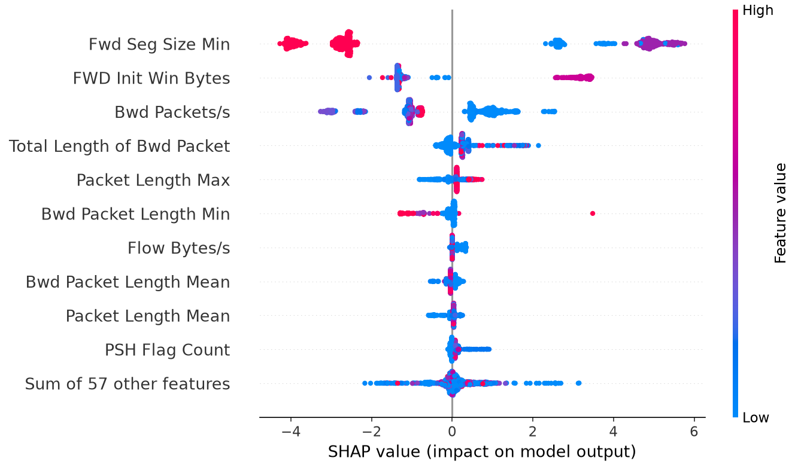
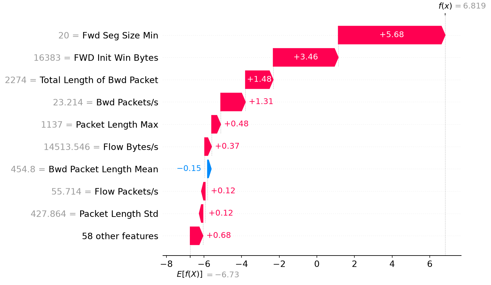
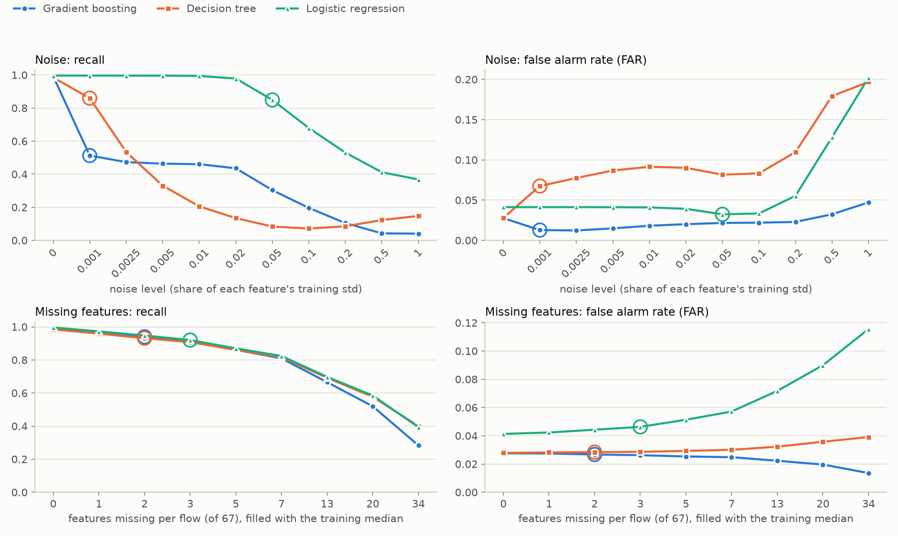
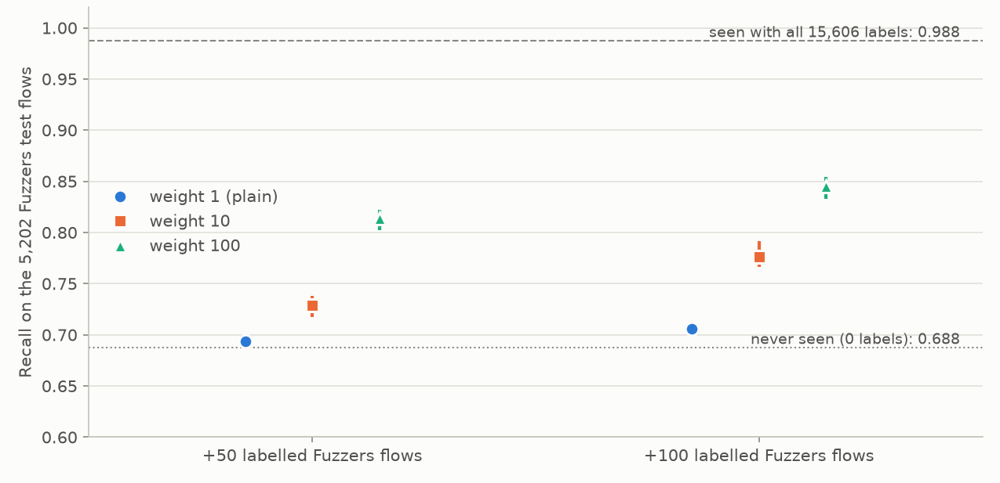

# Mini Project: An Explainable and Robust Cyber-Defence Model

**AI for Cybersecurity (D7084E / D7041E)** · Stefanos Ntentopoulos (stente-5@student.ltu.se), one-person group · October 2026

## 1. Problem and data

**The security problem.** We build a network intrusion detector: for every network flow (one
conversation between two computers, summarised as numbers about packet counts, sizes and timing) it
decides whether the flow is normal traffic or part of an attack. Its users are the analysts of a
Security Operations Centre (SOC), who receive its alerts and decide whether to investigate, block or
ignore. A false alarm costs analyst time; with millions of flows a day, even a false alarm rate (FAR) of
1% buries the real alerts, and analysts start ignoring them (alert fatigue). A missed attack costs more
per case, because the attacker goes unnoticed. The detector must therefore catch most attacks (high
recall) while keeping the FAR low.

**The data.** CIC-UNSW-NB15 [1]: the UNSW-NB15 traffic recorded at UNSW Canberra [2], turned into flows
with 76 numeric features by CICFlowMeter. We use `Data.csv` (447,915 flows, normal traffic and nine
attack types). We do not use the larger `CICFlowMeter_out.csv`, because it holds IP addresses and all
attacks come from one address range, so the address alone would give the label away. Removing 141,742
exact duplicates (a copy in training and another in test would make the test too easy) and 1,068
conflicting rows (identical features, different labels) leaves **305,105 flows, all of which are used**
(no subsample). **26.3% are attacks**: Exploits 10.1%, Fuzzers 8.5%, Reconnaissance 3.9%, Generic and
DoS 1.4% each, and four small types (Shellcode, Backdoor, Analysis, Worms) with under 1% each. The
split is 60/20/20, stratified on the attack type (seed 42): 183,063 training, 61,021 validation and
61,021 test flows. Nine features that are constant in the training set are dropped, leaving 67.

**The trivial baseline** calls every flow benign: accuracy 0.737, recall 0, macro-F1 0.424, PR-AUC
0.263 (the attack share) and FAR 0. Every later score is compared with it.

**Results on validation and on test.** All settings were chosen on the validation set; the test set
was then used once. Table 1 shows that the two agree to within 0.003 on every score, so the settings
were not tuned too closely to the validation set.

| Model | Macro-F1 val / test | Recall val / test | PR-AUC val / test | FAR val / test |
|---|---|---|---|---|
| Always benign | 0.4243 / 0.4243 | 0 / 0 | 0.2631 / 0.2631 | 0 / 0 |
| Decision tree | 0.9685 / 0.9690 | 0.9844 / 0.9849 | 0.9650 / 0.9677 | 0.0282 / 0.0279 |
| Logistic regression | 0.9608 / 0.9608 | 0.9965 / 0.9962 | 0.9500 / 0.9527 | 0.0414 / 0.0413 |
| Gradient boosting | 0.9713 / 0.9718 | 0.9924 / 0.9923 | 0.9807 / 0.9814 | 0.0282 / 0.0276 |

*Table 1. Validation and test scores of the three supervised models and the trivial baseline (61,021 flows each).*

## 2. Method

**Models** (scikit-learn 1.6.1 [3], seed 42). Two glass boxes: a **decision tree** and **logistic
regression** (features scaled inside a pipeline, so the scaler only learns from training rows). One
black box: **gradient boosting** [4] (`HistGradientBoostingClassifier`). We chose boosting over a
random forest for speed: on all training rows a 300-tree forest took about 8 minutes to train and SHAP
on 300 flows over 12 minutes, against seconds for boosting, and every later part retrains or explains
the black box many times.

**How settings were chosen.** Each candidate setting was trained on a stratified 20% part of the
training set (36,612 flows) and scored on the validation set; the best macro-F1 won and was then
trained on all training rows. Tree depth from {3, 5, 8, 12, unlimited}: 12. Logistic regression `C`
from {0.01, 0.1, 1, 10}: 10. Boosting learning rate {0.05, 0.1} by leaves per tree {31, 63}: 0.1 and
31. All four boosting settings were within 0.001 macro-F1 of each other, so the choice matters little.

**Part C, fewer labels.** We keep the labels of 10% of the training flows (18,306, stratified) and hide
the rest. The **lower line** is boosting trained on those 18,306 flows alone; the upper line is the
model with all labels. We then try **pseudo-labelling** [5]: the lower-line model labels the unlabelled
flows it is very sure about (attack probability at least a cutoff, or at most one minus it), they join
the training data and the model is retrained, for two rounds. The cutoff (0.99, 0.95 or 0.90) was chosen
on validation: 0.95. The hidden labels were only used afterwards, to count how many guesses were right.

**Part F, the belief rule base (BRB)** uses the RIMER method with evidential reasoning [6, 7], with the
engine from our Lab 3. Its two inputs are the two most important SHAP features that can take three
distinct referential values (training 5th percentile, median and 95th percentile); 3 × 3 = 9 rules. The
rule beliefs come from the training data: each rule's attack share becomes a belief over Low, Medium and
High risk, and rules with little data keep part of their belief as Unknown. A flow's combined belief
becomes a risk score (utility: Low 0, Medium 50, High 100, Unknown counted halfway), and the threshold
was chosen on validation: 48.5.

## 3. Results

| Model (test set, 61,021 flows) | Macro-F1 | Recall | PR-AUC | FAR |
|---|---|---|---|---|
| Always benign (trivial baseline) | 0.424 | 0.000 | 0.263 | 0.000 |
| Decision tree, all labels | 0.969 | 0.985 | 0.968 | 0.028 |
| Logistic regression, all labels | 0.961 | 0.996 | 0.953 | 0.041 |
| **Gradient boosting, all labels (upper line)** | **0.972** | 0.992 | **0.981** | **0.028** |
| Gradient boosting, 10% labels (lower line) | 0.969 | 0.987 | 0.976 | 0.029 |
| Gradient boosting, 10% labels + pseudo-labels | 0.969 | 0.989 | 0.974 | 0.030 |
| BRB, 2 features, 9 rules | 0.953 | 0.982 | 0.895 | 0.044 |
| Decision tree, same 2 features (depth 4) | 0.962 | 0.996 | 0.918 | 0.040 |
| Random forest, same 2 features (100 trees) | 0.962 | 0.996 | 0.921 | 0.040 |

*Table 2. All models on the same test set with the four scores of the brief, next to the trivial baseline. FAR = share of benign flows called attacks.*

Every model is far above the baseline. Gradient boosting is best, but only just: 0.003 macro-F1 above
the decision tree. Logistic regression catches the most attacks but raises the most false alarms
(1,857 against 1,241 for boosting). Recall is at least 0.957 for every attack type and model; boosting's
weakest large type is Fuzzers (0.988), which accounts for about half of the 124 attacks it misses.
A paired bootstrap over the test flows (200 resamples, in the separate notebook of additional checks)
gives 95% intervals of about ±0.002 on macro-F1, so the 0.003 lead over the tree is small but real.

**Realistic traffic.** In the full UNSW-NB15 recording only 2.53% of flows are attacks, not 26%. In a
network with 1,000,000 flows a day, boosting would catch about 25,100 attacks but raise about 26,900
false alarms: only **48% of its alerts would be real**, against 93% on our test set.

**Did the unlabelled data help? No.** Losing 90% of the labels costs only 0.003 macro-F1 (Table 2), so
there was little to win back. Pseudo-labelling raised validation macro-F1 from 0.9679 to 0.9681 (4% of
the gap to the upper line) and on test it is slightly *below* the lower line (0.9685 against 0.9688).
It changed the balance, not the quality: recall rose by 0.002 to 0.004, but FAR rose and PR-AUC fell.
The reason is visible in the guesses: in the first round 143,824 were added and 99.5% were right, but
they were flows the model already classified correctly (116,556 benign), so they taught it nothing new.
The second round added the borderline flows, mostly attacks, and only 90% of those guesses were right.
An additional check with 1% of the labels (1,830 flows) found a small real gain (+0.003 macro-F1,
+0.012 recall); the unlabelled data only help when labels are really scarce.

## 4. Explanation

**Global SHAP** [8, 9] on 1,000 validation flows (Figure 1) shows that three features carry 76% of the
model's SHAP weight: `Fwd Seg Size Min` (42%), `FWD Init Win Bytes` (21%) and `Bwd Packets/s` (13%). The
first two are **TCP settings of the machine that opens the connection**, not properties of an attack.
In training, 89% of flows with `Fwd Seg Size Min` = 20 are attacks and 0% of those with 32; 95% of all
training attacks (45,850 of 48,154) announce a window of exactly 16,383 bytes. All UNSW-NB15 attacks
were generated from a few attacker machines, so the model has learned to **recognise those machines**, a
shortcut [10]. To a security person, only the next features make sense as evidence: how fast the victim
replies (scans and floods get few replies) and packet sizes.

*Figure 1. SHAP values of gradient boosting on 1,000 validation flows (log-odds; each dot is one flow, colour = feature value). The two top features split into separate clouds: one value pushes strongly towards attack, the other towards benign.*

**Three explained cases** from the test set (Table 3): the most confident correct detection (an Exploits
flow), the most confident correct negative, and the most confident mistake, a **benign flow called an
attack with probability 0.999**. The mistake carries the attacker fingerprint (`Fwd Seg Size Min` = 20,
window 16,383), and SHAP shows that these two values alone add +5.7 and +3.5 log-odds (Figure 2). The
same holds widely: 1,197 of the 1,241 false alarms on the test set are benign flows with the
fingerprint. The negative is cleared by its behaviour (fast replies, −3.0).

| Case | SHAP top 3 | LIME top 3 | Shared | LIME fit (R²) |
|---|---|---|---|---|
| Detection (Exploits, p = 0.9996) | Fwd Seg Size Min, FWD Init Win Bytes, Bwd Packets/s | RST Flag Count, Fwd Seg Size Min, Bwd Packets/s | 2 | 0.26 |
| Negative (benign, p ≈ 0) | Bwd Packets/s, Bwd IAT Min, Fwd Seg Size Min | Fwd PSH Flags, Fwd Seg Size Min, Bwd Packet Length Min | 1 | 0.24 |
| Mistake (benign, p = 0.9989) | Fwd Seg Size Min, FWD Init Win Bytes, Total Length of Bwd Packet | Fwd Seg Size Min, Bwd Packet Length Min, Bwd Packets/s | 1 | 0.25 |

*Table 3. The three explained test flows: top-3 features by SHAP and by LIME [11], how many they share, and how well LIME's local line fits the model.*

*Figure 2. SHAP explanation of the mistake: a benign test flow called an attack with probability 0.9989. Starting from the average output (−6.73 log-odds), the two TCP-settings features push it far above the decision line.*

**Fidelity.** In a deletion test on 500 test flows called attacks, replacing each flow's top SHAP feature
with its training median lowered the attack probability by 0.919 on average and **flipped 100% of the
decisions** to benign; one random feature lowered it by 0.020 (2.8% flipped), ten random features by
0.224 (25.4%). SHAP is therefore faithful. But the top feature was `Fwd Seg Size Min` for all 500 flows,
and its median, 32, is the benign machines' value: giving an attack a normal machine's TCP setting is
enough to make the model call it benign. The test confirms the shortcut as cause and effect.

**Stability.** SHAP's `TreeExplainer` is exact and gave identical values on repeated runs. LIME, run 10
times with seeds 0 to 9, gave the most common top 3 in 8, 5 and 8 runs of 10 (detection, negative,
mistake). Only `Fwd Seg Size Min` was in every top 3. Worse, the most common top 3 was **the same for all
three flows**, and the detection and the mistake got identical results seed by seed: LIME was describing
the model in general, not the flow.

**Do SHAP and LIME agree? Only partly** (1 to 2 of 3 shared features), and we tested four reasons.
(1) LIME's quartile ranges put the attacker window 16,383 and the benign 5,792 into neighbouring ranges
and the values 8 and 20 into one range, although the model treats them oppositely; without ranges and
with samples drawn around the flow, LIME's top 3 for the detection became exactly SHAP's. (2) More
samples (20,000 instead of 5,000) changed neither stability nor agreement. (3) Correlated twin features
did not explain it: the differing features correlate at most 0.30. (4) **Poor local fit is the main
reason:** LIME's R² stayed between 0.06 and 0.29 in every variant, and its own prediction for the
detection was 0.25 where the model says 1.00. The model behaves like a switch (changing one TCP value
flips it from 1 to 0) and a straight line cannot describe a switch. We would show analysts SHAP, which is
exact, stable and faithful here.

## 5. Robustness

We tested **measurement noise** (Gaussian, scaled to each feature's training standard deviation, clipped
at 0, on the 65 continuous features of the test set) and **missing features** (a share of each flow's
features replaced by the training median), at 10 noise levels from 0.001 to 1 and at 1 to 34 missing
features per flow (Figure 3, Table 4). The rule for when to stop trusting a model was fixed before the tests:
recall more than 0.05 below the clean value, or FAR more than twice the clean value.

*Figure 3. Recall and FAR on the test set under noise (top; level = share of each feature's training standard deviation) and missing features (bottom; features per flow filled with the training median). A ring marks the first level at which the trust rule rejects the model.*

| Model | Recall, noise 0.001 | Noise 0.05 | Noise 0.2 | Last noise level trusted | Recall, 2 / 7 / 34 missing | Most missing features trusted |
|---|---|---|---|---|---|---|
| Gradient boosting | 0.513 | 0.304 | 0.104 | none | 0.940 / 0.809 / 0.283 | 1 |
| Decision tree | 0.860 | 0.084 | 0.085 | none | 0.932 / 0.816 / 0.400 | 1 |
| Logistic regression | 0.996 | 0.849 | 0.530 | 0.02 | 0.948 / 0.824 / 0.393 | 2 |

*Table 4. Test recall under noise and missing features (clean recall 0.992, 0.985 and 0.996), and the last level each model is still trusted.*

**What broke first: the two tree models under noise.** Noise of one thousandth of a standard deviation
already halves boosting's recall (0.992 to 0.513); logistic regression stays at 0.98 up to noise 0.02,
twenty times more. The reason is the shortcut again: the trees test for a narrow interval around the
exact fingerprint values (the tree's first two questions isolate a window between 16,368.5 and 16,406.5),
and noise moves the values out of it. Noise on only those three TCP-settings features cut boosting's
recall to 0.42 at level 0.05; noise on all other features to 0.82. **Missing features** hurt all three
models gradually and alike: one missing field per flow is tolerated, two or three are not. Boosting
misses **every** attack whose `Fwd Seg Size Min` went missing, because the median filled in is the benign
machines' value. In every case the metric that broke was recall, not FAR: the models fail silently, with
fewer alerts, which looks like good news on a dashboard.

**What an attacker would fake.** Sorting the top features by what an attacker controls, 69% of the SHAP
weight sits on features they can change cheaply, above all their own TCP settings. Giving all 16,052
test attacks the most common benign settings (`Fwd Seg Size Min` = 32, window 5,792), and nothing else,
drops recall to **0.000 for boosting**, 0.011 for the tree and 0.066 for logistic regression.

## 6. Adaptability

**Hidden attack: Fuzzers**, removed from the training set only (15,606 flows, a third of the training
attacks); validation and test keep theirs. We chose it because, in a trial on the validation set, hiding
it lowered its own recall the most of all types. Boosting was retrained with the same settings.

**Cost.** On the 5,202 Fuzzers test flows, recall fell from **0.988 to 0.688**; overall recall from 0.992 to
0.888, while recall on the other types barely moved (0.995 to 0.984). The model did not get worse at what
it knew. The FAR *fell* (0.028 to 0.019), so the alert count would suggest things had improved. But the
model was visibly unsure: 82% of the Fuzzers flows got an attack probability between 0.1 and 0.9,
against 43% before.

**Adapting.** An analyst labels 50 or 100 Fuzzers flows from the removed training flows (never from the
test set); we add them and retrain, three random draws each (Figure 4). Added as ordinary flows they
barely help: 0.694 with 50 labels and 0.706 with 100. **Weighted** 100 times, the same 100 labels raise
Fuzzers recall to **0.845** (0.833 to 0.854 over the draws) and overall recall to 0.940, with FAR 0.022.
The weights were not tuned, since that would need Fuzzers labels the analyst does not have.

*Figure 4. Recall on the 5,202 Fuzzers test flows after adding 50 or 100 labelled Fuzzers flows to training, with weight 1, 10 or 100 (mean and range of 3 draws). Dotted: never seen; dashed: trained with all 15,606.*

**Labels needed, and how we would notice.** 100 weighted labels recover more than half of the lost
recall, but not all of it (0.845 against 0.988). In a real system nobody announces a new attack, and the
alert count went *down*. We would watch the share of uncertain predictions (it nearly doubled here, and
needs no labels), compare incoming feature distributions with the training data, have analysts label a
small random sample every week (including flows called benign), and retrain regularly.

## 7. Discussion

**A, problem and data.** The data hold 26% attacks; real traffic about 2.5%. The baseline's 0.737
accuracy shows why accuracy alone is useless here, and the realistic-traffic estimate (48% of alerts
real) shows that our test-set precision of 93% flatters every model.

**B, supervised models.** All three models reach macro-F1 0.96 to 0.97 and test agrees with validation.
The black box buys only 0.003 over a readable tree. That is a warning, not a success: a problem that a
depth-12 tree solves this well is probably being solved by a few strong signals.

**C, fewer labels.** 10% of the labels are almost as good as all of them, and pseudo-labelling did not
help: its confident guesses were right but not new. With 1% of the labels it gave a small real gain. In
practice the expensive part is not the labels of common attacks but those of new ones (Part G).

**D, explanation.** SHAP is faithful and stable, and what it reveals is that the model recognises the
attacker machines' TCP fingerprint. LIME disagreed mainly because it cannot fit a switch-like model. The
explanation work did its job: it found the weakness that the scores hid.

**E, robustness.** The most accurate models are the most fragile: tiny noise on the fingerprint values,
or one filled-in missing field, silently turns attacks into "benign". Logistic regression survives noise
twenty times larger.

**F, BRB.** On the same two features the BRB is 0.009 macro-F1 behind a tree and a forest, because three
referential values cannot isolate the exact window 16,383. In return it gives nine readable rules, a
traceable reason for each decision and an explicit **Unknown**. For the false alarm of Part D it put
belief Low 0.09, Medium 0.54, High 0.37 and Unknown 0.0006 (utility 63.8, so it makes the same mistake,
but with visibly less certainty than boosting's 0.999). With `Bwd Packets/s` missing, Unknown rose to
0.43 and the utility became a range, 16.9 to 59.6, that spans the threshold: the honest answer
"cannot decide". It also survives noise far better: at noise 0.05 its macro-F1 is 0.897, against 0.472
for the 2-feature tree and 0.536 for the forest. The costs: lower accuracy, only two features (rules grow
as 3 to the power of the number of features), hand-made choices of levels and threshold, and an Unknown
that only helps if undecided flows go to an analyst.

**G, adaptability.** A new attack type cost 30 points of recall on it while the dashboard looked better.
A hundred weighted labels recovered half of the loss.

**Would we deploy this?** Not as it is. On this dataset it is excellent, but its accuracy rests on
recognising a few attacker machines, which says nothing about attackers elsewhere. An additional check
(separate notebook) trained boosting without the three TCP-settings features: test macro-F1 0.971
instead of 0.972, recall at noise 0.001 0.831 instead of 0.513, and a SHAP ranking led by behaviour
features (`Bwd Packets/s`, 46% of the weight). We would deploy that model, with the BRB as a readable
second opinion that sends undecided flows to an analyst, and with the monitoring of Part G.

**What would an attacker fake?** Their own TCP settings: two system settings, at no cost to the attack,
defeat all three models here. Removing those features is necessary; the behaviour features that remain
are harder, but not impossible, to fake (timing and padding are cheap; the victim's replies are not).

**Which numbers do we least trust?** (1) **The 0.972 macro-F1 itself**: it measures how well the model
recognises the UNSW-NB15 attacker machines, not attacks in general. (2) **The 0.028 FAR**, because it
comes from a 26% attack share; at a realistic 2.5%, more than half of the alerts would be false. (3)
**Recall on the small attack types** (Worms 47 test flows, Analysis 77, Backdoor 90), where one flow moves
the score by one to two points. (4) **Every LIME explanation**, with fit scores of 0.06 to 0.29.

**Where would the method fail outside this dataset?** On any network where attackers and normal users
share operating systems, where traffic comes through proxies or NAT that rewrite TCP settings, or where
flows are measured by another tool or with small timing differences. The data were also recorded in 2015
in a lab, with synthetic normal traffic; modern encrypted traffic and new attack types would need new
labels, as Part G showed.

## 8. Who did what

Stefanos Ntentopoulos (one-person group): all of the work, namely choosing the dataset, the data
cleaning and split, all models and experiments of Parts A to G, the notebook, the README and this report.

## Use of AI

The AI assistant Claude (Anthropic) [12], through the Claude Code tool, was used throughout the project:
to compare candidate datasets, plan the work, explain concepts, write and review the notebook code, run
the experiments, check numbers against the result tables, and draft and edit the text of the README and
this report. The author made the project decisions (dataset, using all rows, which models, which extra
checks) and is responsible for the content. All numbers come from the notebook's own output.

## References

[1] H. Mohammadian, A. H. Lashkari, A. A. Ghorbani. Poisoning and evasion: deep learning-based NIDS
under adversarial attacks. *21st Annual International Conference on Privacy, Security and Trust (PST)*,
2024. Dataset: https://www.unb.ca/cic/datasets/cic-unsw-nb15.html

[2] N. Moustafa, J. Slay. UNSW-NB15: a comprehensive data set for network intrusion detection systems
(UNSW-NB15 network data set). *Military Communications and Information Systems Conference (MilCIS)*, 2015.

[3] F. Pedregosa et al. Scikit-learn: machine learning in Python. *Journal of Machine Learning Research*,
12, 2825-2830, 2011.

[4] J. H. Friedman. Greedy function approximation: a gradient boosting machine. *Annals of Statistics*,
29(5), 1189-1232, 2001.

[5] D.-H. Lee. Pseudo-label: the simple and efficient semi-supervised learning method for deep neural
networks. *ICML Workshop on Challenges in Representation Learning*, 2013.

[6] J.-B. Yang, J. Liu, J. Wang, H.-S. Sii, H.-W. Wang. Belief rule-base inference methodology using the
evidential reasoning approach (RIMER). *IEEE Transactions on Systems, Man, and Cybernetics, Part A*,
36(2), 266-285, 2006.

[7] Y.-M. Wang, J.-B. Yang, D.-L. Xu. Environmental impact assessment using the evidential reasoning
approach. *European Journal of Operational Research*, 174(3), 1885-1913, 2006.

[8] S. M. Lundberg, S.-I. Lee. A unified approach to interpreting model predictions. *Advances in Neural
Information Processing Systems 30 (NeurIPS)*, 2017.

[9] S. M. Lundberg et al. From local explanations to global understanding with explainable AI for trees.
*Nature Machine Intelligence*, 2, 56-67, 2020.

[10] D. Arp et al. Dos and don'ts of machine learning in computer security. *31st USENIX Security
Symposium*, 2022.

[11] M. T. Ribeiro, S. Singh, C. Guestrin. "Why should I trust you?": explaining the predictions of any
classifier. *Proceedings of the 22nd ACM SIGKDD Conference (KDD)*, 1135-1144, 2016.

[12] Anthropic. Claude, AI assistant. https://www.anthropic.com/claude
